# Pawfect Store - 3-Tier Web Application

A simple 3-tier Pawfect Store web application built with modern technologies, featuring a simple CRUD interface for managing pets in an online pet store inventory.

## Architecture

This application follows a 3-tier architecture:

- **Frontend**: Angular 17 with Angular Material UI
- **Backend**: Spring Boot 3.2 REST API with JWT authentication
- **Database**: MySQL 8.0 with JPA/Hibernate

### System Architecture Overview

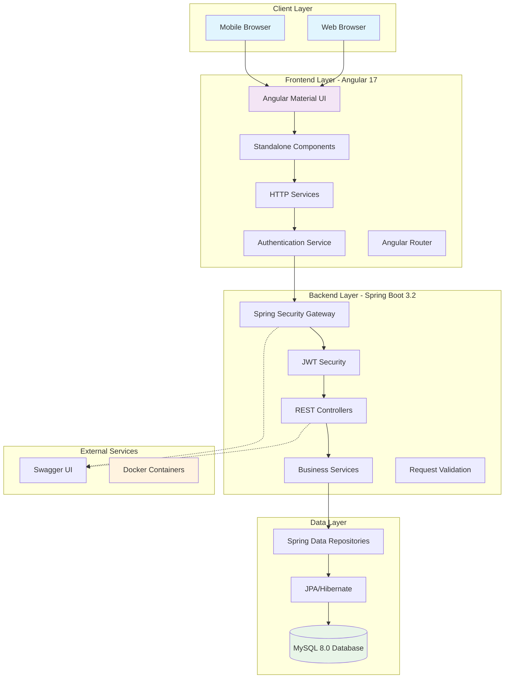

### Component Architecture

```mermaid
graph TD
    App[App Component<br/>Main Application Shell]
    
    subgraph "Public Routes"
        Home[Home Component<br/>Landing Page]
        Login[Login Component<br/>Authentication]
    end
    
    subgraph "Protected Routes"
        PetList[Pet List Component<br/>Main Pet Management]
        PetForm[Pet Form Component<br/>Add/Edit Pets]
        Categories[Category Management<br/>Admin Only]
        Discounts[Discount Management<br/>Admin Only]
        Addresses[Address Management<br/>Card View]
        OrderList[Order List View Component<br/>Card View]
        Cart[Cart View Component<br/>Add Pet to Cart]
        Users[User Management<br/>Admin Only]
    end
    
    subgraph "Shared Components"
        PetCard[Pet Card Component<br/>Pet Display Card]
        PetListView[Pet List View Component<br/>Table View]
        ImageModal[Image Modal Component<br/>Image Viewer]
        LatestPetCard[Latest Pet Card<br/>Homepage Display]
    end
    
    subgraph "Services Layer"
        AuthService[Auth Service<br/>JWT Management]
        PetService[Pet Service<br/>Pet CRUD Operations]
        CategoryService[Category Service<br/>Category Management]
        AddressService[Address Service<br/>Address Management]
        DiscountService[Discount Service<br/>Discount Management]
        StoreService[Store Service<br/>Store/Order Management]
        UserService[User Service<br/>User Management]
        BaseApiService[Base API Service<br/>HTTP Configuration]
    end
    
    App --> Home
    App --> Login
    App --> PetList
    App --> PetForm
    App --> Categories
    App --> Discounts
    App --> Addresses
    App --> OrderList
    App --> Cart
    App --> Users
    
    PetList --> PetCard
    PetList --> PetListView
    PetList --> ImageModal
    Home --> LatestPetCard
    
    Login -.-> AuthService
    PetList -.-> PetService
    PetForm -.-> PetService
    PetForm -.-> CategoryService
    Categories -.-> CategoryService
    Discounts -.-> DiscountService
    Addresses -.-> AddressService
    Cart -.-> StoreService
    OrderList -.-> StoreService
    Users -.-> UserService
    
    AuthService -.-> BaseApiService
    PetService -.-> BaseApiService
    CategoryService -.-> BaseApiService
    DiscountService -.-> BaseApiService
    AddressService -.-> BaseApiService
    StoreService -.-> BaseApiService
    UserService -.-> BaseApiService
    
    style App fill:#ffeb3b
    style AuthService fill:#4caf50
    style BaseApiService fill:#2196f3
```

## Features

### Core Functionality
- **View Pets**: Browse all available pets with filtering and search
- **Add Pets**: Add new pets to the store inventory
- **Update Pets**: Edit existing pet information
- **Delete Pets**: Remove pets from inventory
- **Store Management**: Add to Cart, Order Pets, Mock Payment, View Order Status
- **Discount Management**: Manage Discounts
- **Category Management**: Manage Categories

### Advanced Features
- **Search & Filter**: Filter pets by name, species, and status
- **Responsive Design**: Modern Angular Material UI
- **Authentication**: JWT-based authentication system
- **Role-based Authorization**: Different access levels (User, Admin)
- **Containerization**: Docker support for easy deployment
- **API Documentation**: Swagger/OpenAPI documentation

### Database Schema

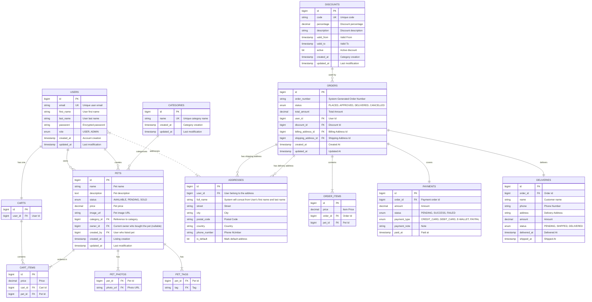

### API Flow Diagrams

#### Authentication Flow
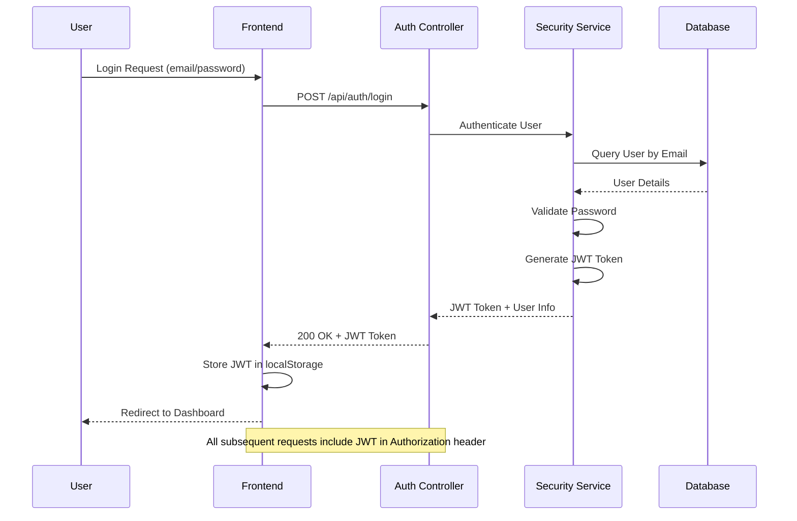

#### Pet Management Flow

##### Create a Pet Flow
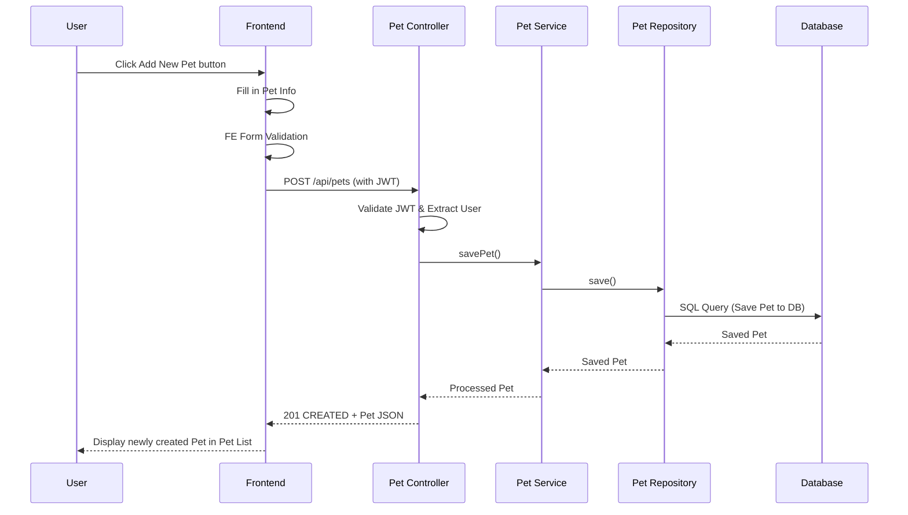

##### Update Pet Flow
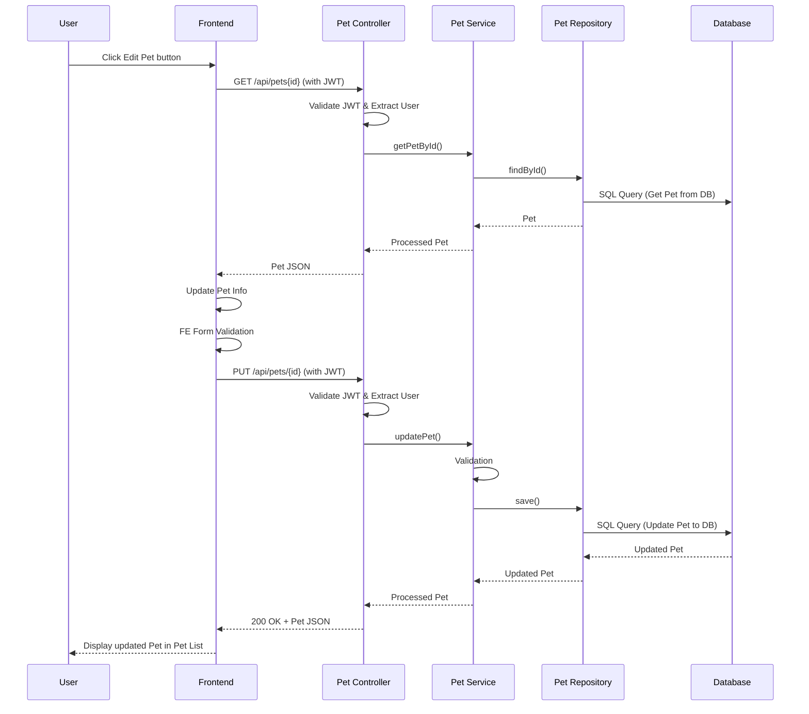

##### View Pets/My Pets Flow
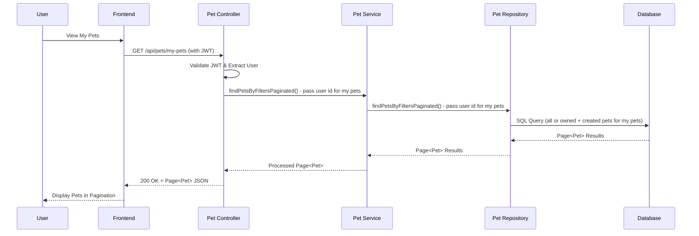

##### Delete Pet Flow
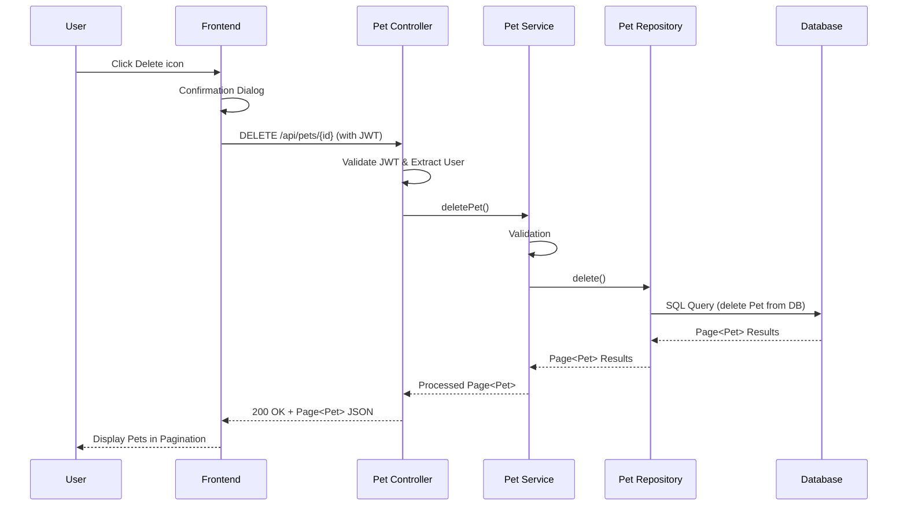

## Quick Start

### Prerequisites
- **Java 17+** (OpenJDK recommended)
- **Node.js 18+** and npm
- **Maven 3.6+**
- **MySQL 8.0+** (or Docker for containerized database)

### 1. Clone and Setup
```bash
# Navigate to the project directory
cd pet-store

# Install frontend dependencies
cd pet-store-frontend
npm install

# Build frontend
npm run build

# Build backend
cd ../pet-store-api
mvn clean package
```

### 2. Database Setup
```bash
# Option A: Local MySQL
mysql -u root -p
CREATE DATABASE petstore_db;

# Option B: Using Docker
cd docker
docker-compose up -d mysql
```

### 3. Run the Application

#### Using VS Code Tasks (Recommended)
1. Open the project in VS Code
2. Press `Ctrl+Shift+P` (Cmd+Shift+P on Mac)
3. Type "Tasks: Run Task"
4. Select "Start Backend" to launch the Spring Boot server
5. Select "Start Frontend" to launch the Angular development server

#### Manual Start
```bash
# Terminal 1: Start Backend
cd pet-store-api
mvn spring-boot:run

# Terminal 2: Start Frontend
cd pet-store-frontend
npm start
```

### 4. Access the Application
- **Frontend**: http://localhost:4200
- **Backend API**: http://localhost:8080/api
- **API Documentation**: http://localhost:8080/swagger-ui.html

### 5. Initial Data Setup

The application automatically creates initial data on first startup through the `DataInitializer` component:

#### Default Admin User
A default administrator account is created for demo purposes:
- **Email**: `admin@pawfect.com`
- **Password**: `admin123`
- **Roles**: ADMIN
- **Access**: Full system administration capabilities

#### Default Categories
The following pet categories are automatically created:
- **Dogs** - Canine companions
- **Cats** - Feline friends  
- **Birds** - Feathered pets
- **Fish** - Aquatic animals
- **Reptiles** - Cold-blooded pets
- **Small Pets** - Rabbits, hamsters, etc.

#### Sample Pets
Demo pets are created in each category, including:

**Dogs:**
- Golden Retriever – Sunny Buddy ($1,200)
- German Shepherd – Brave Rex ($1,500)  
- Labrador – Happy Bella ($1,000)

**Cats:**
- Persian Cat – Royal Luna ($800)
- Siamese Cat – Mister Milo ($600)

**Birds:**
- Canary – Golden Song ($150)
- Parrot – Talking Rio ($500)

**Fish:**
- Goldfish – Golden Bubbles ($25)
- Betta Fish – Blue Sapphire ($15)

All sample pets include multiple high-quality photos and relevant tags for demonstration purposes.

> **Note**: Initial data is only created when the database is empty. Existing data will not be overwritten on subsequent application starts.

## Project Structure

```
pet-store/
├── .vscode/                         # VS Code configuration
│   ├── tasks.json                   # Build and run tasks
│   ├── launch.json                  # Debug configurations
│   └── settings.json                # Editor settings
├── .github/                         # GitHub workflows (empty)
├── docker/                          # Docker configuration
│   ├── .env                         # Local environment variables
│   ├── .env.example                 # Environment template
│   ├── docker-compose.yml           # Main Docker Compose
│   ├── docker-compose.secrets.yml   # Secrets management
│   ├── mysql-init/                  # Database initialization scripts
│   └── secrets/                     # Docker secrets directory
├── pet-store-api/                   # Spring Boot REST API
│   ├── src/main/java/com/petstore/
│   │   ├── PetStoreApplication.java # Main application class
│   │   ├── config/                  # Configuration classes
│   │   │   ├── DataInitializer.java     # Initial data setup
│   │   │   ├── EnvironmentConfig.java   # Environment variables
│   │   │   ├── OpenApiConfig.java       # Swagger configuration
│   │   │   ├── SecurityConfig.java      # Spring Security setup
│   │   │   └── SpringSecurityAuditorAware.java
│   │   ├── controller/              # REST API controllers
│   │   │   ├── AuthController.java      # Authentication endpoints
│   │   │   ├── CategoryController.java  # Category management
│   │   │   ├── PetController.java       # Pet operations
│   │   │   └── UserController.java      # User management
│   │   ├── model/                   # JPA entity classes
│   │   │   ├── Category.java           # Pet category entity
│   │   │   ├── Pet.java               # Pet entity
│   │   │   ├── PetStatus.java         # Pet status enum
│   │   │   ├── Role.java              # User roles enum
│   │   │   └── User.java              # User entity
│   │   ├── repository/              # Data access layer
│   │   │   ├── CategoryRepository.java
│   │   │   ├── PetRepository.java
│   │   │   └── UserRepository.java
│   │   ├── security/                # Security components
│   │   │   ├── JwtAuthenticationFilter.java
│   │   │   ├── JwtTokenProvider.java
│   │   │   └── UserPrincipal.java
│   │   └── service/                 # Business logic layer
│   │       ├── CategoryService.java
│   │       ├── PetService.java
│   │       ├── UserDetailsServiceImpl.java
│   │       └── UserService.java
│   ├── src/main/resources/
│   │   ├── application.properties       # Local configuration
│   │   ├── application-docker.properties # Docker configuration
│   │   └── logback-spring.xml          # Logging configuration
│   ├── src/test/                    # Test classes
│   │   ├── java/com/petstore/
│   │   │   ├── config/              # Test configurations
│   │   │   ├── controller/          # Controller tests
│   │   │   ├── repository/          # Repository tests
│   │   │   └── service/             # Service tests
│   │   └── resources/
│   │       └── application-test.properties
│   ├── logs/                        # Application logs directory
│   ├── Dockerfile                   # Container build file
│   └── pom.xml                      # Maven dependencies
├── pet-store-frontend/              # Angular 17 application
│   ├── src/app/
│   │   ├── components/              # Angular components
│   │   │   ├── category-form/           # Category creation/edit
│   │   │   ├── category-list/           # Category management
│   │   │   ├── confirm-dialog/          # Confirmation dialogs
│   │   │   ├── diagram-viewer/          # Architecture diagrams
│   │   │   ├── documentation/           # API documentation
│   │   │   ├── header/                  # Navigation header
│   │   │   ├── home/                    # Dashboard/landing page
│   │   │   ├── image-modal/             # Pet image display
│   │   │   ├── latest-pet-card/         # Recent pet listings
│   │   │   ├── login/                   # User authentication
│   │   │   ├── mermaid-diagram/         # Mermaid diagram renderer
│   │   │   ├── pet-card/                # Pet display card
│   │   │   ├── pet-form/                # Pet creation/edit form
│   │   │   ├── pet-list/                # Pet browsing
│   │   │   ├── pet-list-view/           # Pet grid/list view
│   │   │   ├── register/                # User registration
│   │   │   ├── unauthorized/            # Access denied page
│   │   │   ├── user-edit/               # User profile editing
│   │   │   └── user-list/               # User management (admin)
│   │   ├── guards/                  # Route protection
│   │   │   ├── auth.guard.ts            # Authentication guard
│   │   │   ├── pet-ownership.guard.ts   # Pet ownership validation
│   │   │   └── user-profile.guard.ts    # Profile access control
│   │   ├── interceptors/            # HTTP interceptors
│   │   │   ├── auth.interceptor.ts      # JWT token injection
│   │   │   └── unauthorized.interceptor.ts # 401 handling
│   │   ├── models/                  # TypeScript interfaces
│   │   │   ├── category.model.ts
│   │   │   └── pet.model.ts
│   │   ├── services/                # HTTP services
│   │   │   ├── auth.service.ts          # Authentication API
│   │   │   ├── base-api.service.ts      # Base HTTP service
│   │   │   ├── category.service.ts      # Category API
│   │   │   ├── pet.service.ts           # Pet API
│   │   │   └── user.service.ts          # User API
│   │   ├── app.component.ts         # Root component
│   │   ├── app.config.ts            # App configuration
│   │   └── app.routes.ts            # Route definitions
│   ├── src/environments/            # Environment configurations
│   │   ├── environment.ts               # Development config
│   │   ├── environment.prod.ts          # Production config
│   │   └── environment.docker.ts        # Docker config
│   ├── src/assets/                  # Static assets
│   │   └── images/                      # Application images
│   ├── dist/                        # Built application output
│   ├── Dockerfile                   # Container build file
│   ├── nginx.conf                   # Production nginx config
│   ├── angular.json                 # Angular CLI configuration
│   ├── tsconfig.json               # TypeScript configuration
│   ├── tsconfig.app.json           # App-specific TypeScript config
│   └── package.json                # Node.js dependencies
├── .gitignore                       # Git ignore patterns
└── README.md                        # Project documentation
```

## Development

### Backend Development
- **Framework**: Spring Boot 3.2
- **Database**: MySQL with JPA/Hibernate
- **Security**: Spring Security with JWT
- **API Documentation**: Swagger/OpenAPI
- **Build Tool**: Maven

### Frontend Development
- **Framework**: Angular 17 (Standalone components)
- **UI Library**: Angular Material
- **Language**: TypeScript
- **Build Tool**: Angular CLI

### Available VS Code Tasks
- `Start Backend` - Launch Spring Boot server
- `Start Frontend` - Launch Angular dev server
- `Build Backend` - Compile and package Spring Boot application
- `Build Frontend` - Build Angular for production
- `Start Docker Services` - Launch all services with Docker Compose

### Development Workflow

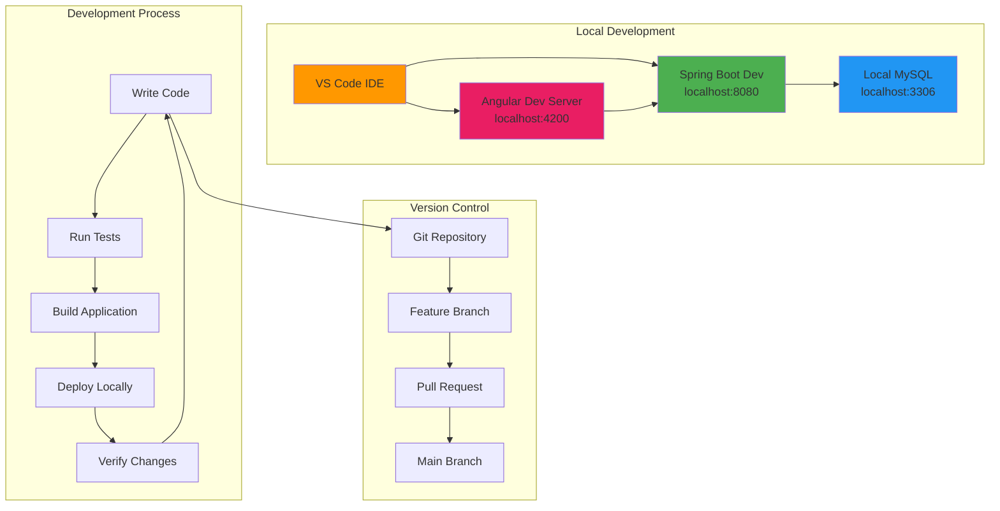

### Development Commands Flow

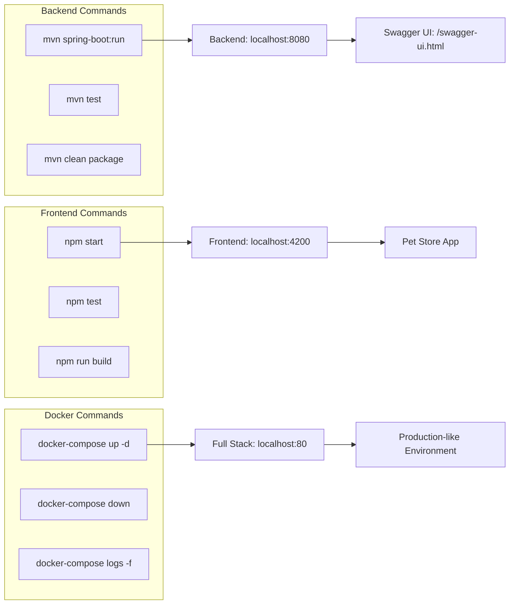

## Docker Deployment

### Deployment Architecture

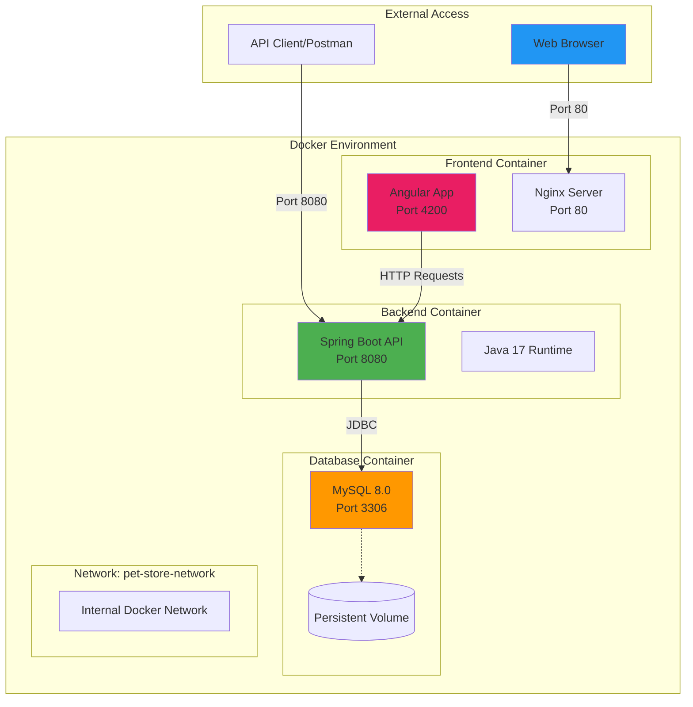

### Container Communication Flow

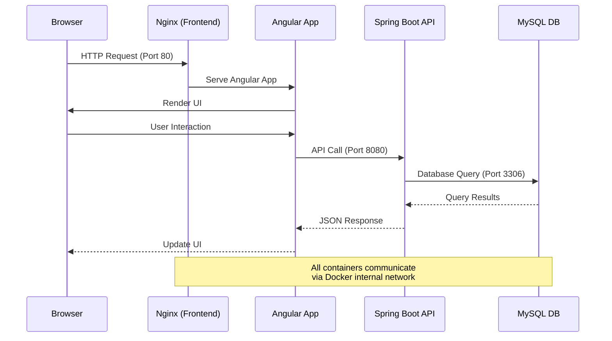

### Full Stack Deployment
```bash
cd docker
docker-compose up -d
```

This will start:
- MySQL database on port 3306
- Spring Boot backend on port 8080
- Angular frontend on port 80

### Individual Services
```bash
# Database only
docker-compose up -d petstore-mysql

# Backend only (requires database)
docker-compose up -d petstore-backend

# Frontend only
docker-compose up -d petstore-frontend
```

## Authentication & Authorization

The application includes a demonstration authentication system:

### User Roles
- **USER**: Can view and search pets, manage own pets, purchase pets
- **ADMIN**: Full CRUD operations on all pets, manage categories and users

### Demo Login Credentials

#### Default Admin Account
Use these credentials to access full administrative features:
- **Email**: `admin@pawfect.com`
- **Password**: `admin123`
- **Access Level**: Full system administration

#### General Demo Access
For testing user functionality, any email/password combination will work in the login interface.

> **Security Note**: This is a demonstration system. In production, proper user registration and authentication would be implemented.

### User Journey Map

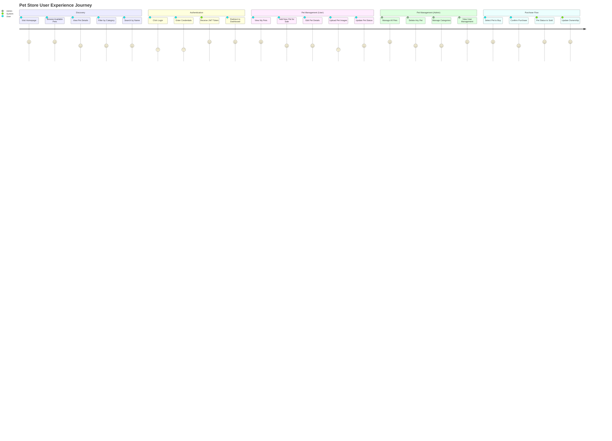

### Role-Based Access Control

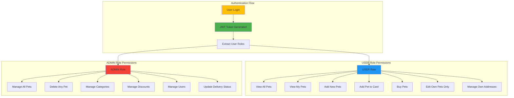

## API Documentation

The REST API follows the Swagger Pawfect Store specification and includes:

### Category Endpoints
- `GET /api/categories{id}` - Get category by ID
- `GET /api/categories` - Get all categories
- `POST /api/categories` - Create a new category
- `PUT /api/categories` - Update a category
- `DELETE /api/categories/{id}` - Delete a category

### Pet Endpoints
- `GET /api/pets` - Get all available pets (supports filters: name, categoryId, status, limit) in pagination
- `GET /api/pets/my-pets` - Get user's own pets (owned and created) (supports filters: name, categoryId, status, limit) in pagination
- `GET /api/pets/latest` - Get latest available pets (for homepage display)
- `GET /api/pets/{id}` - Get pet by ID
- `POST /api/pets` - Add new pet (requires authentication)
- `PUT /api/pets/{id}` - Update an existing pet (requires authentication - user can only edit own pets, admin can edit any)
- `DELETE /api/pets/{id}` - Delete pet

### Authentication Endpoints
- `POST /api/auth/register` - User registration
- `POST /api/auth/login` - User login

### User Endpoints
- `GET /api/users{id}` - Get user by ID
- `GET /api/users` - Get all users
- `PUT /api/users{id}` - Update an existing user
- `DELETE /api/users{id}` - Delete user by ID

### Store Endpoints
- `GET /api/stores/orders` - Get orders
- `GET /api/stores/order/{orderId}` - Get order by ID
- `GET /api/stores/cart/{userId}` - Get user's cart
- `GET /api/stores/cart/discount/validate` - Validate discount
- `POST /api/stores/order/{orderId}/pay` - Make payment for order
- `POST /api/stores/checkout` - Checkout cart
- `PATCH /api/stores/order/{orderId}/delivery-status` - Update order delivery status
- `DELETE /api/stores/order/{orderId}` - Cancel order
- `DELETE /api/stores/order/{orderId}/delete` - Delete order (ADMIN role only)
- `DELETE /api/stores/cart/item/{cartItemId}` - Remove item from cart
- `PATCH /api/stores/order/{orderId}/delivery-status` - Update order delivery status

### Discount Endpoints
- `GET /api/discounts/{id}` - Get discount by ID
- `GET /api/discounts` - Get all discounts (ADMIN role only)
- `GET /api/discounts/active` - Get all active discounts
- `POST /api/discounts` - Create discount (ADMIN role only)
- `PUT /api/discounts/{id}` - Update discount by ID (ADMIN role only)
- `DELETE /api/discounts/{id}` - Delete discount by ID (ADMIN role only)

### Address Endpoints
- `GET /api/addresses` - Get user addresses
- `POST /api/addresses` - Create address
- `PUT /api/addresses/{addressId}` - Get user addresses
- `DELETE /api/addresses/{addressId}` - deleter address

Visit http://localhost:8080/swagger-ui.html when the backend is running for interactive API documentation.

## Configuration

### Backend Configuration (`application.properties`)
```properties
# Database
spring.datasource.url=jdbc:mysql://localhost:3306/petstore_db
spring.datasource.username=your_datasource_user
spring.datasource.password=your_datasource_password

# JPA
spring.jpa.hibernate.ddl-auto=update
spring.jpa.show-sql=true

# JWT
app.jwt.secret=your_secret_key
app.jwt.expiration-ms=86400000
```

### Frontend Configuration
### Frontend Configuration
The Angular app is configured to connect to the backend at `http://localhost:8080/api`.

## Local Environment Configuration

This section explains how to configure environment variables for local development to securely manage sensitive configuration like database passwords and JWT secrets.

### Setup Instructions

#### 1. Copy Environment Template
```bash
# In the pet-store-api directory
cd pet-store-api
cp .env.example .env
```

#### 2. Configure Your Environment
Edit the `.env` file with your actual values:

```bash
# Database Configuration
DB_PASSWORD=your_mysql_password
DB_USERNAME=root
DB_URL=jdbc:mysql://localhost:3306/petstore_db?createDatabaseIfNotExist=true&serverTimezone=UTC

# JWT Configuration - Generate a secure 256-bit secret
JWT_SECRET=your_super_secure_jwt_secret_key_here_at_least_256_bits_long
JWT_EXPIRATION=86400000

# CORS Configuration
CORS_ALLOWED_ORIGINS=http://localhost:4200

# Server Configuration
SERVER_PORT=8080
```

#### 3. Generate Secure JWT Secret
For production, generate a secure JWT secret:

```bash
# Using openssl (recommended)
openssl rand -base64 64

# Using Node.js
node -e "console.log(require('crypto').randomBytes(64).toString('base64'))"

# Using Python
python3 -c "import secrets; print(secrets.token_urlsafe(64))"
```

### How It Works

1. **Environment Loading**: The `EnvironmentConfig` class loads variables from `.env` at startup
2. **Spring Integration**: Variables are available to Spring's `${VARIABLE_NAME:default}` syntax
3. **Priority Order**: Environment variables → .env file → default values
4. **Security**: `.env` file is gitignored and won't be committed

### Local Environment Variables Reference

| Variable | Description | Default | Required |
|----------|-------------|---------|----------|
| `DB_PASSWORD` | MySQL database password | empty | No |
| `DB_USERNAME` | MySQL database username | root | No |
| `DB_URL` | JDBC connection URL | localhost:3306/petstore_db | No |
| `JWT_SECRET` | Secret key for JWT signing | default (insecure) | **Yes for production** |
| `JWT_EXPIRATION` | JWT token expiration time (ms) | 86400000 (24h) | No |
| `CORS_ALLOWED_ORIGINS` | Allowed CORS origins | http://localhost:4200 | No |
| `SERVER_PORT` | Server port | 8080 | No |

### Environment-Specific Configurations

#### Development
```bash
# .env
DB_PASSWORD=your_local_mysql_password
JWT_SECRET=your_development_jwt_secret_here
CORS_ALLOWED_ORIGINS=http://localhost:4200
```

#### Staging
```bash
# .env
DB_PASSWORD=your_staging_db_password_here
JWT_SECRET=your_staging_jwt_secret_256_bits_here
CORS_ALLOWED_ORIGINS=https://staging.petstore.com
```

#### Production
```bash
# Set via environment variables or container secrets
export DB_PASSWORD="your_production_secure_password"
export JWT_SECRET="your_production_jwt_secret_256_bits"
export CORS_ALLOWED_ORIGINS="https://petstore.com"
```

### Running the Application Locally

#### With .env file (Development)
```bash
# Just run normally - .env is loaded automatically
cd pet-store-api
mvn spring-boot:run
```

#### With Environment Variables (Production)
```bash
# Set environment variables and run
export DB_PASSWORD="secure_password"
export JWT_SECRET="super_secure_jwt_secret"
mvn spring-boot:run
```

### Local Environment Security Best Practices

1. **Never commit `.env` files** - they're gitignored
2. **Use strong JWT secrets** - minimum 256 bits (32+ characters)
3. **Rotate secrets regularly** - especially JWT secrets
4. **Use different secrets per environment**
5. **Consider external secret management** for production (Vault, AWS Secrets Manager)

### Environment Troubleshooting

#### Check if variables are loaded:
```bash
# Check application logs for:
✅ Environment variables loaded from .env file
# or
⚠️  No .env file found or error loading it
```

#### Verify configuration at runtime:
Visit the actuator endpoint (admin access required):
```
http://localhost:8080/actuator/env
```

#### Common Environment Issues:
1. **File not found**: Ensure `.env` is in the `pet-store-api` directory
2. **Variables not loaded**: Check file format (KEY=VALUE, no spaces around =)
3. **Still using defaults**: Environment variables override .env values

#### Example Environment Files

##### .env.example (Template)
```bash
DB_PASSWORD=your_mysql_password_here
JWT_SECRET=your_very_secure_jwt_secret_key_here_minimum_256_bits
```

##### .env (Your actual file - gitignored)
```bash
DB_PASSWORD=your_actual_secure_password
JWT_SECRET=your_actual_generated_jwt_secret_256_bits
```

> **Note**: The `.env` file is automatically loaded, and you can override any value with actual environment variables!

## Docker Environment Configuration

## � Docker Environment Configuration

This section explains the environment variables used when running the Pet Store API in Docker containers.

### Docker Environment Variables

#### Database Configuration
| Variable | Description | Default | Used in |
|----------|-------------|---------|---------|
| `MYSQL_ROOT_PASSWORD` | MySQL root password | your_actual_secure_password | MySQL container & Backend |
| `MYSQL_DATABASE` | Database name | petstore_db | MySQL container & Backend |

#### Backend Configuration (Docker Profile)
| Variable | Description | Default | Required |
|----------|-------------|---------|----------|
| `DOCKER_JWT_SECRET` | JWT signing secret for Docker | default (insecure) | **Yes for production** |
| `DOCKER_JWT_EXPIRATION` | JWT expiration time (ms) | 86400000 (24h) | No |
| `DOCKER_CORS_ALLOWED_ORIGINS` | CORS origins for Docker | http://localhost | No |

#### Frontend Configuration
| Variable | Description | Default |
|----------|-------------|---------|
| `API_URL` | Backend API URL for frontend | http://petstore-backend:8080/api |

### Environment Files

#### Development Docker Environment (`.env`)
```bash
# Database
MYSQL_ROOT_PASSWORD=your_mysql_password_here
MYSQL_DATABASE=petstore_db

# Backend (Docker-specific)
DOCKER_JWT_SECRET=your_secure_jwt_secret_here_minimum_256_bits
DOCKER_JWT_EXPIRATION=86400000
DOCKER_CORS_ALLOWED_ORIGINS=http://localhost

# Frontend
API_URL=http://petstore-backend:8080/api
```

#### Production Docker Environment
```bash
# Database
MYSQL_ROOT_PASSWORD=your_production_secure_password_here
MYSQL_DATABASE=petstore_db

# Backend (Docker-specific) - GENERATE SECURE VALUES
DOCKER_JWT_SECRET=your_production_jwt_secret_256_bits_here
DOCKER_JWT_EXPIRATION=3600000
DOCKER_CORS_ALLOWED_ORIGINS=https://your-domain.com

# Frontend
API_URL=https://your-api-domain.com/api
```

### Environment Variable Flow

```
Docker .env file → Docker Compose → Container Environment → application-docker.properties
```

1. **Docker `.env`**: Contains all environment-specific values
2. **Docker Compose**: Reads `.env` and passes variables to containers
3. **Container**: Receives environment variables
4. **Spring Boot**: Loads `application-docker.properties` with variable substitution

### Docker Usage Examples

#### Development Setup
```bash
cd docker
cp .env.example .env
# Edit .env with your values
docker-compose up -d
```

#### Production Setup
```bash
cd docker
# Create secure .env file
echo "MYSQL_ROOT_PASSWORD=your_secure_password" > .env
echo "DOCKER_JWT_SECRET=$(openssl rand -base64 64)" >> .env
echo "DOCKER_CORS_ALLOWED_ORIGINS=https://your-domain.com" >> .env
docker-compose up -d
```

#### Check Configuration
```bash
# View backend container environment
docker exec petstore-backend env | grep DOCKER_

# View database connection
docker exec petstore-backend env | grep DB_
```

### Variable Precedence

1. **Container environment variables** (highest priority)
2. **Docker Compose environment section**
3. **Docker .env file**
4. **application-docker.properties defaults** (lowest priority)

### Profile-Specific Behavior

The application uses different variable names for different profiles:

#### Local Development (`application.properties`)
- `DB_PASSWORD`
- `JWT_SECRET`
- `CORS_ALLOWED_ORIGINS`

#### Docker Environment (`application-docker.properties`)
- `DOCKER_DB_PASSWORD`
- `DOCKER_JWT_SECRET`
- `DOCKER_CORS_ALLOWED_ORIGINS`

This separation ensures no conflicts between local and Docker configurations.

## Docker Security Configuration

This section contains multiple approaches to securely manage passwords and secrets in Docker Compose.

### Security Options

#### Option 1: Environment Variables (Development)
Use `docker-compose.yml` with `.env` file:

```bash
# Copy example environment file
cp .env.example .env

# Edit .env with your actual passwords and secrets
nano .env

# Generate secure JWT secret for Docker
openssl rand -base64 64

# Run with environment variables
docker-compose up -d
```

**Pros:**
- Simple setup
- Good for development
- Environment-specific configs

**Cons:**
- Still visible in process lists
- Not suitable for production

#### Option 2: Docker Secrets (Production)
Use `docker-compose.secrets.yml` with external secret files:

```bash
# Create secrets directory (already gitignored)
mkdir -p secrets

# Create password file
echo "your_super_secure_password" > secrets/mysql_root_password.txt

# Set proper permissions
chmod 600 secrets/mysql_root_password.txt

# Run with secrets
docker-compose -f docker-compose.secrets.yml up -d
```

**Pros:**
- More secure
- Secrets mounted as files in container
- Good for production

**Cons:**
- More complex setup
- Requires file management

#### Option 3: External Secret Management (Enterprise)
For production environments, consider:

- **HashiCorp Vault**
- **AWS Secrets Manager**
- **Azure Key Vault**
- **Google Secret Manager**
- **Kubernetes Secrets**

### Security Best Practices

1. **Never commit secrets to version control**
2. **Use strong, unique passwords**
3. **Rotate passwords regularly**
4. **Limit secret access to necessary services only**
5. **Use proper file permissions (600) for secret files**
6. **Monitor secret access logs**

### File Structure

```
docker/
├── docker-compose.yml          # Main compose file with env vars
├── docker-compose.secrets.yml  # Compose file with Docker secrets
├── .env.example               # Template for environment variables
├── .env                       # Actual environment variables (gitignored)
├── secrets/                   # Secret files directory (gitignored)
│   └── mysql_root_password.txt
```

### Security Quick Start

#### For Development:
```bash
cd docker
cp .env.example .env
# Edit .env with your passwords
docker-compose up -d
```

#### For Production:
```bash
cd docker
mkdir -p secrets
echo "your_secure_password" > secrets/mysql_root_password.txt
chmod 600 secrets/mysql_root_password.txt
docker-compose -f docker-compose.secrets.yml up -d
```

### Security Verification

Check that secrets are properly loaded:

```bash
# Check environment variables (should show masked values)
docker exec petstore-mysql env | grep MYSQL

# Check secrets file (Docker secrets approach)
docker exec petstore-mysql cat /run/secrets/mysql_root_password
```

### Security Considerations

#### For Development:
- Use default values for quick setup
- Keep secrets simple but don't commit them

#### For Production:
- **Generate secure JWT secrets**: `openssl rand -base64 64`
- **Use strong database passwords**: Mix of letters, numbers, symbols
- **Update CORS origins**: Match your actual domain
- **Consider external secret management**: Vault, AWS Secrets Manager

### Important Security Notes

- The `.env` and `secrets/` directories are gitignored
- Always use `.env.example` as a template
- Never put real passwords in example files
- Consider using password managers for team environments

## Troubleshooting

### Common Issues

1. **Backend fails to start**
   - Ensure MySQL is running and accessible
   - Check database credentials in `application.properties`
   - Verify Java 17+ is installed

2. **Frontend build errors**
   - Run `npm install` to ensure dependencies are installed
   - Check Node.js version (requires 18+)

3. **CORS errors**
   - Backend is configured to allow requests from `http://localhost:4200`
   - If running on different ports, update CORS configuration

4. **Local environment issues**
   - Check application logs for environment loading messages
   - Ensure `.env` file exists in `pet-store-api` directory
   - Verify file format: `KEY=VALUE` with no spaces around `=`
   - Use actuator endpoint: `http://localhost:8080/actuator/env` (admin access required)

5. **Docker environment issues**
   - Check if variables are loaded: `docker exec petstore-backend env`
   - Verify `.env` file exists in docker directory
   - Ensure variable names match exactly in configuration
   - Check database connection: verify `MYSQL_ROOT_PASSWORD` matches in both containers

### Database Reset
```sql
DROP DATABASE petstore_db;
CREATE DATABASE petstore_db;
```

## Contributing

1. Fork the repository
2. Create a feature branch
3. Make your changes
4. Test thoroughly
5. Submit a pull request

## License

This project is open source and available under the [MIT License](LICENSE).

## Future Enhancements

- [ ] Image upload for pets
- [ ] Advanced search with filters
- [ ] Shopping cart functionality
- [ ] Order management
- [ ] Email notifications
- [ ] Advanced user management
- [ ] Inventory tracking
- [ ] Reports and analytics

---

Built with ❤️ using Angular, Spring Boot, and MySQL.
