# 📡 API Documentation

> Complete REST API reference and flow diagrams for Pawfect Store.

---

## 📋 Table of Contents

- [API Flow Diagrams](#api-flow-diagrams)
  - [Authentication Flow](#authentication-flow)
  - [Pet Management Flow](#pet-management-flow)
  - [Category Management Flow](#category-management-flow)
  - [User Management Flow](#user-management-flow)
  - [Store/Order Management Flow](#storeorder-management-flow)
  - [Discount Management Flow](#discount-management-flow)
  - [Address Management Flow](#address-management-flow)
- [Authentication & Authorization](#authentication--authorization)
  - [User Roles](#user-roles)
  - [Demo Login Credentials](#demo-login-credentials)
  - [User Journey Map](#user-journey-map)
    - [Guest & Authentication Journey](#guest--authentication-journey)
    - [User Pet Management Journey](#user-pet-management-journey)
    - [Shopping & Purchase Journey](#shopping--purchase-journey)
    - [Order Management Journey](#order-management-journey)
    - [Admin Management Journey](#admin-management-journey)
  - [Role-Based Access Control](#role-based-access-control)
- [API Documentation](#api-documentation)
  - [Category Endpoints](#category-endpoints)
  - [Pet Endpoints](#pet-endpoints)
  - [Authentication Endpoints](#authentication-endpoints)
  - [User Endpoints](#user-endpoints)
  - [Store Endpoints](#store-endpoints)
  - [Discount Endpoints](#discount-endpoints)
  - [Address Endpoints](#address-endpoints)

---

## API Flow Diagrams

### Authentication Flow

<b>Click to view Authentication Flow Diagram</b>

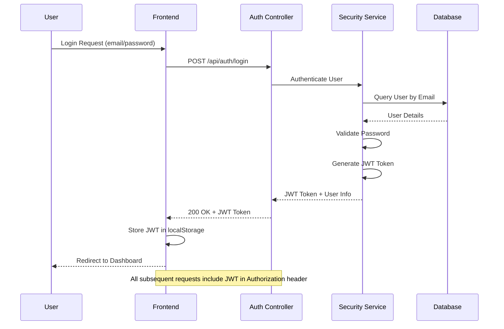
```mermaid
sequenceDiagram
    participant U as User
    participant F as Frontend
    participant A as Auth Controller
    participant S as Security Service
    participant D as Database

    U->>F: Login Request (email/password)
    F->>A: POST /api/auth/login
    A->>S: Authenticate User
    S->>D: Query User by Email
    D-->>S: User Details
    S->>S: Validate Password
    S->>S: Generate JWT Token
    S-->>A: JWT Token + User Info
    A-->>F: 200 OK + JWT Token
    F->>F: Store JWT in localStorage
    F-->>U: Redirect to Dashboard
    
    Note over F,A: All subsequent requests include JWT in Authorization header
```

---

### Pet Management Flow

<b>Click to view Pet Management Flow Diagrams</b>

##### Create a Pet Flow
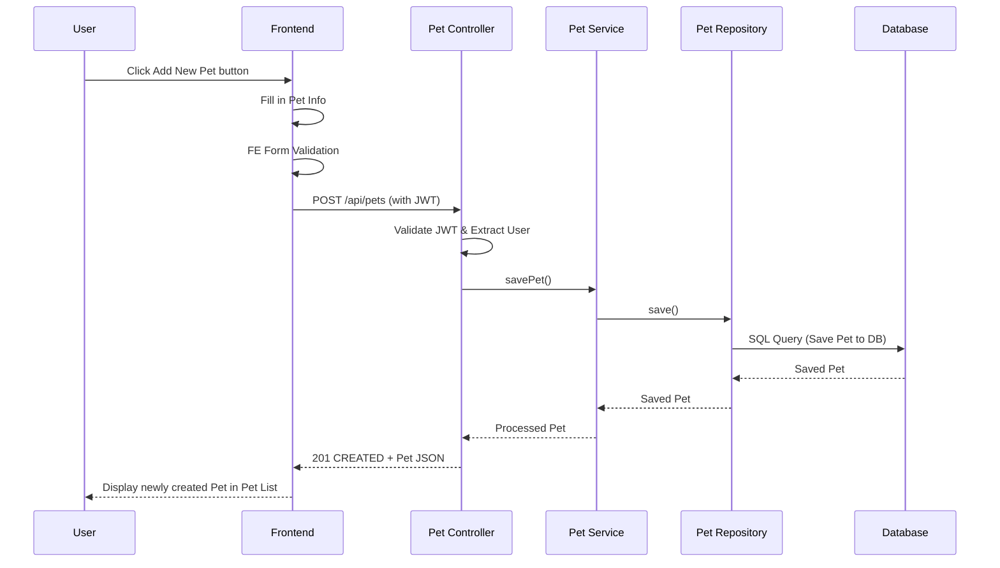
```mermaid
sequenceDiagram
    participant U as User
    participant F as Frontend
    participant P as Pet Controller
    participant S as Pet Service
    participant R as Pet Repository
    participant D as Database

    U->>F: Click Add New Pet button
    F->>F: Fill in Pet Info
    F->>F: FE Form Validation
    F->>P: POST /api/pets (with JWT)
    P->>P: Validate JWT & Extract User
    P->>S: savePet()
    S->>R: save()
    R->>D: SQL Query (Save Pet to DB)
    D-->>R: Saved Pet
    R-->>S: Saved Pet
    S-->>P: Processed Pet
    P-->>F: 201 CREATED + Pet JSON
    F-->>U: Display newly created Pet in Pet List
    
```

##### Update Pet Flow
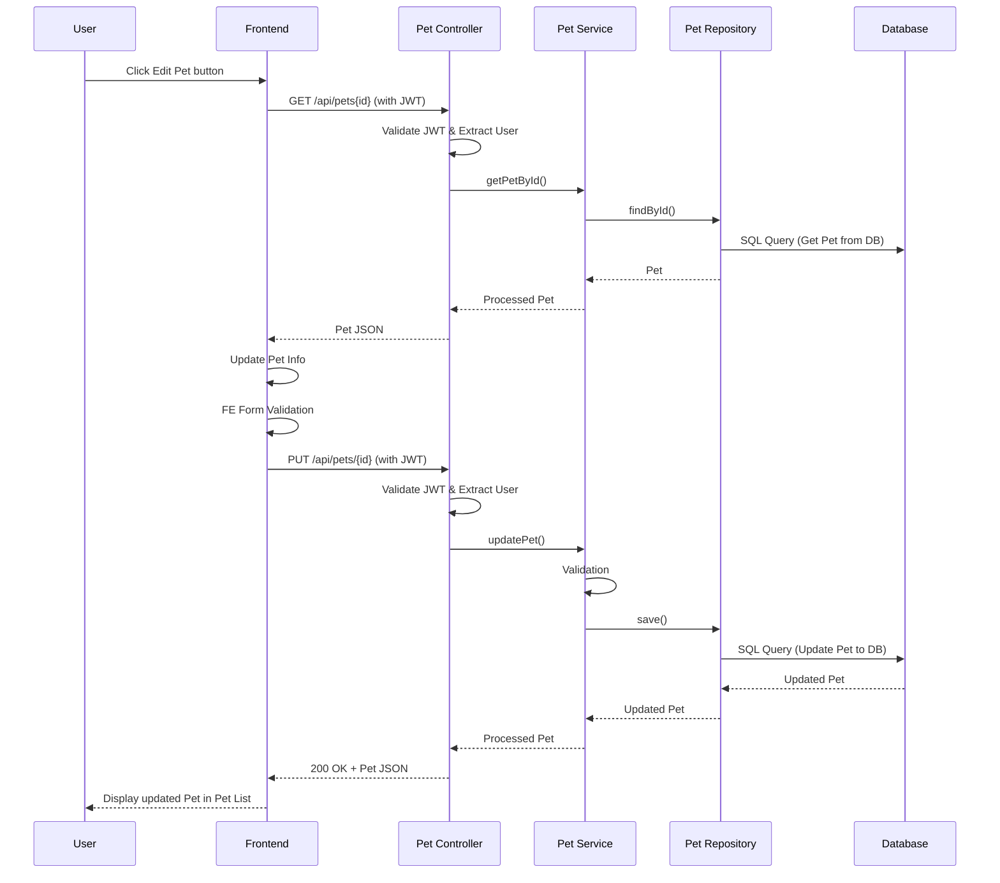
```mermaid
sequenceDiagram
    participant U as User
    participant F as Frontend
    participant P as Pet Controller
    participant S as Pet Service
    participant R as Pet Repository
    participant D as Database

    U->>F: Click Edit Pet button
    F->>P: GET /api/pets{id} (with JWT)
    P->>P: Validate JWT & Extract User
    P->>S: getPetById()
    S->>R: findById()
    R->>D: SQL Query (Get Pet from DB)
    R-->>S: Pet
    S-->>P: Processed Pet
    P-->>F: Pet JSON
    F->>F: Update Pet Info
    F->>F: FE Form Validation
    F->>P: PUT /api/pets/{id} (with JWT)
    P->>P: Validate JWT & Extract User
    P->>S: updatePet()
    S->>S: Validation
    S->>R: save()
    R->>D: SQL Query (Update Pet to DB)
    D-->>R: Updated Pet
    R-->>S: Updated Pet
    S-->>P: Processed Pet
    P-->>F: 200 OK + Pet JSON
    F-->>U: Display updated Pet in Pet List
    
```

##### View Pets/My Pets Flow
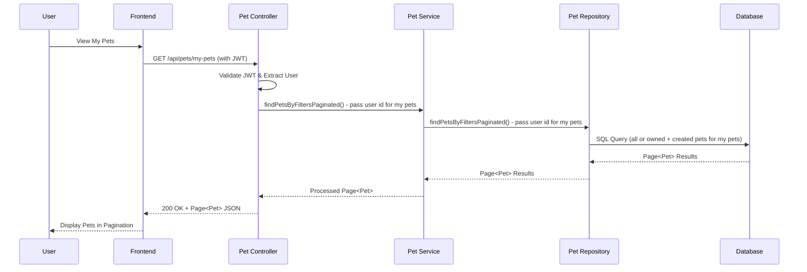
```mermaid
sequenceDiagram
    participant U as User
    participant F as Frontend
    participant P as Pet Controller
    participant S as Pet Service
    participant R as Pet Repository
    participant D as Database

    U->>F: View My Pets
    F->>P: GET /api/pets/my-pets (with JWT)
    P->>P: Validate JWT & Extract User
    P->>S: findPetsByFiltersPaginated() - pass user id for my pets
    S->>R: findPetsByFiltersPaginated() - pass user id for my pets
    R->>D: SQL Query (all or owned + created pets for my pets)
    D-->>R: Page<Pet> Results
    R-->>S: Page<Pet> Results
    S-->>P: Processed Page<Pet>
    P-->>F: 200 OK + Page<Pet> JSON
    F-->>U: Display Pets in Pagination
    
```

##### Delete Pet Flow
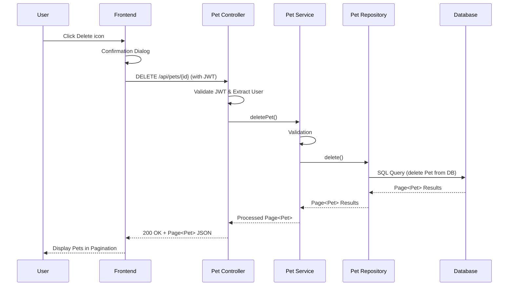
```mermaid
sequenceDiagram
    participant U as User
    participant F as Frontend
    participant P as Pet Controller
    participant S as Pet Service
    participant R as Pet Repository
    participant D as Database

    U->>F: Click Delete icon
    F->>F: Confirmation Dialog
    F->>P: DELETE /api/pets/{id} (with JWT)
    P->>P: Validate JWT & Extract User
    P->>S: deletePet()
    S->>S: Validation 
    S->>R: delete()
    R->>D: SQL Query (delete Pet from DB)
    D-->>R: Page<Pet> Results
    R-->>S: Page<Pet> Results
    S-->>P: Processed Page<Pet>
    P-->>F: 200 OK + Page<Pet> JSON
    F-->>U: Display Pets in Pagination
    
```

---

### Category Management Flow

<b>Click to view Category Management Flow Diagrams</b>

##### View All Categories Flow
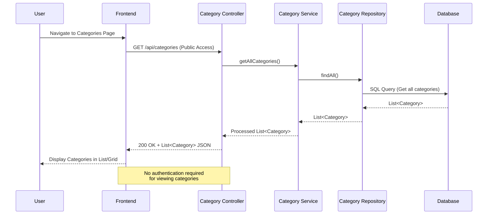
```mermaid
sequenceDiagram
    participant U as User
    participant F as Frontend
    participant C as Category Controller
    participant S as Category Service
    participant R as Category Repository
    participant D as Database

    U->>F: Navigate to Categories Page
    F->>C: GET /api/categories (Public Access)
    C->>S: getAllCategories()
    S->>R: findAll()
    R->>D: SQL Query (Get all categories)
    D-->>R: List<Category>
    R-->>S: List<Category>
    S-->>C: Processed List<Category>
    C-->>F: 200 OK + List<Category> JSON
    F-->>U: Display Categories in List/Grid
    
    Note over F,C: No authentication required<br/>for viewing categories
```

##### Get Category by ID Flow
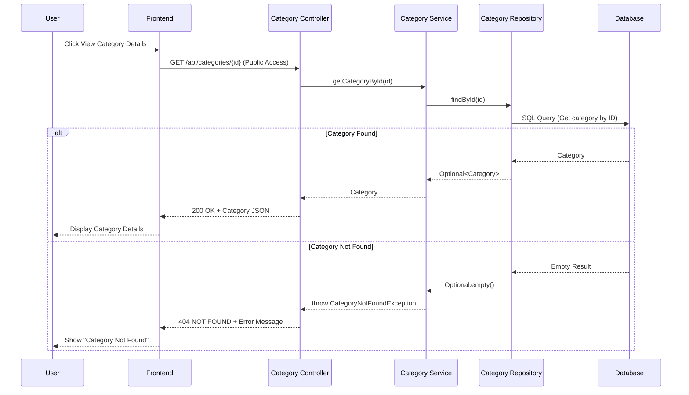
```mermaid
sequenceDiagram
    participant U as User
    participant F as Frontend
    participant C as Category Controller
    participant S as Category Service
    participant R as Category Repository
    participant D as Database

    U->>F: Click View Category Details
    F->>C: GET /api/categories/{id} (Public Access)
    C->>S: getCategoryById(id)
    S->>R: findById(id)
    R->>D: SQL Query (Get category by ID)
    
    alt Category Found
        D-->>R: Category
        R-->>S: Optional<Category>
        S-->>C: Category
        C-->>F: 200 OK + Category JSON
        F-->>U: Display Category Details
    else Category Not Found
        D-->>R: Empty Result
        R-->>S: Optional.empty()
        S-->>C: throw CategoryNotFoundException
        C-->>F: 404 NOT FOUND + Error Message
        F-->>U: Show "Category Not Found"
    end
```

##### Create Category Flow (Admin Only)
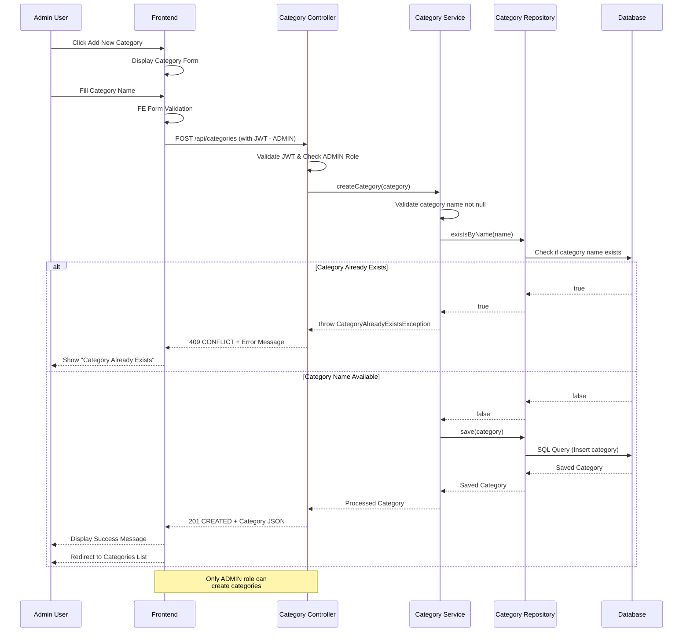
```mermaid
sequenceDiagram
    participant A as Admin User
    participant F as Frontend
    participant C as Category Controller
    participant S as Category Service
    participant R as Category Repository
    participant D as Database

    A->>F: Click Add New Category
    F->>F: Display Category Form
    A->>F: Fill Category Name
    F->>F: FE Form Validation
    F->>C: POST /api/categories (with JWT - ADMIN)
    C->>C: Validate JWT & Check ADMIN Role
    C->>S: createCategory(category)
    S->>S: Validate category name not null
    S->>R: existsByName(name)
    R->>D: Check if category name exists
    
    alt Category Already Exists
        D-->>R: true
        R-->>S: true
        S-->>C: throw CategoryAlreadyExistsException
        C-->>F: 409 CONFLICT + Error Message
        F-->>A: Show "Category Already Exists"
    else Category Name Available
        D-->>R: false
        R-->>S: false
        S->>R: save(category)
        R->>D: SQL Query (Insert category)
        D-->>R: Saved Category
        R-->>S: Saved Category
        S-->>C: Processed Category
        C-->>F: 201 CREATED + Category JSON
        F-->>A: Display Success Message
        F-->>A: Redirect to Categories List
    end
    
    Note over F,C: Only ADMIN role can<br/>create categories
```

##### Update Category Flow (Admin Only)
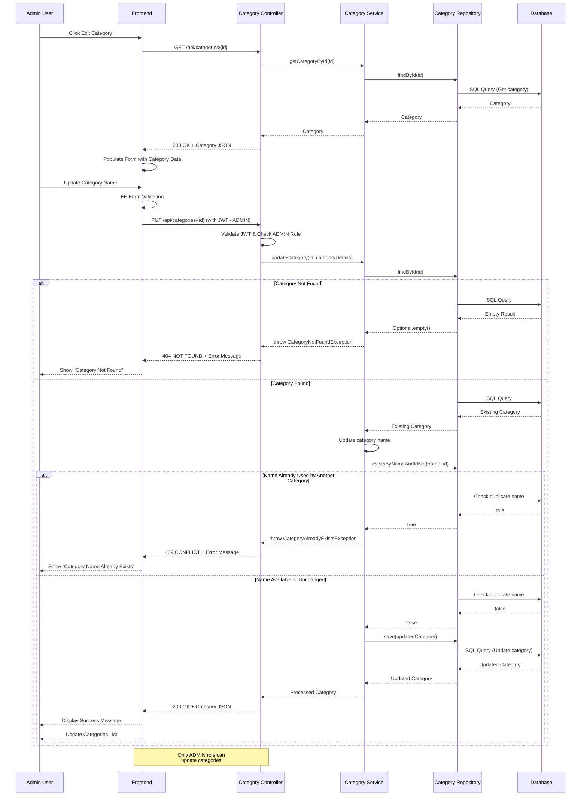
```mermaid
sequenceDiagram
    participant A as Admin User
    participant F as Frontend
    participant C as Category Controller
    participant S as Category Service
    participant R as Category Repository
    participant D as Database

    A->>F: Click Edit Category
    F->>C: GET /api/categories/{id}
    C->>S: getCategoryById(id)
    S->>R: findById(id)
    R->>D: SQL Query (Get category)
    D-->>R: Category
    R-->>S: Category
    S-->>C: Category
    C-->>F: 200 OK + Category JSON
    F->>F: Populate Form with Category Data
    
    A->>F: Update Category Name
    F->>F: FE Form Validation
    F->>C: PUT /api/categories/{id} (with JWT - ADMIN)
    C->>C: Validate JWT & Check ADMIN Role
    C->>S: updateCategory(id, categoryDetails)
    S->>R: findById(id)
    
    alt Category Not Found
        R->>D: SQL Query
        D-->>R: Empty Result
        R-->>S: Optional.empty()
        S-->>C: throw CategoryNotFoundException
        C-->>F: 404 NOT FOUND + Error Message
        F-->>A: Show "Category Not Found"
    else Category Found
        R->>D: SQL Query
        D-->>R: Existing Category
        R-->>S: Existing Category
        S->>S: Update category name
        S->>R: existsByNameAndIdNot(name, id)
        
        alt Name Already Used by Another Category
            R->>D: Check duplicate name
            D-->>R: true
            R-->>S: true
            S-->>C: throw CategoryAlreadyExistsException
            C-->>F: 409 CONFLICT + Error Message
            F-->>A: Show "Category Name Already Exists"
        else Name Available or Unchanged
            R->>D: Check duplicate name
            D-->>R: false
            R-->>S: false
            S->>R: save(updatedCategory)
            R->>D: SQL Query (Update category)
            D-->>R: Updated Category
            R-->>S: Updated Category
            S-->>C: Processed Category
            C-->>F: 200 OK + Category JSON
            F-->>A: Display Success Message
            F-->>A: Update Categories List
        end
    end
    
    Note over F,C: Only ADMIN role can<br/>update categories
```

##### Delete Category Flow (Admin Only)
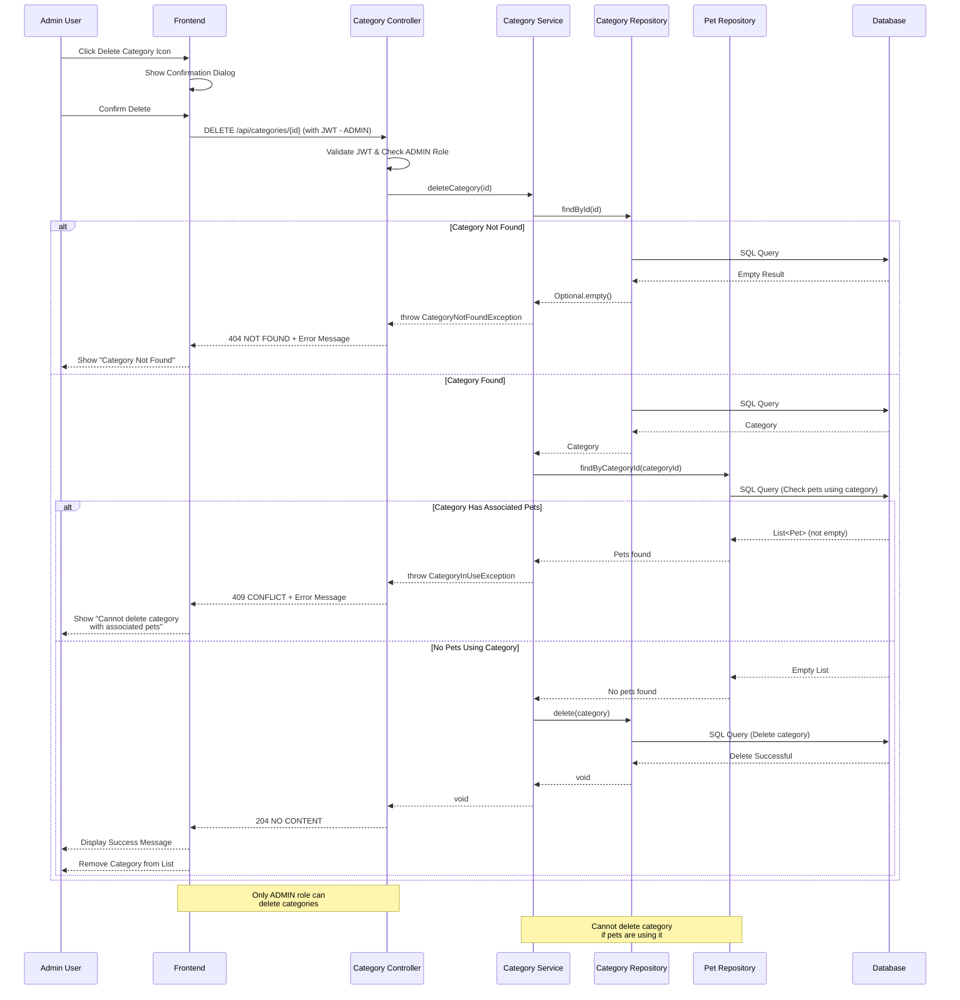
```mermaid
sequenceDiagram
    participant A as Admin User
    participant F as Frontend
    participant C as Category Controller
    participant S as Category Service
    participant R as Category Repository
    participant PR as Pet Repository
    participant D as Database

    A->>F: Click Delete Category Icon
    F->>F: Show Confirmation Dialog
    A->>F: Confirm Delete
    F->>C: DELETE /api/categories/{id} (with JWT - ADMIN)
    C->>C: Validate JWT & Check ADMIN Role
    C->>S: deleteCategory(id)
    S->>R: findById(id)
    
    alt Category Not Found
        R->>D: SQL Query
        D-->>R: Empty Result
        R-->>S: Optional.empty()
        S-->>C: throw CategoryNotFoundException
        C-->>F: 404 NOT FOUND + Error Message
        F-->>A: Show "Category Not Found"
    else Category Found
        R->>D: SQL Query
        D-->>R: Category
        R-->>S: Category
        S->>PR: findByCategoryId(categoryId)
        PR->>D: SQL Query (Check pets using category)
        
        alt Category Has Associated Pets
            D-->>PR: List<Pet> (not empty)
            PR-->>S: Pets found
            S-->>C: throw CategoryInUseException
            C-->>F: 409 CONFLICT + Error Message
            F-->>A: Show "Cannot delete category<br/>with associated pets"
        else No Pets Using Category
            D-->>PR: Empty List
            PR-->>S: No pets found
            S->>R: delete(category)
            R->>D: SQL Query (Delete category)
            D-->>R: Delete Successful
            R-->>S: void
            S-->>C: void
            C-->>F: 204 NO CONTENT
            F-->>A: Display Success Message
            F-->>A: Remove Category from List
        end
    end
    
    Note over F,C: Only ADMIN role can<br/>delete categories
    Note over S,PR: Cannot delete category<br/>if pets are using it
```

---

### User Management Flow

<b>Click to view User Management Flow Diagrams</b>

##### User Registration Flow
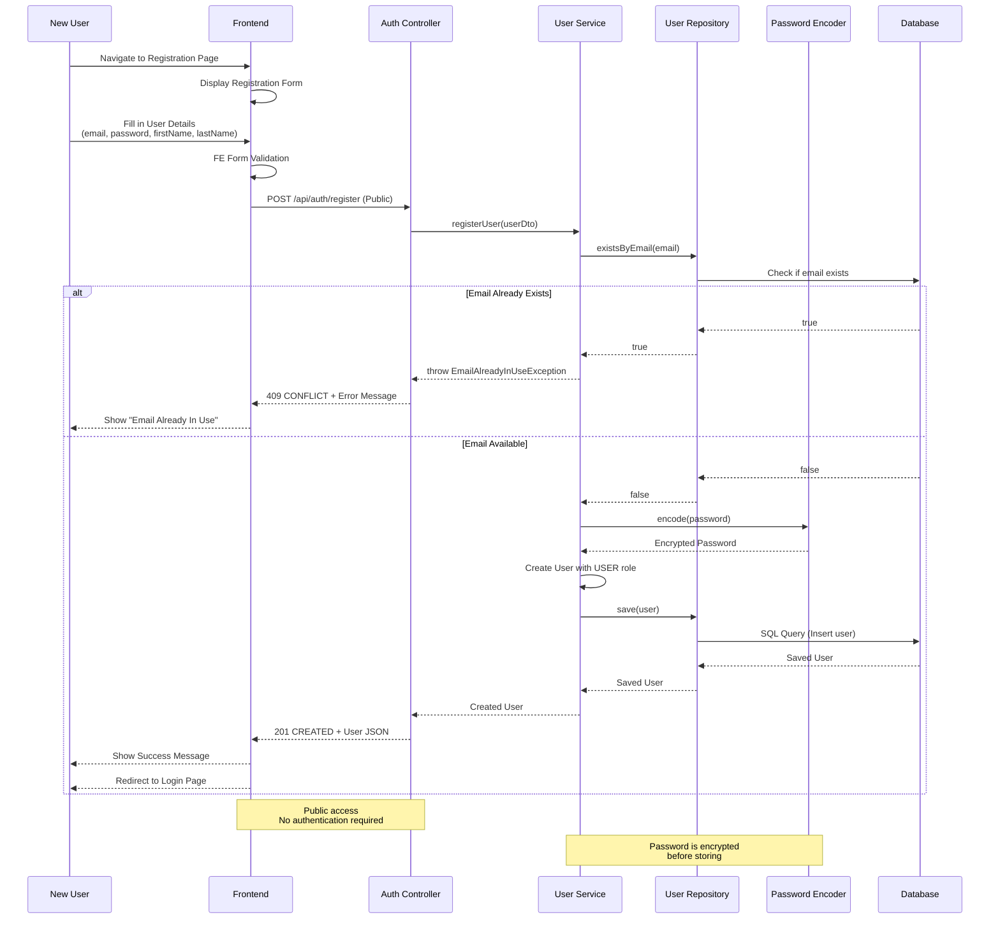
```mermaid
sequenceDiagram
    participant U as New User
    participant F as Frontend
    participant A as Auth Controller
    participant S as User Service
    participant R as User Repository
    participant P as Password Encoder
    participant D as Database

    U->>F: Navigate to Registration Page
    F->>F: Display Registration Form
    U->>F: Fill in User Details<br/>(email, password, firstName, lastName)
    F->>F: FE Form Validation
    F->>A: POST /api/auth/register (Public)
    A->>S: registerUser(userDto)
    S->>R: existsByEmail(email)
    R->>D: Check if email exists
    
    alt Email Already Exists
        D-->>R: true
        R-->>S: true
        S-->>A: throw EmailAlreadyInUseException
        A-->>F: 409 CONFLICT + Error Message
        F-->>U: Show "Email Already In Use"
    else Email Available
        D-->>R: false
        R-->>S: false
        S->>P: encode(password)
        P-->>S: Encrypted Password
        S->>S: Create User with USER role
        S->>R: save(user)
        R->>D: SQL Query (Insert user)
        D-->>R: Saved User
        R-->>S: Saved User
        S-->>A: Created User
        A-->>F: 201 CREATED + User JSON
        F-->>U: Show Success Message
        F-->>U: Redirect to Login Page
    end
    
    Note over F,A: Public access<br/>No authentication required
    Note over S,P: Password is encrypted<br/>before storing
```

##### View All Users Flow (Admin Only)
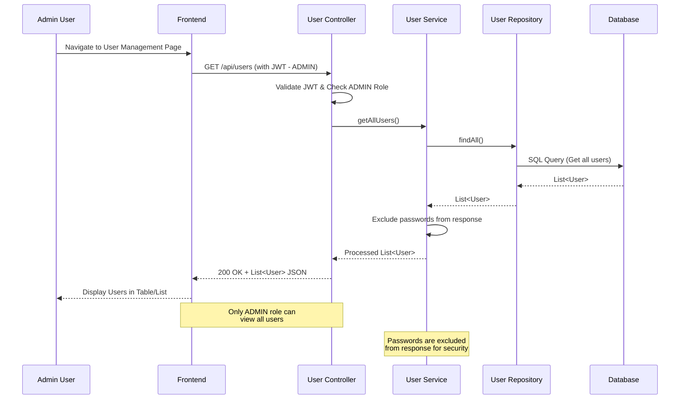
```mermaid
sequenceDiagram
    participant A as Admin User
    participant F as Frontend
    participant C as User Controller
    participant S as User Service
    participant R as User Repository
    participant D as Database

    A->>F: Navigate to User Management Page
    F->>C: GET /api/users (with JWT - ADMIN)
    C->>C: Validate JWT & Check ADMIN Role
    C->>S: getAllUsers()
    S->>R: findAll()
    R->>D: SQL Query (Get all users)
    D-->>R: List<User>
    R-->>S: List<User>
    S->>S: Exclude passwords from response
    S-->>C: Processed List<User>
    C-->>F: 200 OK + List<User> JSON
    F-->>A: Display Users in Table/List
    
    Note over F,C: Only ADMIN role can<br/>view all users
    Note over S: Passwords are excluded<br/>from response for security
```

##### Get User by ID Flow
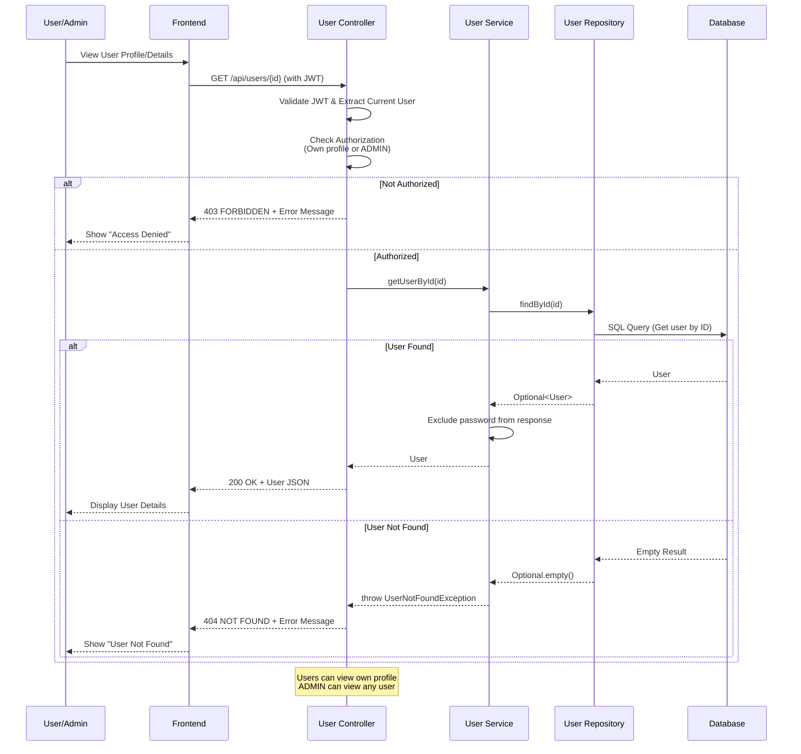
```mermaid
sequenceDiagram
    participant U as User/Admin
    participant F as Frontend
    participant C as User Controller
    participant S as User Service
    participant R as User Repository
    participant D as Database

    U->>F: View User Profile/Details
    F->>C: GET /api/users/{id} (with JWT)
    C->>C: Validate JWT & Extract Current User
    C->>C: Check Authorization<br/>(Own profile or ADMIN)
    
    alt Not Authorized
        C-->>F: 403 FORBIDDEN + Error Message
        F-->>U: Show "Access Denied"
    else Authorized
        C->>S: getUserById(id)
        S->>R: findById(id)
        R->>D: SQL Query (Get user by ID)
        
        alt User Found
            D-->>R: User
            R-->>S: Optional<User>
            S->>S: Exclude password from response
            S-->>C: User
            C-->>F: 200 OK + User JSON
            F-->>U: Display User Details
        else User Not Found
            D-->>R: Empty Result
            R-->>S: Optional.empty()
            S-->>C: throw UserNotFoundException
            C-->>F: 404 NOT FOUND + Error Message
            F-->>U: Show "User Not Found"
        end
    end
    
    Note over C: Users can view own profile<br/>ADMIN can view any user
```

##### Update User Profile Flow
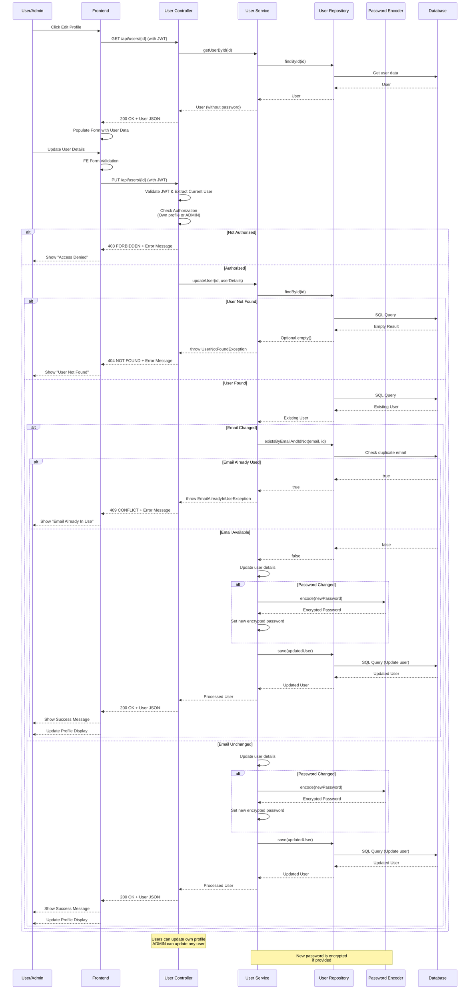
```mermaid
sequenceDiagram
    participant U as User/Admin
    participant F as Frontend
    participant C as User Controller
    participant S as User Service
    participant R as User Repository
    participant P as Password Encoder
    participant D as Database

    U->>F: Click Edit Profile
    F->>C: GET /api/users/{id} (with JWT)
    C->>S: getUserById(id)
    S->>R: findById(id)
    R->>D: Get user data
    D-->>R: User
    R-->>S: User
    S-->>C: User (without password)
    C-->>F: 200 OK + User JSON
    F->>F: Populate Form with User Data
    
    U->>F: Update User Details
    F->>F: FE Form Validation
    F->>C: PUT /api/users/{id} (with JWT)
    C->>C: Validate JWT & Extract Current User
    C->>C: Check Authorization<br/>(Own profile or ADMIN)
    
    alt Not Authorized
        C-->>F: 403 FORBIDDEN + Error Message
        F-->>U: Show "Access Denied"
    else Authorized
        C->>S: updateUser(id, userDetails)
        S->>R: findById(id)
        
        alt User Not Found
            R->>D: SQL Query
            D-->>R: Empty Result
            R-->>S: Optional.empty()
            S-->>C: throw UserNotFoundException
            C-->>F: 404 NOT FOUND + Error Message
            F-->>U: Show "User Not Found"
        else User Found
            R->>D: SQL Query
            D-->>R: Existing User
            R-->>S: Existing User
            
            alt Email Changed
                S->>R: existsByEmailAndIdNot(email, id)
                R->>D: Check duplicate email
                
                alt Email Already Used
                    D-->>R: true
                    R-->>S: true
                    S-->>C: throw EmailAlreadyInUseException
                    C-->>F: 409 CONFLICT + Error Message
                    F-->>U: Show "Email Already In Use"
                else Email Available
                    D-->>R: false
                    R-->>S: false
                    S->>S: Update user details
                    
                    alt Password Changed
                        S->>P: encode(newPassword)
                        P-->>S: Encrypted Password
                        S->>S: Set new encrypted password
                    end
                    
                    S->>R: save(updatedUser)
                    R->>D: SQL Query (Update user)
                    D-->>R: Updated User
                    R-->>S: Updated User
                    S-->>C: Processed User
                    C-->>F: 200 OK + User JSON
                    F-->>U: Show Success Message
                    F-->>U: Update Profile Display
                end
            else Email Unchanged
                S->>S: Update user details
                
                alt Password Changed
                    S->>P: encode(newPassword)
                    P-->>S: Encrypted Password
                    S->>S: Set new encrypted password
                end
                
                S->>R: save(updatedUser)
                R->>D: SQL Query (Update user)
                D-->>R: Updated User
                R-->>S: Updated User
                S-->>C: Processed User
                C-->>F: 200 OK + User JSON
                F-->>U: Show Success Message
                F-->>U: Update Profile Display
            end
        end
    end
    
    Note over C: Users can update own profile<br/>ADMIN can update any user
    Note over S,P: New password is encrypted<br/>if provided
```

##### Delete User Flow (Admin Only)
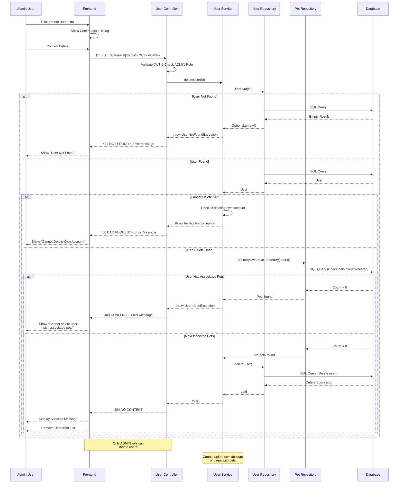
```mermaid
sequenceDiagram
    participant A as Admin User
    participant F as Frontend
    participant C as User Controller
    participant S as User Service
    participant R as User Repository
    participant PR as Pet Repository
    participant D as Database

    A->>F: Click Delete User Icon
    F->>F: Show Confirmation Dialog
    A->>F: Confirm Delete
    F->>C: DELETE /api/users/{id} (with JWT - ADMIN)
    C->>C: Validate JWT & Check ADMIN Role
    C->>S: deleteUser(id)
    S->>R: findById(id)
    
    alt User Not Found
        R->>D: SQL Query
        D-->>R: Empty Result
        R-->>S: Optional.empty()
        S-->>C: throw UserNotFoundException
        C-->>F: 404 NOT FOUND + Error Message
        F-->>A: Show "User Not Found"
    else User Found
        R->>D: SQL Query
        D-->>R: User
        R-->>S: User
        
        alt Cannot Delete Self
            S->>S: Check if deleting own account
            S-->>C: throw InvalidUserException
            C-->>F: 400 BAD REQUEST + Error Message
            F-->>A: Show "Cannot Delete Own Account"
        else Can Delete User
            S->>PR: countByOwnerOrCreatedBy(userId)
            PR->>D: SQL Query (Check pets owned/created)
            
            alt User Has Associated Pets
                D-->>PR: Count > 0
                PR-->>S: Pets found
                S-->>C: throw UserInUseException
                C-->>F: 409 CONFLICT + Error Message
                F-->>A: Show "Cannot delete user<br/>with associated pets"
            else No Associated Pets
                D-->>PR: Count = 0
                PR-->>S: No pets found
                S->>R: delete(user)
                R->>D: SQL Query (Delete user)
                D-->>R: Delete Successful
                R-->>S: void
                S-->>C: void
                C-->>F: 204 NO CONTENT
                F-->>A: Display Success Message
                F-->>A: Remove User from List
            end
        end
    end
    
    Note over F,C: Only ADMIN role can<br/>delete users
    Note over S: Cannot delete own account<br/>or users with pets
```

##### Change User Role Flow (Admin Only)
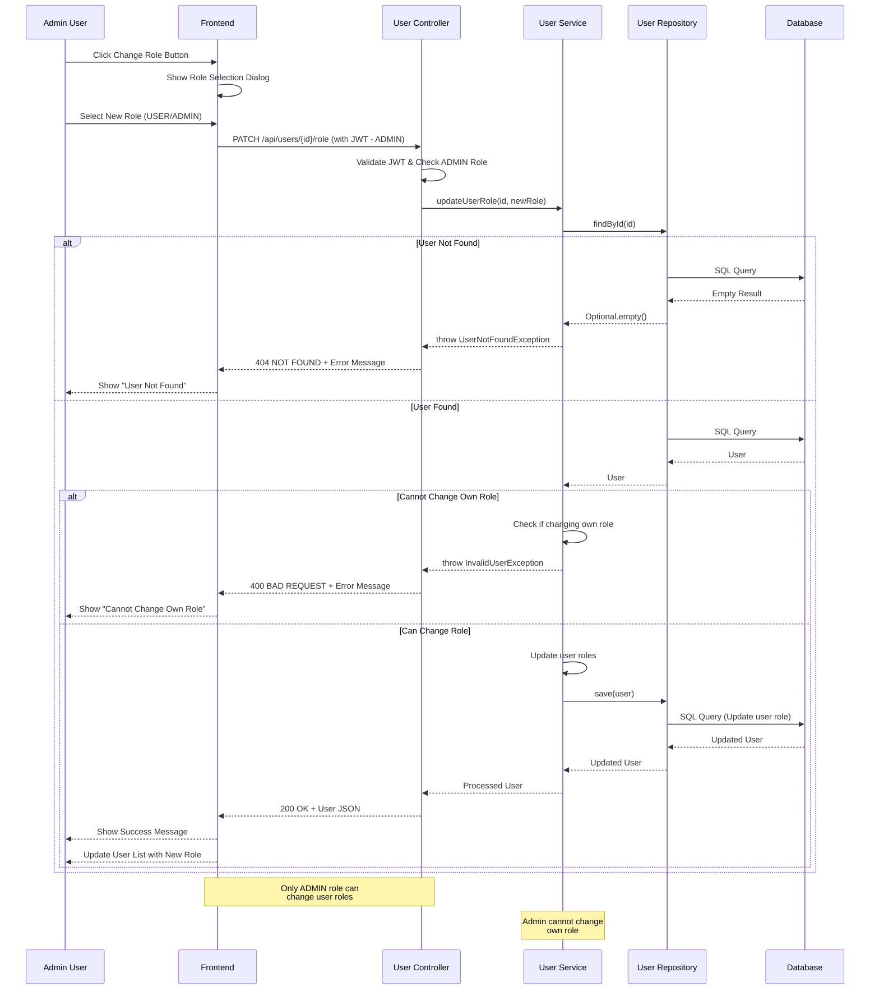
```mermaid
sequenceDiagram
    participant A as Admin User
    participant F as Frontend
    participant C as User Controller
    participant S as User Service
    participant R as User Repository
    participant D as Database

    A->>F: Click Change Role Button
    F->>F: Show Role Selection Dialog
    A->>F: Select New Role (USER/ADMIN)
    F->>C: PATCH /api/users/{id}/role (with JWT - ADMIN)
    C->>C: Validate JWT & Check ADMIN Role
    C->>S: updateUserRole(id, newRole)
    S->>R: findById(id)
    
    alt User Not Found
        R->>D: SQL Query
        D-->>R: Empty Result
        R-->>S: Optional.empty()
        S-->>C: throw UserNotFoundException
        C-->>F: 404 NOT FOUND + Error Message
        F-->>A: Show "User Not Found"
    else User Found
        R->>D: SQL Query
        D-->>R: User
        R-->>S: User
        
        alt Cannot Change Own Role
            S->>S: Check if changing own role
            S-->>C: throw InvalidUserException
            C-->>F: 400 BAD REQUEST + Error Message
            F-->>A: Show "Cannot Change Own Role"
        else Can Change Role
            S->>S: Update user roles
            S->>R: save(user)
            R->>D: SQL Query (Update user role)
            D-->>R: Updated User
            R-->>S: Updated User
            S-->>C: Processed User
            C-->>F: 200 OK + User JSON
            F-->>A: Show Success Message
            F-->>A: Update User List with New Role
        end
    end
    
    Note over F,C: Only ADMIN role can<br/>change user roles
    Note over S: Admin cannot change<br/>own role
```

---

### Store/Order Management Flow

<b>Click to view Store/Order Management Flow Diagrams</b>

##### Add Pet to Cart Flow
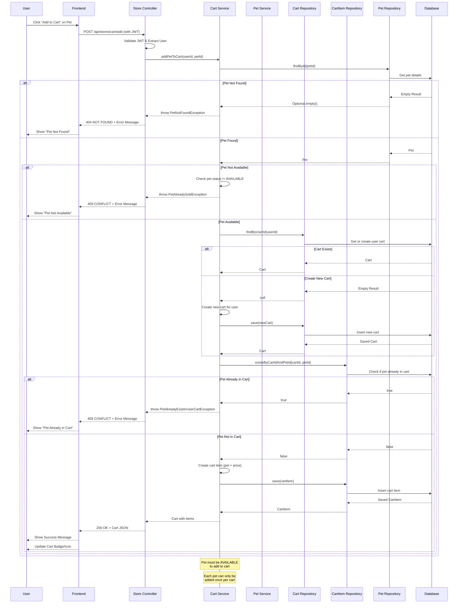
```mermaid
sequenceDiagram
    participant U as User
    participant F as Frontend
    participant SC as Store Controller
    participant CS as Cart Service
    participant PS as Pet Service
    participant CR as Cart Repository
    participant CIR as CartItem Repository
    participant PR as Pet Repository
    participant D as Database

    U->>F: Click "Add to Cart" on Pet
    F->>SC: POST /api/stores/cart/add (with JWT)
    SC->>SC: Validate JWT & Extract User
    SC->>CS: addPetToCart(userId, petId)
    CS->>PR: findById(petId)
    PR->>D: Get pet details
    
    alt Pet Not Found
        D-->>PR: Empty Result
        PR-->>CS: Optional.empty()
        CS-->>SC: throw PetNotFoundException
        SC-->>F: 404 NOT FOUND + Error Message
        F-->>U: Show "Pet Not Found"
    else Pet Found
        D-->>PR: Pet
        PR-->>CS: Pet
        
        alt Pet Not Available
            CS->>CS: Check pet status != AVAILABLE
            CS-->>SC: throw PetAlreadySoldException
            SC-->>F: 409 CONFLICT + Error Message
            F-->>U: Show "Pet Not Available"
        else Pet Available
            CS->>CR: findByUserId(userId)
            CR->>D: Get or create user cart
            
            alt Cart Exists
                D-->>CR: Cart
                CR-->>CS: Cart
            else Create New Cart
                D-->>CR: Empty Result
                CR-->>CS: null
                CS->>CS: Create new cart for user
                CS->>CR: save(newCart)
                CR->>D: Insert new cart
                D-->>CR: Saved Cart
                CR-->>CS: Cart
            end
            
            CS->>CIR: existsByCartIdAndPetId(cartId, petId)
            CIR->>D: Check if pet already in cart
            
            alt Pet Already in Cart
                D-->>CIR: true
                CIR-->>CS: true
                CS-->>SC: throw PetAlreadyExistInUserCartException
                SC-->>F: 409 CONFLICT + Error Message
                F-->>U: Show "Pet Already in Cart"
            else Pet Not in Cart
                D-->>CIR: false
                CIR-->>CS: false
                CS->>CS: Create cart item (pet + price)
                CS->>CIR: save(cartItem)
                CIR->>D: Insert cart item
                D-->>CIR: Saved CartItem
                CIR-->>CS: CartItem
                CS-->>SC: Cart with items
                SC-->>F: 200 OK + Cart JSON
                F-->>U: Show Success Message
                F-->>U: Update Cart Badge/Icon
            end
        end
    end
    
    Note over CS: Pet must be AVAILABLE<br/>to add to cart
    Note over CS: Each pet can only be<br/>added once per cart
```

##### View Cart Flow
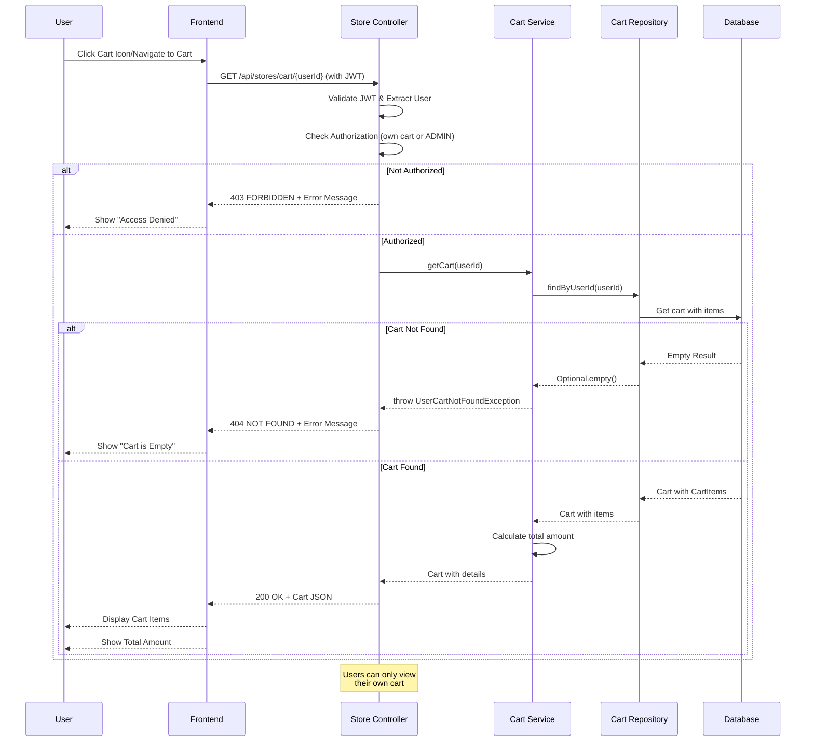
```mermaid
sequenceDiagram
    participant U as User
    participant F as Frontend
    participant SC as Store Controller
    participant CS as Cart Service
    participant CR as Cart Repository
    participant D as Database

    U->>F: Click Cart Icon/Navigate to Cart
    F->>SC: GET /api/stores/cart/{userId} (with JWT)
    SC->>SC: Validate JWT & Extract User
    SC->>SC: Check Authorization (own cart or ADMIN)
    
    alt Not Authorized
        SC-->>F: 403 FORBIDDEN + Error Message
        F-->>U: Show "Access Denied"
    else Authorized
        SC->>CS: getCart(userId)
        CS->>CR: findByUserId(userId)
        CR->>D: Get cart with items
        
        alt Cart Not Found
            D-->>CR: Empty Result
            CR-->>CS: Optional.empty()
            CS-->>SC: throw UserCartNotFoundException
            SC-->>F: 404 NOT FOUND + Error Message
            F-->>U: Show "Cart is Empty"
        else Cart Found
            D-->>CR: Cart with CartItems
            CR-->>CS: Cart with items
            CS->>CS: Calculate total amount
            CS-->>SC: Cart with details
            SC-->>F: 200 OK + Cart JSON
            F-->>U: Display Cart Items
            F-->>U: Show Total Amount
        end
    end
    
    Note over SC: Users can only view<br/>their own cart
```

##### Remove Item from Cart Flow
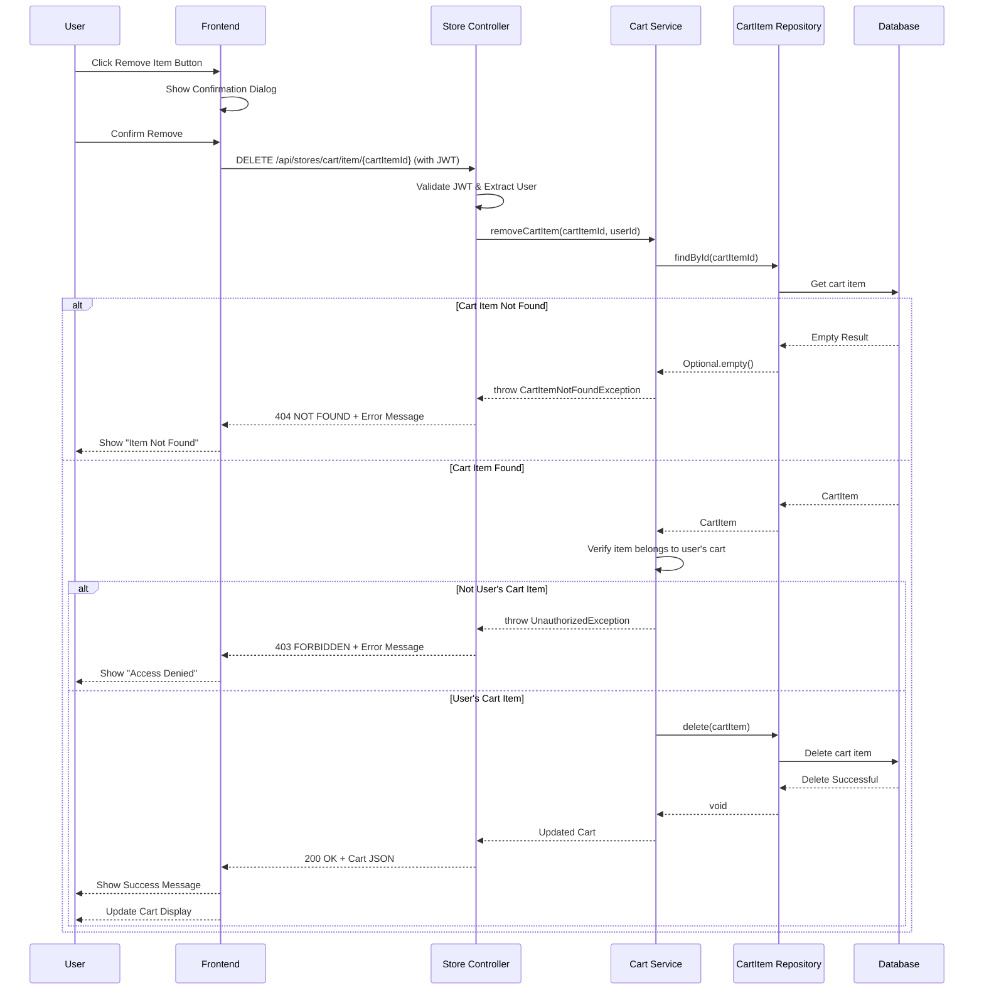
```mermaid
sequenceDiagram
    participant U as User
    participant F as Frontend
    participant SC as Store Controller
    participant CS as Cart Service
    participant CIR as CartItem Repository
    participant D as Database

    U->>F: Click Remove Item Button
    F->>F: Show Confirmation Dialog
    U->>F: Confirm Remove
    F->>SC: DELETE /api/stores/cart/item/{cartItemId} (with JWT)
    SC->>SC: Validate JWT & Extract User
    SC->>CS: removeCartItem(cartItemId, userId)
    CS->>CIR: findById(cartItemId)
    CIR->>D: Get cart item
    
    alt Cart Item Not Found
        D-->>CIR: Empty Result
        CIR-->>CS: Optional.empty()
        CS-->>SC: throw CartItemNotFoundException
        SC-->>F: 404 NOT FOUND + Error Message
        F-->>U: Show "Item Not Found"
    else Cart Item Found
        D-->>CIR: CartItem
        CIR-->>CS: CartItem
        CS->>CS: Verify item belongs to user's cart
        
        alt Not User's Cart Item
            CS-->>SC: throw UnauthorizedException
            SC-->>F: 403 FORBIDDEN + Error Message
            F-->>U: Show "Access Denied"
        else User's Cart Item
            CS->>CIR: delete(cartItem)
            CIR->>D: Delete cart item
            D-->>CIR: Delete Successful
            CIR-->>CS: void
            CS-->>SC: Updated Cart
            SC-->>F: 200 OK + Cart JSON
            F-->>U: Show Success Message
            F-->>U: Update Cart Display
        end
    end
```

##### Validate Discount Code Flow
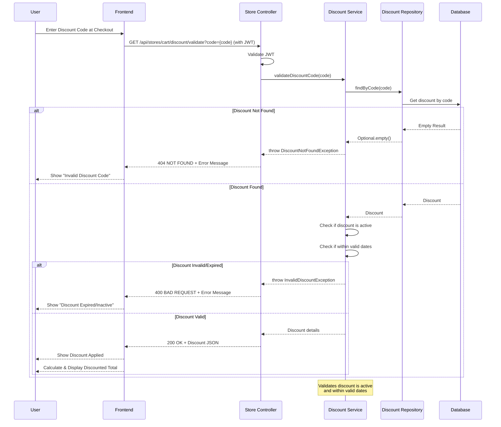
```mermaid
sequenceDiagram
    participant U as User
    participant F as Frontend
    participant SC as Store Controller
    participant DS as Discount Service
    participant DR as Discount Repository
    participant D as Database

    U->>F: Enter Discount Code at Checkout
    F->>SC: GET /api/stores/cart/discount/validate?code={code} (with JWT)
    SC->>SC: Validate JWT
    SC->>DS: validateDiscountCode(code)
    DS->>DR: findByCode(code)
    DR->>D: Get discount by code
    
    alt Discount Not Found
        D-->>DR: Empty Result
        DR-->>DS: Optional.empty()
        DS-->>SC: throw DiscountNotFoundException
        SC-->>F: 404 NOT FOUND + Error Message
        F-->>U: Show "Invalid Discount Code"
    else Discount Found
        D-->>DR: Discount
        DR-->>DS: Discount
        DS->>DS: Check if discount is active
        DS->>DS: Check if within valid dates
        
        alt Discount Invalid/Expired
            DS-->>SC: throw InvalidDiscountException
            SC-->>F: 400 BAD REQUEST + Error Message
            F-->>U: Show "Discount Expired/Inactive"
        else Discount Valid
            DS-->>SC: Discount details
            SC-->>F: 200 OK + Discount JSON
            F-->>U: Show Discount Applied
            F-->>U: Calculate & Display Discounted Total
        end
    end
    
    Note over DS: Validates discount is active<br/>and within valid dates
```

##### Checkout Flow
```mermaid
sequenceDiagram
    participant U as User
    participant F as Frontend
    participant SC as Store Controller
    participant OS as Order Service
    participant CS as Cart Service
    participant PS as Pet Service
    participant OR as Order Repository
    participant PR as Pet Repository
    participant CR as Cart Repository
    participant AR as Address Repository
    participant D as Database

    U->>F: Click Checkout Button
    F->>F: Validate Cart Not Empty
    F->>SC: POST /api/stores/checkout (with JWT)<br/>{shippingAddressId, billingAddressId, discountCode}
    SC->>SC: Validate JWT & Extract User
    SC->>OS: checkout(userId, checkoutRequest)
    OS->>CS: getCart(userId)
    CS->>CR: findByUserId(userId)
    CR->>D: Get cart with items
    
    alt Cart Empty
        D-->>CR: Empty Cart
        CR-->>CS: Cart with no items
        CS-->>OS: Empty Cart
        OS-->>SC: throw CartEmptyException
        SC-->>F: 400 BAD REQUEST + Error Message
        F-->>U: Show "Cart is Empty"
    else Cart Has Items
        D-->>CR: Cart with Items
        CR-->>CS: Cart
        CS-->>OS: Cart with items
        
        OS->>AR: findById(shippingAddressId)
        AR->>D: Get shipping address
        
        alt Address Not Found
            D-->>AR: Empty Result
            AR-->>OS: Optional.empty()
            OS-->>SC: throw AddressNotFoundException
            SC-->>F: 404 NOT FOUND + Error Message
            F-->>U: Show "Address Not Found"
        else Address Found
            D-->>AR: Address
            AR-->>OS: Shipping Address
            OS->>AR: findById(billingAddressId)
            AR->>D: Get billing address
            D-->>AR: Address
            AR-->>OS: Billing Address
            
            OS->>OS: Verify all pets still available
            loop For Each Cart Item
                OS->>PR: findById(petId)
                PR->>D: Check pet status
                
                alt Pet Not Available
                    D-->>PR: Pet (status != AVAILABLE)
                    PR-->>OS: Unavailable Pet
                    OS-->>SC: throw PetAlreadySoldException
                    SC-->>F: 409 CONFLICT + Error Message
                    F-->>U: Show "Some pets no longer available"
                end
            end
            
            opt Discount Code Provided
                OS->>OS: Validate and apply discount
            end
            
            OS->>OS: Calculate total amount
            OS->>OS: Generate order number
            OS->>OS: Create order (PLACED status)
            OS->>OS: Create order items from cart
            OS->>OS: Create payment (PENDING status)
            OS->>OS: Create delivery record
            OS->>OR: save(order)
            OR->>D: Insert order with items
            D-->>OR: Saved Order
            OR-->>OS: Order
            
            OS->>PR: Update pets status to PENDING
            PR->>D: Update pet statuses
            D-->>PR: Updated
            
            OS->>CR: Clear cart items
            CR->>D: Delete cart items
            D-->>CR: Cleared
            
            OS-->>SC: Order with details
            SC-->>F: 201 CREATED + Order JSON
            F-->>U: Show Order Confirmation
            F-->>U: Redirect to Order Details
        end
    end
    
    Note over OS: All pets must be AVAILABLE<br/>to complete checkout
    Note over OS: Cart is cleared after<br/>successful order creation
```

##### Make Payment Flow
```mermaid
sequenceDiagram
    participant U as User
    participant F as Frontend
    participant SC as Store Controller
    participant OS as Order Service
    participant OR as Order Repository
    participant PayR as Payment Repository
    participant PR as Pet Repository
    participant D as Database

    U->>F: Navigate to Order Details
    U->>F: Click Pay Now Button
    F->>F: Show Payment Form
    U->>F: Enter Payment Details<br/>(type, details)
    F->>SC: POST /api/stores/order/{orderId}/pay (with JWT)<br/>{paymentType, paymentNote}
    SC->>SC: Validate JWT & Extract User
    SC->>OS: makePayment(orderId, userId, paymentRequest)
    OS->>OR: findById(orderId)
    OR->>D: Get order
    
    alt Order Not Found
        D-->>OR: Empty Result
        OR-->>OS: Optional.empty()
        OS-->>SC: throw OrderNotFoundException
        SC-->>F: 404 NOT FOUND + Error Message
        F-->>U: Show "Order Not Found"
    else Order Found
        D-->>OR: Order
        OR-->>OS: Order
        OS->>OS: Verify order belongs to user
        
        alt Not User's Order
            OS-->>SC: throw OrderOwnershipException
            SC-->>F: 403 FORBIDDEN + Error Message
            F-->>U: Show "Access Denied"
        else User's Order
            OS->>OS: Check order status
            
            alt Order Not PLACED
                OS-->>SC: throw InvalidOrderException
                SC-->>F: 400 BAD REQUEST + Error Message
                F-->>U: Show "Order Cannot Be Paid"
            else Order is PLACED
                OS->>PayR: findByOrderId(orderId)
                PayR->>D: Get payment record
                D-->>PayR: Payment (PENDING)
                PayR-->>OS: Payment
                
                OS->>OS: Process payment (mock)
                OS->>OS: Update payment status to SUCCESS
                OS->>OS: Set payment timestamp
                OS->>PayR: save(payment)
                PayR->>D: Update payment
                D-->>PayR: Updated Payment
                
                OS->>OS: Update order status to APPROVED
                OS->>PR: Update pets status to SOLD
                OS->>PR: Set pet owner to user
                PR->>D: Update pets
                D-->>PR: Updated
                
                OS->>OR: save(order)
                OR->>D: Update order
                D-->>OR: Updated Order
                OR-->>OS: Order
                
                OS-->>SC: Payment confirmation
                SC-->>F: 200 OK + Order JSON
                F-->>U: Show Payment Success
                F-->>U: Update Order Status Display
            end
        end
    end
    
    Note over OS: Payment processing is mocked<br/>for demonstration
    Note over OS: Pets become SOLD and<br/>assigned to buyer
```

##### View Orders Flow
```mermaid
sequenceDiagram
    participant U as User/Admin
    participant F as Frontend
    participant SC as Store Controller
    participant OS as Order Service
    participant OR as Order Repository
    participant D as Database

    U->>F: Navigate to Orders Page
    F->>SC: GET /api/stores/orders (with JWT)
    SC->>SC: Validate JWT & Extract User
    SC->>SC: Check User Role
    
    alt User Role
        SC->>OS: getOrdersByUser(userId)
        OS->>OR: findByUserId(userId)
        OR->>D: Get user's orders
        D-->>OR: List<Order>
        OR-->>OS: User's Orders
        OS-->>SC: Filtered Orders
        SC-->>F: 200 OK + Orders JSON
        F-->>U: Display User's Orders
    else Admin Role
        SC->>OS: getAllOrders()
        OS->>OR: findAll()
        OR->>D: Get all orders
        D-->>OR: List<Order>
        OR-->>OS: All Orders
        OS-->>SC: All Orders
        SC-->>F: 200 OK + Orders JSON
        F-->>U: Display All Orders
    end
    
    Note over SC: Users see own orders<br/>ADMIN sees all orders
```

##### Get Order by ID Flow
```mermaid
sequenceDiagram
    participant U as User/Admin
    participant F as Frontend
    participant SC as Store Controller
    participant OS as Order Service
    participant OR as Order Repository
    participant D as Database

    U->>F: Click View Order Details
    F->>SC: GET /api/stores/order/{orderId} (with JWT)
    SC->>SC: Validate JWT & Extract User
    SC->>OS: getOrderById(orderId, userId)
    OS->>OR: findById(orderId)
    OR->>D: Get order with items
    
    alt Order Not Found
        D-->>OR: Empty Result
        OR-->>OS: Optional.empty()
        OS-->>SC: throw OrderNotFoundException
        SC-->>F: 404 NOT FOUND + Error Message
        F-->>U: Show "Order Not Found"
    else Order Found
        D-->>OR: Order with details
        OR-->>OS: Order
        OS->>OS: Verify authorization<br/>(own order or ADMIN)
        
        alt Not Authorized
            OS-->>SC: throw OrderOwnershipException
            SC-->>F: 403 FORBIDDEN + Error Message
            F-->>U: Show "Access Denied"
        else Authorized
            OS-->>SC: Order with full details
            SC-->>F: 200 OK + Order JSON
            F-->>U: Display Order Details
            F-->>U: Show Items, Payment, Delivery Info
        end
    end
```

##### Cancel Order Flow
```mermaid
sequenceDiagram
    participant U as User
    participant F as Frontend
    participant SC as Store Controller
    participant OS as Order Service
    participant OR as Order Repository
    participant PayR as Payment Repository
    participant PR as Pet Repository
    participant D as Database

    U->>F: Click Cancel Order Button
    F->>F: Show Confirmation Dialog
    U->>F: Confirm Cancellation
    F->>SC: DELETE /api/stores/order/{orderId} (with JWT)
    SC->>SC: Validate JWT & Extract User
    SC->>OS: cancelOrder(orderId, userId)
    OS->>OR: findById(orderId)
    OR->>D: Get order
    
    alt Order Not Found
        D-->>OR: Empty Result
        OR-->>OS: Optional.empty()
        OS-->>SC: throw OrderNotFoundException
        SC-->>F: 404 NOT FOUND + Error Message
        F-->>U: Show "Order Not Found"
    else Order Found
        D-->>OR: Order
        OR-->>OS: Order
        OS->>OS: Verify order belongs to user
        
        alt Not User's Order
            OS-->>SC: throw OrderOwnershipException
            SC-->>F: 403 FORBIDDEN + Error Message
            F-->>U: Show "Access Denied"
        else User's Order
            OS->>OS: Check order status
            
            alt Order Already Delivered/Cancelled
                OS-->>SC: throw InvalidOrderException
                SC-->>F: 400 BAD REQUEST + Error Message
                F-->>U: Show "Cannot Cancel Order"
            else Can Cancel
                OS->>PayR: findByOrderId(orderId)
                PayR->>D: Get payment
                D-->>PayR: Payment
                
                alt Payment Completed
                    PayR-->>OS: Payment (SUCCESS)
                    OS->>OS: Process refund (mock)
                    OS->>PayR: Update payment status to REFUNDED
                    PayR->>D: Update payment
                end
                
                OS->>OS: Update order status to CANCELLED
                OS->>PR: Restore pets status to AVAILABLE
                OS->>PR: Remove pet owner
                PR->>D: Update pets
                D-->>PR: Updated
                
                OS->>OR: save(order)
                OR->>D: Update order
                D-->>OR: Updated Order
                OR-->>OS: Cancelled Order
                
                OS-->>SC: Cancellation confirmation
                SC-->>F: 200 OK + Order JSON
                F-->>U: Show Cancellation Success
                F-->>U: Update Order List
            end
        end
    end
    
    Note over OS: Pets become AVAILABLE again<br/>after cancellation
    Note over OS: Cannot cancel DELIVERED orders
```

##### Update Delivery Status Flow (Admin Only)
```mermaid
sequenceDiagram
    participant A as Admin User
    participant F as Frontend
    participant SC as Store Controller
    participant OS as Order Service
    participant OR as Order Repository
    participant DR as Delivery Repository
    participant D as Database

    A->>F: Click Update Delivery Status
    F->>F: Show Status Selection Dialog
    A->>F: Select New Status<br/>(PENDING/SHIPPED/DELIVERED)
    F->>SC: PATCH /api/stores/order/{orderId}/delivery-status (with JWT - ADMIN)<br/>{status}
    SC->>SC: Validate JWT & Check ADMIN Role
    SC->>OS: updateDeliveryStatus(orderId, status)
    OS->>OR: findById(orderId)
    OR->>D: Get order
    
    alt Order Not Found
        D-->>OR: Empty Result
        OR-->>OS: Optional.empty()
        OS-->>SC: throw OrderNotFoundException
        SC-->>F: 404 NOT FOUND + Error Message
        F-->>A: Show "Order Not Found"
    else Order Found
        D-->>OR: Order
        OR-->>OS: Order
        OS->>DR: findByOrderId(orderId)
        DR->>D: Get delivery record
        D-->>DR: Delivery
        DR-->>OS: Delivery
        
        OS->>OS: Update delivery status
        
        alt Status = SHIPPED
            OS->>OS: Set shipped timestamp
        else Status = DELIVERED
            OS->>OS: Set delivered timestamp
            OS->>OS: Update order status to DELIVERED
        end
        
        OS->>DR: save(delivery)
        DR->>D: Update delivery
        D-->>DR: Updated Delivery
        
        opt Order DELIVERED
            OS->>OR: save(order)
            OR->>D: Update order status
        end
        
        OS-->>SC: Updated order with delivery info
        SC-->>F: 200 OK + Order JSON
        F-->>A: Show Success Message
        F-->>A: Update Order Status Display
    end
    
    Note over F,SC: Only ADMIN role can<br/>update delivery status
```

---

### Discount Management Flow

<b>Click to view Discount Management Flow Diagrams</b>

##### View All Discounts Flow
```mermaid
sequenceDiagram
    participant U as User/Admin
    participant F as Frontend
    participant DC as Discount Controller
    participant DS as Discount Service
    participant DR as Discount Repository
    participant D as Database

    U->>F: Navigate to Discounts Page
    F->>DC: GET /api/discounts (with JWT)
    DC->>DC: Validate JWT
    DC->>DS: getAllDiscounts()
    DS->>DR: findAll()
    DR->>D: Get all discounts
    D-->>DR: List<Discount>
    DR-->>DS: All Discounts
    DS->>DS: Filter active vs inactive
    DS-->>DC: List of Discounts
    DC-->>F: 200 OK + Discounts JSON
    F-->>U: Display Discount List
    F-->>U: Show codes, types, values, dates
    
    Note over F,DC: All users can view<br/>available discounts
```

##### Get Discount by ID Flow
```mermaid
sequenceDiagram
    participant U as User/Admin
    participant F as Frontend
    participant DC as Discount Controller
    participant DS as Discount Service
    participant DR as Discount Repository
    participant D as Database

    U->>F: Click View Discount Details
    F->>DC: GET /api/discounts/{id} (with JWT)
    DC->>DC: Validate JWT
    DC->>DS: getDiscountById(id)
    DS->>DR: findById(id)
    DR->>D: Get discount
    
    alt Discount Not Found
        D-->>DR: Empty Result
        DR-->>DS: Optional.empty()
        DS-->>DC: throw DiscountNotFoundException
        DC-->>F: 404 NOT FOUND + Error Message
        F-->>U: Show "Discount Not Found"
    else Discount Found
        D-->>DR: Discount
        DR-->>DS: Discount
        DS-->>DC: Discount details
        DC-->>F: 200 OK + Discount JSON
        F-->>U: Display Discount Details
        F-->>U: Show code, type, value, dates, status
    end
```

##### Create Discount Flow (Admin Only)
```mermaid
sequenceDiagram
    participant A as Admin User
    participant F as Frontend
    participant DC as Discount Controller
    participant DS as Discount Service
    participant DR as Discount Repository
    participant D as Database

    A->>F: Click Create New Discount
    F->>F: Show Discount Creation Form
    A->>F: Fill in Discount Details<br/>(code, type, value, dates)
    F->>F: Validate form data
    F->>DC: POST /api/discounts (with JWT - ADMIN)<br/>{code, type, value, validFrom, validTo}
    DC->>DC: Validate JWT & Check ADMIN Role
    
    alt Not Admin
        DC-->>F: 403 FORBIDDEN + Error Message
        F-->>A: Show "Access Denied"
    else Is Admin
        DC->>DC: Validate discount data
        
        alt Invalid Data
            DC-->>F: 400 BAD REQUEST + Validation Errors
            F-->>A: Show Validation Errors
        else Valid Data
            DC->>DS: createDiscount(discountRequest)
            DS->>DR: existsByCode(code)
            DR->>D: Check if code exists
            
            alt Code Already Exists
                D-->>DR: true
                DR-->>DS: true
                DS-->>DC: throw DuplicateDiscountCodeException
                DC-->>F: 409 CONFLICT + Error Message
                F-->>A: Show "Discount Code Already Exists"
            else Code Unique
                D-->>DR: false
                DR-->>DS: false
                DS->>DS: Validate discount type (PERCENTAGE/FIXED)
                DS->>DS: Validate value range
                DS->>DS: Validate date range (validFrom < validTo)
                
                alt Invalid Configuration
                    DS-->>DC: throw InvalidDiscountException
                    DC-->>F: 400 BAD REQUEST + Error Message
                    F-->>A: Show Error Details
                else Valid Configuration
                    DS->>DS: Create discount entity
                    DS->>DS: Set status as ACTIVE
                    DS->>DR: save(discount)
                    DR->>D: Insert discount
                    D-->>DR: Saved Discount
                    DR-->>DS: Discount
                    DS-->>DC: Created Discount
                    DC-->>F: 201 CREATED + Discount JSON
                    F-->>A: Show Success Message
                    F-->>A: Redirect to Discount List
                end
            end
        end
    end
    
    Note over F,DC: Only ADMIN role can<br/>create discounts
    Note over DS: Discount code must be unique<br/>validFrom must be before validTo
```

##### Update Discount Flow (Admin Only)
```mermaid
sequenceDiagram
    participant A as Admin User
    participant F as Frontend
    participant DC as Discount Controller
    participant DS as Discount Service
    participant DR as Discount Repository
    participant D as Database

    A->>F: Click Edit Discount
    F->>F: Load Current Discount Data
    A->>F: Modify Discount Details
    F->>DC: PUT /api/discounts/{id} (with JWT - ADMIN)<br/>{code, type, value, validFrom, validTo, status}
    DC->>DC: Validate JWT & Check ADMIN Role
    
    alt Not Admin
        DC-->>F: 403 FORBIDDEN + Error Message
        F-->>A: Show "Access Denied"
    else Is Admin
        DC->>DS: updateDiscount(id, discountRequest)
        DS->>DR: findById(id)
        DR->>D: Get discount
        
        alt Discount Not Found
            D-->>DR: Empty Result
            DR-->>DS: Optional.empty()
            DS-->>DC: throw DiscountNotFoundException
            DC-->>F: 404 NOT FOUND + Error Message
            F-->>A: Show "Discount Not Found"
        else Discount Found
            D-->>DR: Discount
            DR-->>DS: Existing Discount
            
            opt Code Changed
                DS->>DR: existsByCodeAndIdNot(newCode, id)
                DR->>D: Check if new code exists
                
                alt Code Taken
                    D-->>DR: true
                    DR-->>DS: true
                    DS-->>DC: throw DuplicateDiscountCodeException
                    DC-->>F: 409 CONFLICT + Error Message
                    F-->>A: Show "Code Already In Use"
                end
            end
            
            DS->>DS: Validate discount type
            DS->>DS: Validate value range
            DS->>DS: Validate date range
            
            alt Invalid Configuration
                DS-->>DC: throw InvalidDiscountException
                DC-->>F: 400 BAD REQUEST + Error Message
                F-->>A: Show Error Details
            else Valid Configuration
                DS->>DS: Update discount fields
                DS->>DR: save(discount)
                DR->>D: Update discount
                D-->>DR: Updated Discount
                DR-->>DS: Discount
                DS-->>DC: Updated Discount
                DC-->>F: 200 OK + Discount JSON
                F-->>A: Show Success Message
                F-->>A: Update Discount Display
            end
        end
    end
    
    Note over F,DC: Only ADMIN role can<br/>update discounts
```

##### Toggle Discount Status Flow (Admin Only)
```mermaid
sequenceDiagram
    participant A as Admin User
    participant F as Frontend
    participant DC as Discount Controller
    participant DS as Discount Service
    participant DR as Discount Repository
    participant D as Database

    A->>F: Click Activate/Deactivate Discount
    F->>F: Show Confirmation Dialog
    A->>F: Confirm Status Change
    F->>DC: PATCH /api/discounts/{id}/status (with JWT - ADMIN)<br/>{status: ACTIVE/INACTIVE}
    DC->>DC: Validate JWT & Check ADMIN Role
    
    alt Not Admin
        DC-->>F: 403 FORBIDDEN + Error Message
        F-->>A: Show "Access Denied"
    else Is Admin
        DC->>DS: toggleDiscountStatus(id)
        DS->>DR: findById(id)
        DR->>D: Get discount
        
        alt Discount Not Found
            D-->>DR: Empty Result
            DR-->>DS: Optional.empty()
            DS-->>DC: throw DiscountNotFoundException
            DC-->>F: 404 NOT FOUND + Error Message
            F-->>A: Show "Discount Not Found"
        else Discount Found
            D-->>DR: Discount
            DR-->>DS: Discount
            DS->>DS: Check current status
            
            alt Currently ACTIVE
                DS->>DS: Set status to INACTIVE
            else Currently INACTIVE
                DS->>DS: Check if dates valid
                
                alt Dates Expired
                    DS-->>DC: throw ExpiredDiscountException
                    DC-->>F: 400 BAD REQUEST + Error Message
                    F-->>A: Show "Cannot activate expired discount"
                else Dates Valid
                    DS->>DS: Set status to ACTIVE
                end
            end
            
            DS->>DR: save(discount)
            DR->>D: Update discount status
            D-->>DR: Updated Discount
            DR-->>DS: Discount
            DS-->>DC: Updated Discount
            DC-->>F: 200 OK + Discount JSON
            F-->>A: Show Status Changed
            F-->>A: Update UI Status Badge
        end
    end
    
    Note over F,DC: Only ADMIN role can<br/>toggle discount status
    Note over DS: Cannot activate expired discounts
```

##### Delete Discount Flow (Admin Only)
```mermaid
sequenceDiagram
    participant A as Admin User
    participant F as Frontend
    participant DC as Discount Controller
    participant DS as Discount Service
    participant DR as Discount Repository
    participant OR as Order Repository
    participant D as Database

    A->>F: Click Delete Discount
    F->>F: Show Confirmation Dialog
    A->>F: Confirm Deletion
    F->>DC: DELETE /api/discounts/{id} (with JWT - ADMIN)
    DC->>DC: Validate JWT & Check ADMIN Role
    
    alt Not Admin
        DC-->>F: 403 FORBIDDEN + Error Message
        F-->>A: Show "Access Denied"
    else Is Admin
        DC->>DS: deleteDiscount(id)
        DS->>DR: findById(id)
        DR->>D: Get discount
        
        alt Discount Not Found
            D-->>DR: Empty Result
            DR-->>DS: Optional.empty()
            DS-->>DC: throw DiscountNotFoundException
            DC-->>F: 404 NOT FOUND + Error Message
            F-->>A: Show "Discount Not Found"
        else Discount Found
            D-->>DR: Discount
            DR-->>DS: Discount
            DS->>OR: existsByDiscountId(id)
            OR->>D: Check if discount used in orders
            
            alt Discount In Use
                D-->>OR: true
                OR-->>DS: true
                DS-->>DC: throw DiscountInUseException
                DC-->>F: 409 CONFLICT + Error Message
                F-->>A: Show "Cannot delete discount<br/>used in existing orders"
            else Discount Not In Use
                D-->>OR: false
                OR-->>DS: false
                DS->>DR: delete(discount)
                DR->>D: Delete discount
                D-->>DR: Delete Successful
                DR-->>DS: void
                DS-->>DC: Deletion Successful
                DC-->>F: 200 OK + Success Message
                F-->>A: Show Success Message
                F-->>A: Remove from Discount List
            end
        end
    end
    
    Note over F,DC: Only ADMIN role can<br/>delete discounts
    Note over DS: Cannot delete discounts<br/>used in existing orders
```

##### Apply Discount at Checkout Flow
```mermaid
sequenceDiagram
    participant U as User
    participant F as Frontend
    participant SC as Store Controller
    participant DS as Discount Service
    participant CS as Cart Service
    participant DR as Discount Repository
    participant CR as Cart Repository
    participant D as Database

    U->>F: Enter Discount Code at Checkout
    F->>SC: POST /api/stores/cart/apply-discount (with JWT)<br/>{code}
    SC->>SC: Validate JWT & Extract User
    SC->>DS: validateAndApplyDiscount(code)
    DS->>DR: findByCode(code)
    DR->>D: Get discount by code
    
    alt Discount Not Found
        D-->>DR: Empty Result
        DR-->>DS: Optional.empty()
        DS-->>SC: throw DiscountNotFoundException
        SC-->>F: 404 NOT FOUND + Error Message
        F-->>U: Show "Invalid Discount Code"
    else Discount Found
        D-->>DR: Discount
        DR-->>DS: Discount
        DS->>DS: Check if status is ACTIVE
        
        alt Discount Inactive
            DS-->>SC: throw InactiveDiscountException
            SC-->>F: 400 BAD REQUEST + Error Message
            F-->>U: Show "Discount Code Inactive"
        else Discount Active
            DS->>DS: Check current date within valid range
            
            alt Discount Expired/Not Yet Valid
                DS-->>SC: throw ExpiredDiscountException
                SC-->>F: 400 BAD REQUEST + Error Message
                F-->>U: Show "Discount Code Expired"
            else Discount Valid
                DS->>CS: getCart(userId)
                CS->>CR: findByUserId(userId)
                CR->>D: Get cart
                D-->>CR: Cart
                CR-->>CS: Cart
                CS-->>DS: Cart details
                DS->>DS: Calculate cart subtotal
                DS->>DS: Apply discount calculation
                
                alt Discount Type = PERCENTAGE
                    DS->>DS: Calculate: subtotal * (percentage / 100)
                else Discount Type = FIXED
                    DS->>DS: Calculate: min(fixed_amount, subtotal)
                end
                
                DS->>DS: Calculate final total
                DS-->>SC: Discount applied with amounts
                SC-->>F: 200 OK + {discountAmount, finalTotal, discount}
                F-->>U: Show Discount Applied
                F-->>U: Display Original Price (struck through)
                F-->>U: Display Discount Amount (in green)
                F-->>U: Display Final Total
                F-->>U: Save discount for order creation
            end
        end
    end
    
    Note over DS: Validates discount is ACTIVE<br/>and within valid date range
    Note over DS: PERCENTAGE: % off total<br/>FIXED: fixed amount off
```

##### View Discount Usage Statistics Flow (Admin Only)
```mermaid
sequenceDiagram
    participant A as Admin User
    participant F as Frontend
    participant DC as Discount Controller
    participant DS as Discount Service
    participant DR as Discount Repository
    participant OR as Order Repository
    participant D as Database

    A->>F: Navigate to Discount Analytics
    F->>DC: GET /api/discounts/{id}/statistics (with JWT - ADMIN)
    DC->>DC: Validate JWT & Check ADMIN Role
    
    alt Not Admin
        DC-->>F: 403 FORBIDDEN + Error Message
        F-->>A: Show "Access Denied"
    else Is Admin
        DC->>DS: getDiscountStatistics(id)
        DS->>DR: findById(id)
        DR->>D: Get discount
        
        alt Discount Not Found
            D-->>DR: Empty Result
            DR-->>DS: Optional.empty()
            DS-->>DC: throw DiscountNotFoundException
            DC-->>F: 404 NOT FOUND + Error Message
            F-->>A: Show "Discount Not Found"
        else Discount Found
            D-->>DR: Discount
            DR-->>DS: Discount
            DS->>OR: countByDiscountId(id)
            OR->>D: Count orders using discount
            D-->>OR: Usage Count
            OR-->>DS: Usage Count
            
            DS->>OR: sumTotalDiscountAmount(id)
            OR->>D: Sum discount amounts
            D-->>OR: Total Discount Given
            OR-->>DS: Total Amount
            
            DS->>OR: findRecentOrdersByDiscountId(id, limit)
            OR->>D: Get recent orders
            D-->>OR: Recent Orders
            OR-->>DS: Order List
            
            DS->>DS: Calculate statistics:<br/>- Total uses<br/>- Total discount amount<br/>- Average order value<br/>- Recent usage
            DS-->>DC: Statistics Object
            DC-->>F: 200 OK + Statistics JSON
            F-->>A: Display Usage Charts
            F-->>A: Show Total Uses
            F-->>A: Show Total Discount Given
            F-->>A: Show Recent Orders Table
        end
    end
    
    Note over F,DC: Only ADMIN role can view<br/>discount statistics
```

---

### Address Management Flow

<b>Click to view Address Management Flow Diagrams</b>

##### View User Addresses Flow
```mermaid
sequenceDiagram
    participant U as User
    participant F as Frontend
    participant AC as Address Controller
    participant AS as Address Service
    participant AR as Address Repository
    participant D as Database

    U->>F: Navigate to My Addresses Page
    F->>AC: GET /api/addresses/user/{userId} (with JWT)
    AC->>AC: Validate JWT & Extract User
    AC->>AC: Verify authorization (own addresses or ADMIN)
    
    alt Not Authorized
        AC-->>F: 403 FORBIDDEN + Error Message
        F-->>U: Show "Access Denied"
    else Authorized
        AC->>AS: getUserAddresses(userId)
        AS->>AR: findByUserId(userId)
        AR->>D: Get user's addresses
        
        alt No Addresses
            D-->>AR: Empty List
            AR-->>AS: []
            AS-->>AC: Empty List
            AC-->>F: 200 OK + Empty Array
            F-->>U: Show "No Addresses Found"
            F-->>U: Display "Add New Address" Button
        else Has Addresses
            D-->>AR: List<Address>
            AR-->>AS: User's Addresses
            AS->>AS: Sort by default flag & created date
            AS-->>AC: Sorted Address List
            AC-->>F: 200 OK + Addresses JSON
            F-->>U: Display Address Cards
            F-->>U: Highlight Default Address
            F-->>U: Show Edit/Delete Options
        end
    end
    
    Note over AC: Users can only view<br/>their own addresses
```

##### Get Address by ID Flow
```mermaid
sequenceDiagram
    participant U as User
    participant F as Frontend
    participant AC as Address Controller
    participant AS as Address Service
    participant AR as Address Repository
    participant D as Database

    U->>F: Click View Address Details
    F->>AC: GET /api/addresses/{id} (with JWT)
    AC->>AC: Validate JWT & Extract User
    AC->>AS: getAddressById(id, userId)
    AS->>AR: findById(id)
    AR->>D: Get address
    
    alt Address Not Found
        D-->>AR: Empty Result
        AR-->>AS: Optional.empty()
        AS-->>AC: throw AddressNotFoundException
        AC-->>F: 404 NOT FOUND + Error Message
        F-->>U: Show "Address Not Found"
    else Address Found
        D-->>AR: Address
        AR-->>AS: Address
        AS->>AS: Verify address belongs to user<br/>(or user is ADMIN)
        
        alt Not User's Address
            AS-->>AC: throw UnauthorizedException
            AC-->>F: 403 FORBIDDEN + Error Message
            F-->>U: Show "Access Denied"
        else User's Address
            AS-->>AC: Address details
            AC-->>F: 200 OK + Address JSON
            F-->>U: Display Address Details
            F-->>U: Show Full Address Info
        end
    end
```

##### Create Address Flow
```mermaid
sequenceDiagram
    participant U as User
    participant F as Frontend
    participant AC as Address Controller
    participant AS as Address Service
    participant AR as Address Repository
    participant D as Database

    U->>F: Click Add New Address
    F->>F: Show Address Creation Form
    U->>F: Fill in Address Details<br/>(name, street, city, state, zip, country, phone)
    U->>F: Set as Default (optional)
    F->>F: Validate form data (required fields, format)
    F->>AC: POST /api/addresses (with JWT)<br/>{addressRequest}
    AC->>AC: Validate JWT & Extract User
    AC->>AC: Validate address data
    
    alt Invalid Data
        AC-->>F: 400 BAD REQUEST + Validation Errors
        F-->>U: Show Field Errors
    else Valid Data
        AC->>AS: createAddress(userId, addressRequest)
        
        opt Set as Default = true
            AS->>AR: findByUserIdAndIsDefaultTrue(userId)
            AR->>D: Get current default address
            
            alt Has Default Address
                D-->>AR: Current Default Address
                AR-->>AS: Address
                AS->>AS: Set current default to false
                AS->>AR: save(previousDefault)
                AR->>D: Update previous default
            end
        end
        
        AS->>AS: Create new address entity
        AS->>AS: Set user association
        AS->>AS: Set isDefault flag
        AS->>AR: save(address)
        AR->>D: Insert address
        D-->>AR: Saved Address
        AR-->>AS: Address
        AS-->>AC: Created Address
        AC-->>F: 201 CREATED + Address JSON
        F-->>U: Show Success Message
        F-->>U: Add to Address List
        F-->>U: Highlight if Default
    end
    
    Note over AS: Only one address can be<br/>default per user
```

##### Update Address Flow
```mermaid
sequenceDiagram
    participant U as User
    participant F as Frontend
    participant AC as Address Controller
    participant AS as Address Service
    participant AR as Address Repository
    participant D as Database

    U->>F: Click Edit Address
    F->>F: Load Current Address Data
    U->>F: Modify Address Details
    F->>F: Validate form data
    F->>AC: PUT /api/addresses/{id} (with JWT)<br/>{addressRequest}
    AC->>AC: Validate JWT & Extract User
    AC->>AS: updateAddress(id, userId, addressRequest)
    AS->>AR: findById(id)
    AR->>D: Get address
    
    alt Address Not Found
        D-->>AR: Empty Result
        AR-->>AS: Optional.empty()
        AS-->>AC: throw AddressNotFoundException
        AC-->>F: 404 NOT FOUND + Error Message
        F-->>U: Show "Address Not Found"
    else Address Found
        D-->>AR: Address
        AR-->>AS: Existing Address
        AS->>AS: Verify address belongs to user
        
        alt Not User's Address
            AS-->>AC: throw UnauthorizedException
            AC-->>F: 403 FORBIDDEN + Error Message
            F-->>U: Show "Access Denied"
        else User's Address
            opt Setting as Default
                AS->>AR: findByUserIdAndIsDefaultTrue(userId)
                AR->>D: Get current default
                
                alt Has Different Default
                    D-->>AR: Current Default
                    AR-->>AS: Address
                    AS->>AS: Set current default to false
                    AS->>AR: save(previousDefault)
                    AR->>D: Update previous default
                end
            end
            
            AS->>AS: Update address fields
            AS->>AS: Validate updated data
            
            alt Invalid Data
                AS-->>AC: throw ValidationException
                AC-->>F: 400 BAD REQUEST + Errors
                F-->>U: Show Validation Errors
            else Valid Data
                AS->>AR: save(address)
                AR->>D: Update address
                D-->>AR: Updated Address
                AR-->>AS: Address
                AS-->>AC: Updated Address
                AC-->>F: 200 OK + Address JSON
                F-->>U: Show Success Message
                F-->>U: Update Address Display
            end
        end
    end
```

##### Set Default Address Flow
```mermaid
sequenceDiagram
    participant U as User
    participant F as Frontend
    participant AC as Address Controller
    participant AS as Address Service
    participant AR as Address Repository
    participant D as Database

    U->>F: Click "Set as Default" Button
    F->>AC: PATCH /api/addresses/{id}/set-default (with JWT)
    AC->>AC: Validate JWT & Extract User
    AC->>AS: setDefaultAddress(id, userId)
    AS->>AR: findById(id)
    AR->>D: Get address
    
    alt Address Not Found
        D-->>AR: Empty Result
        AR-->>AS: Optional.empty()
        AS-->>AC: throw AddressNotFoundException
        AC-->>F: 404 NOT FOUND + Error Message
        F-->>U: Show "Address Not Found"
    else Address Found
        D-->>AR: Address
        AR-->>AS: Address
        AS->>AS: Verify address belongs to user
        
        alt Not User's Address
            AS-->>AC: throw UnauthorizedException
            AC-->>F: 403 FORBIDDEN + Error Message
            F-->>U: Show "Access Denied"
        else User's Address
            alt Already Default
                AS->>AS: Check if already default
                AS-->>AC: Address (no change)
                AC-->>F: 200 OK + Address JSON
                F-->>U: Show "Already Default Address"
            else Not Default
                AS->>AR: findByUserIdAndIsDefaultTrue(userId)
                AR->>D: Get current default address
                
                alt Has Current Default
                    D-->>AR: Current Default
                    AR-->>AS: Address
                    AS->>AS: Set current default to false
                    AS->>AR: save(previousDefault)
                    AR->>D: Update previous default
                    D-->>AR: Updated
                end
                
                AS->>AS: Set this address as default
                AS->>AR: save(address)
                AR->>D: Update address
                D-->>AR: Updated Address
                AR-->>AS: Address
                AS-->>AC: Updated Address
                AC-->>F: 200 OK + Address JSON
                F-->>U: Show Success Message
                F-->>U: Update UI (highlight new default)
            end
        end
    end
    
    Note over AS: Only one address can be<br/>default per user
```

##### Delete Address Flow
```mermaid
sequenceDiagram
    participant U as User
    participant F as Frontend
    participant AC as Address Controller
    participant AS as Address Service
    participant AR as Address Repository
    participant OR as Order Repository
    participant D as Database

    U->>F: Click Delete Address
    F->>F: Show Confirmation Dialog
    U->>F: Confirm Deletion
    F->>AC: DELETE /api/addresses/{id} (with JWT)
    AC->>AC: Validate JWT & Extract User
    AC->>AS: deleteAddress(id, userId)
    AS->>AR: findById(id)
    AR->>D: Get address
    
    alt Address Not Found
        D-->>AR: Empty Result
        AR-->>AS: Optional.empty()
        AS-->>AC: throw AddressNotFoundException
        AC-->>F: 404 NOT FOUND + Error Message
        F-->>U: Show "Address Not Found"
    else Address Found
        D-->>AR: Address
        AR-->>AS: Address
        AS->>AS: Verify address belongs to user
        
        alt Not User's Address
            AS-->>AC: throw UnauthorizedException
            AC-->>F: 403 FORBIDDEN + Error Message
            F-->>U: Show "Access Denied"
        else User's Address
            AS->>OR: existsByShippingAddressIdOrBillingAddressId(id)
            OR->>D: Check if address used in orders
            
            alt Address In Use
                D-->>OR: true
                OR-->>AS: true
                AS-->>AC: throw AddressInUseException
                AC-->>F: 409 CONFLICT + Error Message
                F-->>U: Show "Cannot delete address<br/>used in existing orders"
            else Address Not In Use
                D-->>OR: false
                OR-->>AS: false
                
                opt Is Default Address
                    AS->>AS: Check if isDefault = true
                    AS->>AR: findByUserId(userId)
                    AR->>D: Get all user addresses
                    D-->>AR: Address List
                    
                    alt Has Other Addresses
                        AS->>AS: Set first other address as default
                        AS->>AR: save(newDefault)
                        AR->>D: Update new default
                    end
                end
                
                AS->>AR: delete(address)
                AR->>D: Delete address
                D-->>AR: Delete Successful
                AR-->>AS: void
                AS-->>AC: Deletion Successful
                AC-->>F: 200 OK + Success Message
                F-->>U: Show Success Message
                F-->>U: Remove from Address List
                F-->>U: Update Default if Changed
            end
        end
    end
    
    Note over AS: Cannot delete addresses<br/>used in existing orders
    Note over AS: If deleting default, another<br/>address becomes default
```

##### Validate Address for Checkout Flow
```mermaid
sequenceDiagram
    participant U as User
    participant F as Frontend
    participant AC as Address Controller
    participant AS as Address Service
    participant AR as Address Repository
    participant D as Database

    U->>F: Proceed to Checkout
    F->>F: Load User's Addresses
    U->>F: Select Shipping Address
    U->>F: Select/Confirm Billing Address
    F->>AC: GET /api/addresses/validate/{id} (with JWT)
    AC->>AC: Validate JWT & Extract User
    AC->>AS: validateAddress(id, userId)
    AS->>AR: findById(id)
    AR->>D: Get address
    
    alt Address Not Found
        D-->>AR: Empty Result
        AR-->>AS: Optional.empty()
        AS-->>AC: throw AddressNotFoundException
        AC-->>F: 404 NOT FOUND + Error Message
        F-->>U: Show "Address Not Found"
        F-->>U: Prompt to Select Different Address
    else Address Found
        D-->>AR: Address
        AR-->>AS: Address
        AS->>AS: Verify address belongs to user
        
        alt Not User's Address
            AS-->>AC: throw UnauthorizedException
            AC-->>F: 403 FORBIDDEN + Error Message
            F-->>U: Show "Access Denied"
        else User's Address
            AS->>AS: Validate address completeness
            AS->>AS: Check all required fields
            
            alt Missing Required Fields
                AS-->>AC: throw IncompleteAddressException
                AC-->>F: 400 BAD REQUEST + Missing Fields
                F-->>U: Show "Please complete address"
                F-->>U: Highlight Missing Fields
            else Address Complete
                AS-->>AC: Valid Address
                AC-->>F: 200 OK + Address JSON
                F-->>U: Enable Checkout Button
                F-->>U: Display Selected Addresses
            end
        end
    end
    
    Note over AS: Validates address has all<br/>required fields for shipping
```

##### Get Default Address Flow
```mermaid
sequenceDiagram
    participant U as User
    participant F as Frontend
    participant AC as Address Controller
    participant AS as Address Service
    participant AR as Address Repository
    participant D as Database

    U->>F: Navigate to Checkout/Profile
    F->>AC: GET /api/addresses/user/{userId}/default (with JWT)
    AC->>AC: Validate JWT & Extract User
    AC->>AC: Verify authorization
    
    alt Not Authorized
        AC-->>F: 403 FORBIDDEN + Error Message
        F-->>U: Show "Access Denied"
    else Authorized
        AC->>AS: getDefaultAddress(userId)
        AS->>AR: findByUserIdAndIsDefaultTrue(userId)
        AR->>D: Get default address
        
        alt No Default Address
            D-->>AR: Empty Result
            AR-->>AS: Optional.empty()
            AS->>AR: findFirstByUserIdOrderByCreatedAtAsc(userId)
            AR->>D: Get first created address
            
            alt Has Any Address
                D-->>AR: First Address
                AR-->>AS: Address
                AS->>AS: Set as default
                AS->>AR: save(address)
                AR->>D: Update address
                D-->>AR: Updated Address
                AR-->>AS: Address
                AS-->>AC: Default Address
                AC-->>F: 200 OK + Address JSON
                F-->>U: Pre-select Default Address
            else No Addresses
                D-->>AR: Empty
                AR-->>AS: null
                AS-->>AC: null
                AC-->>F: 204 NO CONTENT
                F-->>U: Show "Add Address" Prompt
            end
        else Has Default
            D-->>AR: Default Address
            AR-->>AS: Address
            AS-->>AC: Default Address
            AC-->>F: 200 OK + Address JSON
            F-->>U: Pre-select Default Address
        end
    end
    
    Note over AS: If no default, first address<br/>becomes default automatically
```

---

## Authentication & Authorization

The application includes a demonstration authentication system:

### User Roles
- **USER**: Can view and search pets, manage own pets, purchase pets
- **ADMIN**: Full CRUD operations on all pets, manage categories and users

### Demo Login Credentials

#### Default Admin Account
Use these credentials to access full administrative features:
- **Email**: `admin@pawfect.com`
- **Password**: `admin123`
- **Access Level**: Full system administration

#### General Demo Access
For testing user functionality, any email/password combination will work in the login interface.

> **Security Note**: This is a demonstration system. In production, proper user registration and authentication would be implemented.

### User Journey Map

The following diagrams illustrate different user experiences in the Pet Store application.

#### Guest & Authentication Journey

```mermaid
journey
    title Guest to Authenticated User Journey
    section Discovery
      Visit Homepage: 5: Guest
      Browse Available Pets: 5: Guest
      View Pet Details: 4: Guest
      Filter by Category: 4: Guest
      Search by Name: 4: Guest
    section Authentication
      Click Login/Register: 3: Guest
      Enter Credentials: 3: User
      Receive JWT Token: 5: System
      Redirect to Dashboard: 5: User
```

#### User Pet Management Journey

```mermaid
journey
    title Pet Owner Experience
    section My Pet Listings
      View My Pets: 5: User
      Click Add New Pet: 4: User
      Fill Pet Details Form: 3: User
      Add Pet Images (links): 3: User
      Submit Pet Listing: 4: User
    section Pet Maintenance
      Browse My Listings: 5: User
      Select Pet to Edit: 4: User
      Update Pet Information: 4: User
      Change Pet Status: 4: User
      Save Changes: 5: User
```

#### Shopping & Purchase Journey

```mermaid
journey
    title Pet Shopping Experience
    section Shopping
      Browse Available Pets: 5: User
      View Pet Details: 5: User
      Click Add to Cart: 4: User
      Pet Added to Cart: 5: System
      Continue Shopping: 4: User
    section Cart Management
      View Cart: 5: User
      Review Cart Items: 4: User
      Remove Unwanted Items: 3: User
      Enter Discount Code: 4: User
      Discount Applied: 5: System
    section Checkout
      Click Checkout: 5: User
      Order Created (PLACED): 5: System
      Review Order Details: 4: User
      Enter Payment Info: 3: User
      Submit Payment: 4: User
    section Post-Purchase
      Payment Processed: 5: System
      Pets Status to SOLD: 5: System
      Ownership Transferred: 5: System
      View Order Confirmation: 5: User
```

#### Order Management Journey

```mermaid
journey
    title Order Tracking Experience
    section Order Viewing
      Navigate to My Orders: 5: User
      View Order List: 5: User
      Click Order Details: 4: User
      Review Order Info: 4: User
    section Order Actions
      Check Payment Status: 4: User
      Track Delivery Status: 4: User
      Request Cancellation: 3: User
      Order Cancelled: 4: System
      Pets Restored to Available: 5: System
```

#### Admin Management Journey

```mermaid
journey
    title Admin Operations Experience
    section Pet Administration
      View All Pets: 5: Admin
      Manage Any Pet: 5: Admin
      Delete Inappropriate Listing: 4: Admin
    section Category Management
      View Categories: 5: Admin
      Create New Category: 4: Admin
      Update Category: 4: Admin
      Delete Unused Category: 3: Admin
    section User Management
      View All Users: 5: Admin
      Change User Roles: 4: Admin
      Manage User Accounts: 4: Admin
    section Order Administration
      View All Orders: 5: Admin
      Update Delivery Status: 4: Admin
      Mark Order as Shipped: 4: Admin
      Mark Order as Delivered: 5: Admin
    section Discount Management
      Create Discount Codes: 4: Admin
      Activate/Deactivate Discounts: 4: Admin
      View Usage Statistics: 5: Admin
```

### Role-Based Access Control

```mermaid
graph TD
    subgraph "Authentication Flow"
        Login[User Login] --> JWT[JWT Token Generated]
        JWT --> Roles[Extract User Roles]
    end
    
    subgraph "USER Role Permissions"
        UserRole[USER Role]
        UserRole --> ViewPets[View All Pets]
        UserRole --> MyPets[View My Pets]
        UserRole --> AddPet[Add New Pets]
        UserRole --> AddToCart[Add Pet to Card]
        UserRole --> OrderPet[Buy Pets]
        UserRole --> EditOwn[Edit Own Pets Only]
        UserRole --> Addresses[Manage Own Addresses]
    end
    
    subgraph "ADMIN Role Permissions"
        AdminRole[ADMIN Role]
        AdminRole --> AllPets[Manage All Pets]
        AdminRole --> DeleteAny[Delete Any Pet]
        AdminRole --> Categories[Manage Categories]
        AdminRole --> Discounts[Manage Discounts]
        AdminRole --> Users[Manage Users]
        AdminRole --> DeliveryStatus[Update Delivery Status]
    end
    
    Roles --> UserRole
    Roles --> AdminRole
    
    style Login fill:#ffc107
    style JWT fill:#4caf50
    style UserRole fill:#2196f3
    style AdminRole fill:#f44336
```

---

## API Documentation

The REST API follows the Swagger Pawfect Store specification and includes:

### Category Endpoints
- `GET /api/categories{id}` - Get category by ID
- `GET /api/categories` - Get all categories
- `POST /api/categories` - Create a new category
- `PUT /api/categories` - Update a category
- `DELETE /api/categories/{id}` - Delete a category

### Pet Endpoints
- `GET /api/pets` - Get all available pets (supports filters: name, categoryId, status, limit) in pagination
- `GET /api/pets/my-pets` - Get user's own pets (owned and created) (supports filters: name, categoryId, status, limit) in pagination
- `GET /api/pets/latest` - Get latest available pets (for homepage display)
- `GET /api/pets/{id}` - Get pet by ID
- `POST /api/pets` - Add new pet (requires authentication)
- `PUT /api/pets/{id}` - Update an existing pet (requires authentication - user can only edit own pets, admin can edit any)
- `DELETE /api/pets/{id}` - Delete pet

### Authentication Endpoints
- `POST /api/auth/register` - User registration
- `POST /api/auth/login` - User login

### User Endpoints
- `GET /api/users{id}` - Get user by ID
- `GET /api/users` - Get all users
- `PUT /api/users{id}` - Update an existing user
- `DELETE /api/users{id}` - Delete user by ID

### Store Endpoints
- `GET /api/stores/orders` - Get orders
- `GET /api/stores/order/{orderId}` - Get order by ID
- `GET /api/stores/cart/{userId}` - Get user's cart
- `GET /api/stores/cart/discount/validate` - Validate discount
- `POST /api/stores/order/{orderId}/pay` - Make payment for order
- `POST /api/stores/checkout` - Checkout cart
- `PATCH /api/stores/order/{orderId}/delivery-status` - Update order delivery status
- `DELETE /api/stores/order/{orderId}` - Cancel order
- `DELETE /api/stores/order/{orderId}/delete` - Delete order (ADMIN role only)
- `DELETE /api/stores/cart/item/{cartItemId}` - Remove item from cart
- `PATCH /api/stores/order/{orderId}/delivery-status` - Update order delivery status

### Discount Endpoints
- `GET /api/discounts/{id}` - Get discount by ID
- `GET /api/discounts` - Get all discounts (ADMIN role only)
- `GET /api/discounts/active` - Get all active discounts
- `POST /api/discounts` - Create discount (ADMIN role only)
- `PUT /api/discounts/{id}` - Update discount by ID (ADMIN role only)
- `DELETE /api/discounts/{id}` - Delete discount by ID (ADMIN role only)

### Address Endpoints
- `GET /api/addresses` - Get user addresses
- `POST /api/addresses` - Create address
- `PUT /api/addresses/{addressId}` - Get user addresses
- `DELETE /api/addresses/{addressId}` - deleter address

Visit http://localhost:8080/swagger-ui.html when the backend is running for interactive API documentation.

