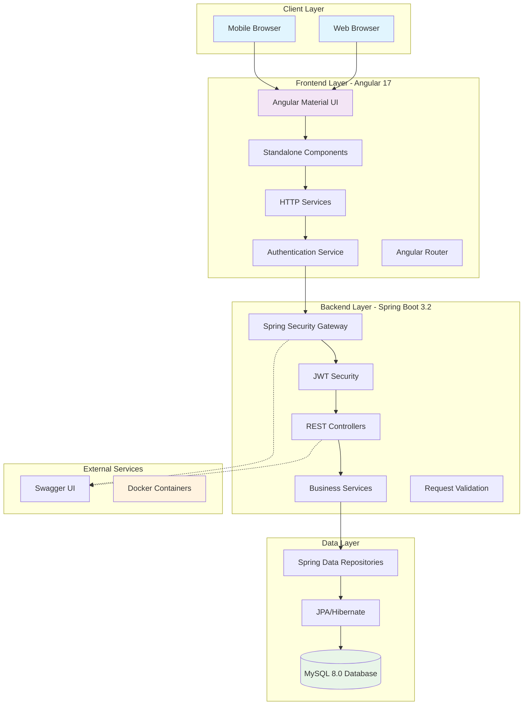
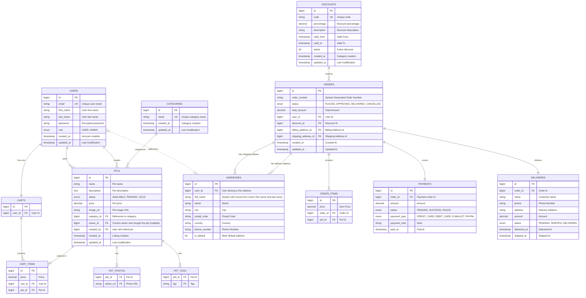

# Architecture Documentation

This document describes the system architecture, component design, and database schema of Pawfect Store.

---

## Architecture

This application follows a 3-tier architecture:

- **Frontend**: Angular 17 with Angular Material UI
- **Backend**: Spring Boot 3.2 REST API with JWT authentication
- **Database**: MySQL 8.0 with JPA/Hibernate

### System Architecture Overview



### Component Architecture

```mermaid
graph TD
    App[App Component<br/>Main Application Shell]
    
    subgraph "Public Routes"
        Home[Home Component<br/>Landing Page]
        Login[Login Component<br/>Authentication]
    end
    
    subgraph "Protected Routes"
        PetList[Pet List Component<br/>Main Pet Management]
        PetForm[Pet Form Component<br/>Add/Edit Pets]
        Categories[Category Management<br/>Admin Only]
        Discounts[Discount Management<br/>Admin Only]
        Addresses[Address Management<br/>Card View]
        OrderList[Order List View Component<br/>Card View]
        Cart[Cart View Component<br/>Add Pet to Cart]
        Users[User Management<br/>Admin Only]
    end
    
    subgraph "Shared Components"
        PetCard[Pet Card Component<br/>Pet Display Card]
        PetListView[Pet List View Component<br/>Table View]
        ImageModal[Image Modal Component<br/>Image Viewer]
        LatestPetCard[Latest Pet Card<br/>Homepage Display]
    end
    
    subgraph "Services Layer"
        AuthService[Auth Service<br/>JWT Management]
        PetService[Pet Service<br/>Pet CRUD Operations]
        CategoryService[Category Service<br/>Category Management]
        AddressService[Address Service<br/>Address Management]
        DiscountService[Discount Service<br/>Discount Management]
        StoreService[Store Service<br/>Store/Order Management]
        UserService[User Service<br/>User Management]
        BaseApiService[Base API Service<br/>HTTP Configuration]
    end
    
    App --> Home
    App --> Login
    App --> PetList
    App --> PetForm
    App --> Categories
    App --> Discounts
    App --> Addresses
    App --> OrderList
    App --> Cart
    App --> Users
    
    PetList --> PetCard
    PetList --> PetListView
    PetList --> ImageModal
    Home --> LatestPetCard
    
    Login -.-> AuthService
    PetList -.-> PetService
    PetForm -.-> PetService
    PetForm -.-> CategoryService
    Categories -.-> CategoryService
    Discounts -.-> DiscountService
    Addresses -.-> AddressService
    Cart -.-> StoreService
    OrderList -.-> StoreService
    Users -.-> UserService
    
    AuthService -.-> BaseApiService
    PetService -.-> BaseApiService
    CategoryService -.-> BaseApiService
    DiscountService -.-> BaseApiService
    AddressService -.-> BaseApiService
    StoreService -.-> BaseApiService
    UserService -.-> BaseApiService
    
    style App fill:#ffeb3b
    style AuthService fill:#4caf50
    style BaseApiService fill:#2196f3
```



## Features

### Core Functionality
- **View Pets**: Browse all available pets with filtering and search
- **Add Pets**: Add new pets to the store inventory
- **Update Pets**: Edit existing pet information
- **Delete Pets**: Remove pets from inventory
- **Store Management**: Add to Cart, Order Pets, Mock Payment, View Order Status
- **Discount Management**: Manage Discounts
- **Category Management**: Manage Categories

### Advanced Features
- **Search & Filter**: Filter pets by name, species, and status
- **Responsive Design**: Modern Angular Material UI
- **Authentication**: JWT-based authentication system
- **Role-based Authorization**: Different access levels (User, Admin)
- **Containerization**: Docker support for easy deployment
- **API Documentation**: Swagger/OpenAPI documentation

### Database Schema




---

## Project Structure

<details>
  <summary><b>Click to expand the Project Structure</b></summary>

<br>

```
pet-store/
├── .vscode/                         # VS Code configuration
│   ├── tasks.json                   # Build and run tasks
│   ├── launch.json                  # Debug configurations
│   └── settings.json                # Editor settings
├── .github/                         # GitHub workflows
│   └── workflows/                   # CI/CD automation (planned)
├── docker/                          # Docker configuration
│   ├── .env                         # Local environment variables
│   ├── .env.example                 # Environment template
│   ├── docker-compose.yml           # Main Docker Compose
│   ├── docker-compose.secrets.yml   # Secrets management
│   ├── mysql-init/                  # Database initialization scripts
│   └── secrets/                     # Docker secrets directory
│       └── mysql_root_password.txt  # MySQL root password
├── pet-store-api/                   # Spring Boot REST API
│   ├── src/main/java/com/petstore/
│   │   ├── PetStoreApplication.java # Main application class
│   │   ├── config/                  # Configuration classes
│   │   │   ├── DataInitializer.java     # Initial data setup
│   │   │   ├── EnvironmentConfig.java   # Environment variables
│   │   │   ├── OpenApiConfig.java       # Swagger configuration
│   │   │   ├── SecurityConfig.java      # Spring Security setup
│   │   │   └── SpringSecurityAuditorAware.java
│   │   ├── controller/              # REST API controllers
│   │   │   ├── AddressController.java   # Address management
│   │   │   ├── AuthController.java      # Authentication endpoints
│   │   │   ├── CategoryController.java  # Category management
│   │   │   ├── DiscountController.java  # Discount management
│   │   │   ├── PetController.java       # Pet operations
│   │   │   ├── StoreController.java     # Cart/Order/Payment operations
│   │   │   └── UserController.java      # User management
│   │   ├── dto/                     # Data Transfer Objects
│   │   │   ├── LoginRequest.java        # Login credentials
│   │   │   ├── PaymentOrderRequest.java # Payment request
│   │   │   ├── PetPageResponse.java     # Paginated pet response
│   │   │   ├── SignUpRequest.java       # User registration
│   │   │   └── UserUpdateRequest.java   # User update payload
│   │   ├── enums/                   # Enumeration types
│   │   │   ├── AuditOrderAction.java    # Order audit actions (CREATE_ORDER/CHECKOUT_ORDER/CANCEL_ORDER/UPDATE_DELIVERY_STATUS)
│   │   │   ├── DeliveryStatus.java      # Delivery state (PENDING/SHIPPED/DELIVERED)
│   │   │   ├── OrderStatus.java         # Order state (PLACED/APPROVED/DELIVERED/CANCELLED)
│   │   │   ├── PaymentStatus.java       # Payment state (PENDING/SUCCESS/FAILED)
│   │   │   ├── PaymentType.java         # Payment methods (CREDIT_CARD/DEBIT_CARD/E_WALLET/PAYPAL)
│   │   │   ├── PetStatus.java           # Pet availability (AVAILABLE/PENDING/SOLD)
│   │   │   └── WalletType.java          # Digital wallet types (GRABPAY/BOOSTPAY/TOUCHNGO)
│   │   ├── exception/               # Custom exceptions & error handling
│   │   │   ├── GlobalExceptionHandler.java  # Centralized exception handler
│   │   │   ├── ErrorCodes.java              # Application error codes
│   │   │   ├── ErrorResponse.java           # Error response structure
│   │   │   ├── AddressInUseException.java
│   │   │   ├── AddressNotFoundException.java
│   │   │   ├── AuthenticationFailedException.java
│   │   │   ├── CartEmptyException.java
│   │   │   ├── CartItemNotFoundException.java
│   │   │   ├── CategoryAlreadyExistsException.java
│   │   │   ├── CategoryInUseException.java
│   │   │   ├── CategoryNotFoundException.java
│   │   │   ├── DiscountAlreadyExistsException.java
│   │   │   ├── DiscountInUseException.java
│   │   │   ├── DiscountNotFoundException.java
│   │   │   ├── EmailAlreadyInUseException.java
│   │   │   ├── InvalidCategoryException.java
│   │   │   ├── InvalidDiscountException.java
│   │   │   ├── InvalidPaymentException.java
│   │   │   ├── InvalidPetException.java
│   │   │   ├── InvalidUserException.java
│   │   │   ├── OrderNotFoundException.java
│   │   │   ├── OrderOwnershipException.java
│   │   │   ├── PetAlreadyExistInUserCartException.java
│   │   │   ├── PetAlreadySoldException.java
│   │   │   ├── PetNotFoundException.java
│   │   │   ├── UnsupportedPaymentException.java
│   │   │   ├── UnsupportedPaymentTypeException.java
│   │   │   ├── UserCartNotFoundException.java
│   │   │   ├── UserInUseException.java
│   │   │   └── UserNotFoundException.java
│   │   ├── generator/               # Code generators
│   │   │   ├── OrderNumberGenerator.java   # OrderNumberGenerator Strategy Interface
│   │   │   ├── SequentialOrderNumberGenerator.java # Timestamp + Atomic Counter Implementation
│   │   │   ├── TimeBasedOrderNumberGenerator.java  # Time-based Implementation
│   │   │   ├── UUIDOrderNumberGenerator.java   # UUID-based Implementation
│   │   ├── model/                   # JPA entity classes
│   │   │   ├── Address.java             # User address entity
│   │   │   ├── AuditLog.java            # Order audit trail
│   │   │   ├── Cart.java                # Shopping cart entity
│   │   │   ├── CartItem.java            # Cart item entity
│   │   │   ├── Category.java            # Pet category entity
│   │   │   ├── Delivery.java            # Order delivery entity
│   │   │   ├── Discount.java            # Discount code entity
│   │   │   ├── Order.java               # Order entity
│   │   │   ├── OrderItem.java           # Order line item entity
│   │   │   ├── Payment.java             # Payment entity
│   │   │   ├── Pet.java                 # Pet entity
│   │   │   ├── Role.java                # User roles enum (USER/ADMIN)
│   │   │   └── User.java                # User entity
│   │   ├── repository/              # Data access layer (Spring Data JPA)
│   │   │   ├── AddressRepository.java
│   │   │   ├── AuditLogRepository.java
│   │   │   ├── CartItemRepository.java
│   │   │   ├── CartRepository.java
│   │   │   ├── CategoryRepository.java
│   │   │   ├── DeliveryRepository.java
│   │   │   ├── DiscountRepository.java
│   │   │   ├── OrderRepository.java
│   │   │   ├── PaymentRepository.java
│   │   │   ├── PetRepository.java
│   │   │   └── UserRepository.java
│   │   ├── security/                # Security components
│   │   │   ├── JwtAuthenticationFilter.java  # JWT validation filter
│   │   │   ├── JwtTokenProvider.java         # JWT token generation/validation
│   │   │   └── UserPrincipal.java            # Security user details
│   │   ├── service/                 # Business logic layer
│   │   │   ├── AddressService.java          # Address business logic
│   │   │   ├── CartService.java             # Cart management
│   │   │   ├── CategoryService.java         # Category operations
│   │   │   ├── DiscountService.java         # Discount management
│   │   │   ├── OrderService.java            # Order processing
│   │   │   ├── PetService.java              # Pet operations
│   │   │   ├── UserDetailsServiceImpl.java  # Spring Security user service
│   │   │   └── UserService.java             # User management
│   │   ├── strategy/                # Strategy pattern implementations
│   │   └── util/                    # Utility classes
│   ├── src/main/resources/
│   │   ├── application.properties       # Local configuration
│   │   ├── application-docker.properties # Docker configuration
│   │   └── logback-spring.xml          # Logging configuration
│   ├── src/test/                    # Test classes
│   │   ├── java/com/petstore/
│   │   │   ├── config/              # Test configurations
│   │   │   ├── controller/          # Controller unit tests
│   │   │   ├── exception/           # Exception tests
│   │   │   ├── repository/          # Repository integration tests
│   │   │   └── service/             # Service unit tests
│   │   └── resources/
│   │       └── application-test.properties  # Test configuration
│   ├── logs/                        # Application logs directory
│   ├── Dockerfile                   # Container build file
│   └── pom.xml                      # Maven dependencies & build config
├── pet-store-frontend/              # Angular 17 application
│   ├── src/app/
│   │   ├── components/              # Angular components
│   │   │   ├── address/                 # Address form component
│   │   │   ├── address-book/            # Address list management
│   │   │   ├── cart/                    # Shopping cart view
│   │   │   ├── cart-overlay/            # Cart dropdown overlay
│   │   │   ├── category-form/           # Category creation/edit
│   │   │   ├── category-list/           # Category management
│   │   │   ├── checkout/                # Checkout process
│   │   │   ├── confirm-dialog/          # Confirmation dialogs
│   │   │   ├── diagram-viewer/          # Architecture diagrams viewer
│   │   │   ├── discount-form/           # Discount creation/edit
│   │   │   ├── discount-list/           # Discount management
│   │   │   ├── documentation/           # API documentation viewer
│   │   │   ├── header/                  # Navigation header
│   │   │   ├── home/                    # Dashboard/landing page
│   │   │   ├── image-modal/             # Pet image lightbox
│   │   │   ├── latest-pet-card/         # Recent pet listings
│   │   │   ├── login/                   # User authentication
│   │   │   ├── mermaid-diagram/         # Mermaid diagram renderer
│   │   │   ├── order-card/              # Order display card
│   │   │   ├── order-history/           # User order history
│   │   │   ├── order-list/              # Admin order management
│   │   │   ├── payment-processing-dialog/ # Payment modal
│   │   │   ├── pet-card/                # Pet display card
│   │   │   ├── pet-form/                # Pet creation/edit form
│   │   │   ├── pet-list/                # Pet browsing
│   │   │   ├── pet-list-view/           # Pet grid/list view
│   │   │   ├── register/                # User registration
│   │   │   ├── unauthorized/            # Access denied page
│   │   │   ├── update-delivery-status-dialog/ # Delivery status update
│   │   │   ├── user-edit/               # User profile editing
│   │   │   └── user-list/               # User management (admin)
│   │   ├── guards/                  # Route protection
│   │   │   ├── auth.guard.ts            # Authentication guard
│   │   │   ├── pet-ownership.guard.ts   # Pet ownership validation
│   │   │   └── user-profile.guard.ts    # Profile access control
│   │   ├── interceptors/            # HTTP interceptors
│   │   │   ├── auth.interceptor.ts      # JWT token injection
│   │   │   └── unauthorized.interceptor.ts # 401 handling
│   │   ├── models/                  # TypeScript interfaces
│   │   │   ├── address.model.ts         # Address interface
│   │   │   ├── category.model.ts        # Category interface
│   │   │   ├── delivery.model.ts        # Delivery interface
│   │   │   ├── discount.model.ts        # Discount interface
│   │   │   ├── error-response.model.ts  # Error response interface
│   │   │   ├── order.model.ts           # Order interface
│   │   │   ├── orderItem.model.ts       # Order item interface
│   │   │   ├── payment.model.ts         # Payment interface
│   │   │   ├── paymentOrder.model.ts    # Payment order interface
│   │   │   └── pet.model.ts             # Pet interface
│   │   ├── services/                # HTTP services
│   │   │   ├── address.service.ts       # Address API client
│   │   │   ├── auth.service.ts          # Authentication API
│   │   │   ├── base-api.service.ts      # Base HTTP service
│   │   │   ├── category.service.ts      # Category API client
│   │   │   ├── discount.service.ts      # Discount API client
│   │   │   ├── error-handler.service.ts # Error handling service
│   │   │   ├── pet.service.ts           # Pet API client
│   │   │   ├── store.service.ts         # Store API (cart/order/payment)
│   │   │   └── user.service.ts          # User API client
│   │   ├── app.component.ts         # Root component
│   │   ├── app.config.ts            # App configuration
│   │   └── app.routes.ts            # Route definitions
│   ├── src/environments/            # Environment configurations
│   │   ├── environment.ts               # Development config
│   │   ├── environment.prod.ts          # Production config
│   │   └── environment.docker.ts        # Docker config
│   ├── src/assets/                  # Static assets
│   │   └── images/                      # Application images
│   ├── src/styles.scss              # Global styles
│   ├── src/index.html               # Entry HTML file
│   ├── src/main.ts                  # Bootstrap file
│   ├── dist/                        # Built application output
│   ├── docs/                        # Documentation files
│   ├── Dockerfile                   # Container build file
│   ├── nginx.conf                   # Production nginx config
│   ├── angular.json                 # Angular CLI configuration
│   ├── tsconfig.json                # TypeScript configuration
│   ├── tsconfig.app.json            # App-specific TypeScript config
│   └── package.json                 # Node.js dependencies
├── .gitignore                       # Git ignore patterns
├── LICENSE                          # Project license
└── README.md                        # Project documentation
```
</details>

### Key Architecture Components

#### Backend (Spring Boot)
- **Controllers**: Handle HTTP requests and responses
- **Services**: Contain business logic and orchestrate operations
- **Repositories**: Data access layer using Spring Data JPA
- **Models**: JPA entities representing database tables
- **DTOs**: Data Transfer Objects for API requests/responses
- **Exceptions**: Custom exception classes with global error handling
- **Security**: JWT-based authentication and authorization
- **Enums**: Type-safe enumeration for status values

#### Frontend (Angular)
- **Components**: Reusable UI components with standalone architecture
- **Services**: HTTP clients for backend API communication
- **Guards**: Route protection for authentication and authorization
- **Interceptors**: HTTP request/response interceptors for JWT and error handling
- **Models**: TypeScript interfaces matching backend DTOs
- **Routing**: Lazy loading and route guards for performance

#### Database Schema
- **Core Entities**: User, Pet, Category
- **Store/Order**: Cart, CartItem, Order, OrderItem, Payment, Delivery
- **Supporting**: Address, Discount, AuditLog
- **Relationships**: One-to-Many, Many-to-One, Many-to-Many with proper cascade operations

