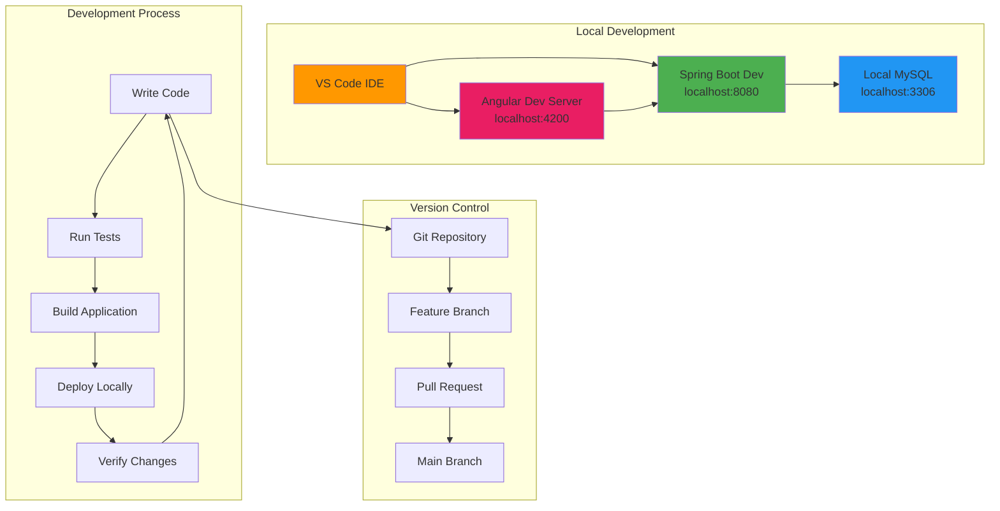
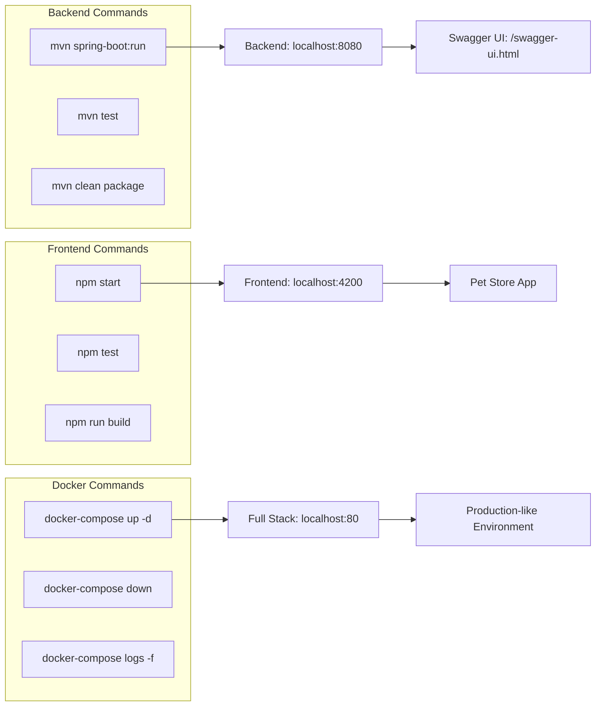
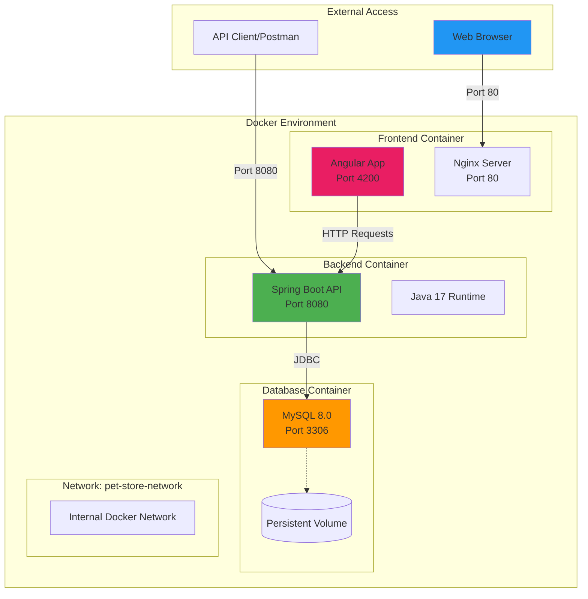
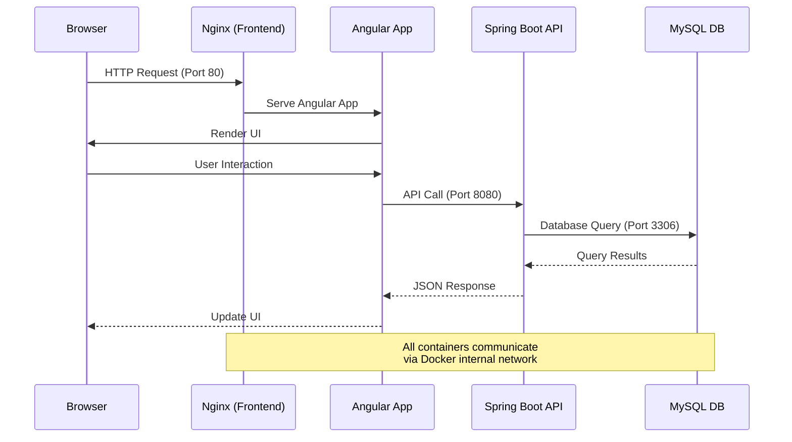
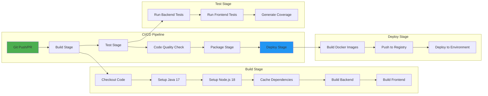
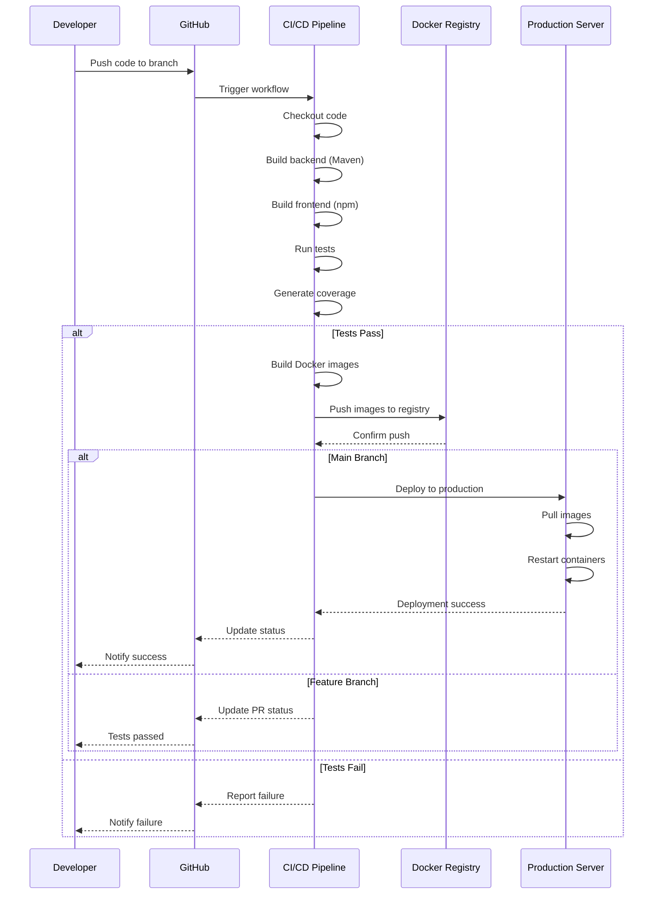

# 🚢 Deployment Guide

> Docker deployment and CI/CD pipeline documentation for Pawfect Store.

---

## 📋 Table of Contents

- [Development](#development)
  - [Backend Development](#backend-development)
  - [Frontend Development](#frontend-development)
  - [Available VS Code Tasks](#available-vs-code-tasks)
  - [Development Workflow](#development-workflow)
  - [Development Commands Flow](#development-commands-flow)
- [Docker Deployment](#docker-deployment)
  - [Deployment Architecture](#deployment-architecture)
  - [Container Communication Flow](#container-communication-flow)
  - [Full Stack Deployment](#full-stack-deployment)
  - [Individual Services](#individual-services)
- [Docker Security Configuration](#docker-security-configuration)
  - [Security Options](#security-options)
  - [Security Best Practices](#security-best-practices)
  - [File Structure](#file-structure)
  - [Security Quick Start](#security-quick-start)
  - [Security Verification](#security-verification)
  - [Security Considerations](#security-considerations)
  - [Important Security Notes](#important-security-notes)
- [CI/CD Pipeline](#cicd-pipeline)
  - [Overview](#overview)
  - [GitHub Actions Workflow](#github-actions-workflow)
  - [Pipeline Stages](#pipeline-stages)
  - [Setting Up CI/CD](#setting-up-cicd)
  - [Environment Variables for CI/CD](#environment-variables-for-cicd)
  - [Deployment Strategies](#deployment-strategies)
  - [CI/CD Best Practices](#cicd-best-practices)
  - [CI/CD Workflow Diagram](#cicd-workflow-diagram)
  - [Example: Complete CI/CD Setup](#example-complete-cicd-setup)

---

## 💻 Development

### Backend Development
- **Framework**: Spring Boot 3.2
- **Database**: MySQL with JPA/Hibernate
- **Security**: Spring Security with JWT
- **API Documentation**: Swagger/OpenAPI
- **Build Tool**: Maven

### Frontend Development
- **Framework**: Angular 17 (Standalone components)
- **UI Library**: Angular Material
- **Language**: TypeScript
- **Build Tool**: Angular CLI

### Available VS Code Tasks
- `Start Backend` - Launch Spring Boot server
- `Start Frontend` - Launch Angular dev server
- `Build Backend` - Compile and package Spring Boot application
- `Build Frontend` - Build Angular for production
- `Start Docker Services` - Launch all services with Docker Compose

### Development Workflow



### Development Commands Flow




---

## 🐳 Docker Deployment

### Deployment Architecture



### Container Communication Flow



### Full Stack Deployment
```bash
cd docker
docker-compose up -d
```

This will start:
- MySQL database on port 3306
- Spring Boot backend on port 8080
- Angular frontend on port 80

### Individual Services
```bash
# Database only
docker-compose up -d petstore-mysql

# Backend only (requires database)
docker-compose up -d petstore-backend

# Frontend only
docker-compose up -d petstore-frontend
```


---

## 🔒 Docker Security Configuration

This section contains multiple approaches to securely manage passwords and secrets in Docker Compose.

### Security Options

#### Option 1: Environment Variables (Development)
Use `docker-compose.yml` with `.env` file:

```bash
# Copy example environment file
cp .env.example .env

# Edit .env with your actual passwords and secrets
nano .env

# Generate secure JWT secret for Docker
openssl rand -base64 64

# Run with environment variables
docker-compose up -d
```

**Pros:**
- Simple setup
- Good for development
- Environment-specific configs

**Cons:**
- Still visible in process lists
- Not suitable for production

#### Option 2: Docker Secrets (Production)
Use `docker-compose.secrets.yml` with external secret files:

```bash
# Create secrets directory (already gitignored)
mkdir -p secrets

# Create password file
echo "your_super_secure_password" > secrets/mysql_root_password.txt

# Set proper permissions
chmod 600 secrets/mysql_root_password.txt

# Run with secrets
docker-compose -f docker-compose.secrets.yml up -d
```

**Pros:**
- More secure
- Secrets mounted as files in container
- Good for production

**Cons:**
- More complex setup
- Requires file management

#### Option 3: External Secret Management (Enterprise)
For production environments, consider:

- **HashiCorp Vault**
- **AWS Secrets Manager**
- **Azure Key Vault**
- **Google Secret Manager**
- **Kubernetes Secrets**

### Security Best Practices

1. **Never commit secrets to version control**
2. **Use strong, unique passwords**
3. **Rotate passwords regularly**
4. **Limit secret access to necessary services only**
5. **Use proper file permissions (600) for secret files**
6. **Monitor secret access logs**

### File Structure

```
docker/
├── docker-compose.yml          # Main compose file with env vars
├── docker-compose.secrets.yml  # Compose file with Docker secrets
├── .env.example               # Template for environment variables
├── .env                       # Actual environment variables (gitignored)
├── secrets/                   # Secret files directory (gitignored)
│   └── mysql_root_password.txt
```

### Security Quick Start

#### For Development:
```bash
cd docker
cp .env.example .env
# Edit .env with your passwords
docker-compose up -d
```

#### For Production:
```bash
cd docker
mkdir -p secrets
echo "your_secure_password" > secrets/mysql_root_password.txt
chmod 600 secrets/mysql_root_password.txt
docker-compose -f docker-compose.secrets.yml up -d
```

### Security Verification

Check that secrets are properly loaded:

```bash
# Check environment variables (should show masked values)
docker exec petstore-mysql env | grep MYSQL

# Check secrets file (Docker secrets approach)
docker exec petstore-mysql cat /run/secrets/mysql_root_password
```

### Security Considerations

#### For Development:
- Use default values for quick setup
- Keep secrets simple but don't commit them

#### For Production:
- **Generate secure JWT secrets**: `openssl rand -base64 64`
- **Use strong database passwords**: Mix of letters, numbers, symbols
- **Update CORS origins**: Match your actual domain
- **Consider external secret management**: Vault, AWS Secrets Manager

### Important Security Notes

- The `.env` and `secrets/` directories are gitignored
- Always use `.env.example` as a template
- Never put real passwords in example files
- Consider using password managers for team environments


---

## 🔄 CI/CD Pipeline

### Overview

This project supports continuous integration and continuous deployment (CI/CD) using GitHub Actions. The CI/CD pipeline automates building, testing, and deploying both the backend (Spring Boot) and frontend (Angular) applications.

### GitHub Actions Workflow

The CI/CD workflow is defined in `.github/workflows/` directory and includes:



### Pipeline Stages

#### 1. **Build Stage**
- Checkout code from repository
- Set up Java 17 for backend
- Set up Node.js 18 for frontend
- Cache Maven and npm dependencies
- Build Spring Boot application (`mvn clean package`)
- Build Angular application (`npm run build`)

#### 2. **Test Stage**
- Run backend unit tests (`mvn test`)
- Run backend integration tests
- Run frontend unit tests (`npm test`)
- Generate code coverage reports
- Upload coverage to services like Codecov or SonarQube

#### 3. **Code Quality Stage**
- Run static code analysis
- Check code formatting
- Security vulnerability scanning
- Dependency audit

#### 4. **Package Stage**
- Build Docker images for backend and frontend
- Tag images with version/commit SHA
- Run container security scanning

#### 5. **Deploy Stage**
- Push Docker images to container registry (Docker Hub, AWS ECR, etc.)
- Deploy to target environment (Development/Staging/Production)
- Run smoke tests
- Update deployment status

### Setting Up CI/CD

#### Step 1: Create GitHub Actions Workflow

Create `.github/workflows/ci-cd.yml`:

```yaml
name: CI/CD Pipeline

on:
  push:
    branches: [ main, develop ]
  pull_request:
    branches: [ main, develop ]

env:
  JAVA_VERSION: '17'
  NODE_VERSION: '18'
  REGISTRY: docker.io
  BACKEND_IMAGE_NAME: ${{ github.repository }}/petstore-backend
  FRONTEND_IMAGE_NAME: ${{ github.repository }}/petstore-frontend

jobs:
  build-and-test-backend:
    name: Build and Test Backend
    runs-on: ubuntu-latest
    
    steps:
    - name: Checkout code
      uses: actions/checkout@v4
      
    - name: Set up JDK 17
      uses: actions/setup-java@v4
      with:
        java-version: ${{ env.JAVA_VERSION }}
        distribution: 'temurin'
        cache: maven
        
    - name: Build with Maven
      run: |
        cd pet-store-api
        mvn clean package -DskipTests
        
    - name: Run Tests
      run: |
        cd pet-store-api
        mvn test
        
    - name: Generate Coverage Report
      run: |
        cd pet-store-api
        mvn jacoco:report
        
    - name: Upload Coverage
      uses: codecov/codecov-action@v3
      with:
        files: ./pet-store-api/target/site/jacoco/jacoco.xml
        flags: backend

  build-and-test-frontend:
    name: Build and Test Frontend
    runs-on: ubuntu-latest
    
    steps:
    - name: Checkout code
      uses: actions/checkout@v4
      
    - name: Set up Node.js
      uses: actions/setup-node@v4
      with:
        node-version: ${{ env.NODE_VERSION }}
        cache: 'npm'
        cache-dependency-path: pet-store-frontend/package-lock.json
        
    - name: Install dependencies
      run: |
        cd pet-store-frontend
        npm ci
        
    - name: Build
      run: |
        cd pet-store-frontend
        npm run build --prod
        
    - name: Run Tests
      run: |
        cd pet-store-frontend
        npm test -- --watch=false --code-coverage
        
    - name: Upload Coverage
      uses: codecov/codecov-action@v3
      with:
        files: ./pet-store-frontend/coverage/lcov.info
        flags: frontend

  docker-build-and-push:
    name: Build and Push Docker Images
    needs: [build-and-test-backend, build-and-test-frontend]
    runs-on: ubuntu-latest
    if: github.event_name == 'push' && github.ref == 'refs/heads/main'
    
    steps:
    - name: Checkout code
      uses: actions/checkout@v4
      
    - name: Set up Docker Buildx
      uses: docker/setup-buildx-action@v3
      
    - name: Log in to Docker Hub
      uses: docker/login-action@v3
      with:
        username: ${{ secrets.DOCKER_USERNAME }}
        password: ${{ secrets.DOCKER_PASSWORD }}
        
    - name: Extract metadata (tags, labels)
      id: meta-backend
      uses: docker/metadata-action@v5
      with:
        images: ${{ env.REGISTRY }}/${{ env.BACKEND_IMAGE_NAME }}
        tags: |
          type=ref,event=branch
          type=sha,prefix={{branch}}-
          type=semver,pattern={{version}}
          
    - name: Build and push backend image
      uses: docker/build-push-action@v5
      with:
        context: ./pet-store-api
        push: true
        tags: ${{ steps.meta-backend.outputs.tags }}
        labels: ${{ steps.meta-backend.outputs.labels }}
        cache-from: type=gha
        cache-to: type=gha,mode=max
        
    - name: Extract metadata for frontend
      id: meta-frontend
      uses: docker/metadata-action@v5
      with:
        images: ${{ env.REGISTRY }}/${{ env.FRONTEND_IMAGE_NAME }}
        
    - name: Build and push frontend image
      uses: docker/build-push-action@v5
      with:
        context: ./pet-store-frontend
        push: true
        tags: ${{ steps.meta-frontend.outputs.tags }}
        labels: ${{ steps.meta-frontend.outputs.labels }}
        cache-from: type=gha
        cache-to: type=gha,mode=max

  deploy:
    name: Deploy to Environment
    needs: docker-build-and-push
    runs-on: ubuntu-latest
    if: github.event_name == 'push' && github.ref == 'refs/heads/main'
    
    steps:
    - name: Deploy to production
      run: |
        echo "Deploying to production environment..."
        # Add deployment commands here (e.g., kubectl, AWS ECS, etc.)
```

#### Step 2: Configure Repository Secrets

Add these secrets in GitHub repository settings (`Settings > Secrets and variables > Actions`):

```bash
# Docker Registry
DOCKER_USERNAME=your_docker_username
DOCKER_PASSWORD=your_docker_password

# Database (for integration tests)
DB_PASSWORD=test_password
JWT_SECRET=test_jwt_secret_key_for_ci_cd

# Deployment credentials (if needed)
AWS_ACCESS_KEY_ID=your_aws_key
AWS_SECRET_ACCESS_KEY=your_aws_secret
KUBECONFIG=your_kubernetes_config
```

#### Step 3: Add Maven Wrapper (Optional)

```bash
cd pet-store-api
mvn wrapper:wrapper
git add .mvn mvnw mvnw.cmd
git commit -m "Add Maven wrapper for CI/CD"
```

### Environment Variables for CI/CD

Create environment-specific configuration files:

#### Backend - `application-ci.properties`
```properties
# CI/CD Test Configuration
spring.datasource.url=jdbc:h2:mem:testdb
spring.datasource.driver-class-name=org.h2.Driver
spring.jpa.hibernate.ddl-auto=create-drop

# JWT Configuration
app.jwt.secret=${JWT_SECRET:test_secret_key_for_ci_cd}
app.jwt.expiration=86400000

# Disable unnecessary features in CI
spring.jpa.show-sql=false
logging.level.root=WARN
```

#### Frontend - `environment.ci.ts`
```typescript
export const environment = {
  production: false,
  apiUrl: 'http://localhost:8080/api',
  enableDebug: false
};
```

### Deployment Strategies

#### 1. **Manual Deployment** (Current)
```bash
# Build and deploy manually
docker-compose -f docker/docker-compose.yml up -d
```

#### 2. **Automated Docker Deployment**
- Images automatically pushed to Docker Hub/Registry
- Pull and restart containers on target server
```bash
docker-compose pull
docker-compose up -d
```

#### 3. **Kubernetes Deployment**
```yaml
# k8s/deployment.yaml
apiVersion: apps/v1
kind: Deployment
metadata:
  name: petstore-backend
spec:
  replicas: 3
  selector:
    matchLabels:
      app: petstore-backend
  template:
    metadata:
      labels:
        app: petstore-backend
    spec:
      containers:
      - name: backend
        image: your-registry/petstore-backend:latest
        ports:
        - containerPort: 8080
```

#### 4. **Cloud Platform Deployment**
- **AWS**: ECS, Elastic Beanstalk, or EKS
- **Azure**: App Service or AKS
- **Google Cloud**: Cloud Run or GKE
- **Heroku**: Container Registry

### CI/CD Best Practices

#### 1. **Automated Testing**
- Run all unit tests on every commit
- Run integration tests before deployment
- Maintain minimum code coverage (e.g., 80%)

#### 2. **Branch Strategy**
- `main` branch → Production deployment
- `develop` branch → Staging deployment
- `feature/*` branches → Run tests only
- Use pull requests for code review

#### 3. **Version Control**
- Tag releases with semantic versioning (v1.0.0)
- Generate changelog automatically
- Track deployment history

#### 4. **Rollback Strategy**
```bash
# Quick rollback to previous version
docker-compose down
docker-compose pull petstore-backend:previous-tag
docker-compose up -d
```

#### 5. **Monitoring and Alerts**
- Set up health check endpoints
- Configure alerts for failed deployments
- Monitor application logs and metrics
- Use tools like Prometheus, Grafana, or ELK stack

#### 6. **Security Scanning**
```yaml
# Add to workflow for security scanning
- name: Run Trivy vulnerability scanner
  uses: aquasecurity/trivy-action@master
  with:
    image-ref: 'petstore-backend:latest'
    format: 'sarif'
    output: 'trivy-results.sarif'
```

#### 7. **Environment Isolation**
- Development → Feature testing
- Staging → Pre-production validation
- Production → Live environment
- Each environment has separate configurations and databases

### CI/CD Workflow Diagram



### Example: Complete CI/CD Setup

1. **Initialize CI/CD**:
```bash
# Create workflow directory
mkdir -p .github/workflows

# Create workflow file
touch .github/workflows/ci-cd.yml

# Commit and push
git add .github/
git commit -m "Add CI/CD pipeline"
git push origin main
```

2. **Monitor Pipeline**:
- Go to GitHub repository → Actions tab
- View running/completed workflows
- Check logs for each job
- Review test results and coverage reports

3. **Deployment Verification**:
```bash
# Check deployed application
curl http://your-production-url/actuator/health

# Verify API endpoints
curl http://your-production-url/api/pets

# Check logs
docker logs petstore-backend
```

