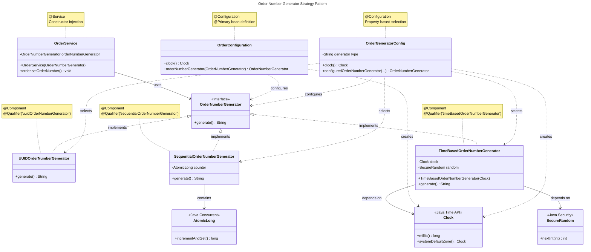
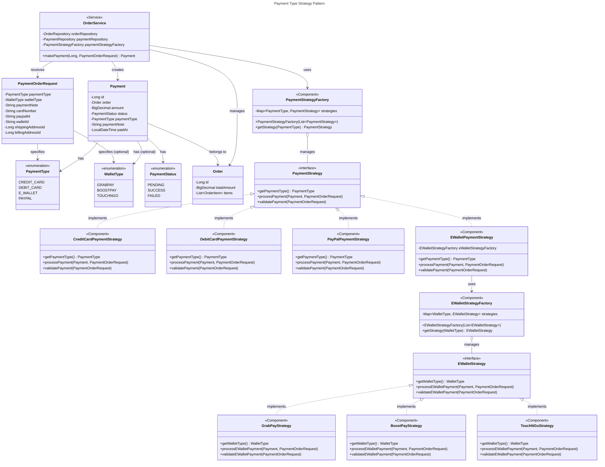

# 🎨 Design Patterns

> Design patterns used in Pawfect Store backend implementation.

---

## 📋 Table of Contents

- [Design Pattern Used](#design-pattern-used)
  - [1. Order Number Generator](#1-order-number-generator)
  - [2. Payment Type](#2-payment-type)
  - [3. Other Design Patterns](#3-other-design-patterns)

---

## 🏗️ Design Pattern Used

The project uses design patterns in below implementation

### 1. Order Number Generator

&nbsp;&nbsp;&nbsp;&nbsp;**Three Generator Implementations:**
<ul>
  <li>UUIDOrderNumberGenerator - Best for production (truly unique, distributed-safe)</li>
  <li>SSequentialOrderNumberGenerator - Thread-safe with atomic counter</li>
  <li>imeBasedOrderNumberGenerator** - Simple timebased generator</li>
</ul>

&nbsp;&nbsp;&nbsp;&nbsp;**Design Patterns Used:**
<ul>
  <li>Strategy Pattern - Interface allows swapping implementations</li>
  <li>Dependency Injection - All dependencies injected via constructor</li>
  <li>Configuration Pattern - Can switch generators via application.properties</li>
</ul>

&nbsp;&nbsp;&nbsp;&nbsp;**Key Features:**
<ul>
  <li>Thread-safe - All implementations handle concurrency
</li>
  <li>Testable - Clock injection allows deterministic tests</li>
  <li>Configurable - Switch generators without code changes</li>
  <li>SOLID principles - Single responsibility, open/closed, dependency inversion</li>
</ul>

&nbsp;&nbsp;&nbsp;&nbsp;**Benefits:**
<ul>
  <li>Open/Closed Principle - Add new generators without modifying existing code
</li>
  <li>Dependency Inversion - High-level OrderService depends on abstraction</li>
  <li>Single Responsibility - Each class has one job</li>
  <li>Testability - Mock the interface or inject test doubles</li>
  <li>Flexibility - Switch implementations via configuration</li>
</ul>

&nbsp;&nbsp;&nbsp;&nbsp;**Quick Usage:**
```java
@Autowired
private OrderNumberGenerator orderNumberGenerator;

order.setOrderNUmber(orderNumberGenerator.generate());
```

&nbsp;&nbsp;&nbsp;&nbsp;**Configuration (`application.properties`):**
```properties
# Order Number Generator Type (uuid, sequential, timeBased)
app.order.generator.type=uuid
```
The UUID implementation is recommended for production as it guarantees uniqueness even across multiple servers/instances.

&nbsp;&nbsp;&nbsp;&nbsp;**Class Diagram:**

The diagram shows how Spring wires everything together with annotations like @Component, @Service, and @Configuration. The OrderService only knows about the interface, making it completely decoupled from the implementation details.




### 2. Payment Type

&nbsp;&nbsp;&nbsp;&nbsp;**Design Patterns Used:**


<ul>
  <li>Strategy Pattern (Primary) 
  <ol>
        <li>Defines a family of algorithms (payment methods), encapsulates each one, and makes them interchangeable
        </li>
         <li>Allows runtime selection of payment processing algorithm based on payment type
        </li>
  </ol>
  </li>
  <li>Factory Pattern
  <ol>
        <li>Provides an interface for creating objects without specifying their exact classes
        </li>
         <li>Centralizes object creation and simplifies strategy selection logic
        </li>
  </ol>
  </li>
  <li>Dependency Injection Pattern
  <ol>
        <li>Dependencies are provided to objects rather than created by them
        </li>
         <li>Promotes loose coupling and easier testing
        </li>
  </ol>
  </li>
  <li>Template Method Pattern (Implicit)
  <ol>
        <li>Defines skeleton of algorithm, letting subclasses override specific steps
        </li>
         <li>Ensures consistent payment processing flow across all payment types
        </li>
  </ol>
  </li>
</ul>

&nbsp;&nbsp;&nbsp;&nbsp;**Key Features:**

- Type-Safe Enum-Driven Selection
   - Uses <code>PaymentType</code> enum to select payment strategy
   - Uses <code>WalletType</code> enum to select e-wallet strategy
   - Compile-time safety prevents invalid payment types
- Centralized Strategy Management
   - Factories automatically discover and register all strategies via Spring's dependency injection
   - No manual registration required
   - Strategies are managed in <code>Map<Enum, Strategy></code> for O(1) lookup
- Uniform Interface 
   - ```java
      @Autowired
      private OrderNumberGenerator orderNumberGenerator;

      order.setOrderNumber(orderNumberGenerator.generate());
      ```
- Extensibility
   - Add new payment type: Create new strategy class, implement interface
   - Add new e-wallet: Create new e-wallet strategy class, implement interface
   - No changes to existing code required

&nbsp;&nbsp;&nbsp;&nbsp;**Benefits:**
- Open/Closed Principle
   - Open for extension (add new payment types)
   - Closed for modification (no changes to existing code)
   - ```java
      // Adding Apple Pay requires ZERO changes to existing code
        @Component
        public class ApplePayStrategy implements PaymentStrategy {
            // Implementation
        }
      ```
- Single Responsibility Principle
    - Each strategy handles ONE payment type
    - Factory handles strategy selection
    - Service orchestrates payment flow
-  Dependency Inversion Principle
    - <code>OrderService</code> depends on <code>PaymentStrategy</code> interface, not concrete implementations
    - High-level modules don't depend on low-level modules
- Clean Code & Maintainability
    - ```java
      // WITHOUT Strategy Pattern
        if (paymentType == CREDIT_CARD) {
            // nth lines of credit card logic
        } else if (paymentType == DEBIT_CARD) {
            // nth lines of debit card logic
        } else if (paymentType == E_WALLET) {
            if (eWalletType == GRABPAY) {
                // nth lines
            } else if (eWalletType == BOOSTPAY) {
                // nth lines
            }
            // ... nested
        }

        // WITH Strategy Pattern
        PaymentStrategy strategy = factory.getStrategy(paymentType);
        strategy.processPayment(payment, request);
      ```
- Easy Testing
    - Each strategy can be unit tested independently
    - Mock strategies easily in integration tests
    - No complex conditional logic to test
- Parallel Development
    - Different developers can work on different payment strategies simultaneously
    - No merge conflicts in business logic
- Code Reusability
    - Common logic can be extracted to abstract base class
    - Shared utilities can be injected into strategies
- Easy Integration with Third-Party APIs
    - Each strategy can call different payment gateways
    - ```java
        @Component
        public class StripePaymentStrategy implements PaymentStrategy {
            @Autowired
            private StripeClient stripeClient;
            
            public void processPayment(Payment payment, PaymentOrderRequest request) {
                stripeClient.charge(payment.getAmount());
            }
        }
      ```
- Performance Optimization
    - Can optimize each strategy independently
    - Can implement caching per payment type
    - Can add async processing for specific payment types
- Scalability
    - Different payment strategies can be deployed as separate microservices
    - Can scale individual payment processors based on demand
- Future-Proof Architecture
    - Ready for new payment technologies (crypto, BNPL, etc.)
    - Can adapt to regional payment requirements
    - ```java
            // Easy to add region-specific payment methods
            @Component
            public class AliPayStrategy implements PaymentStrategy { /* China */}

            @Component 
            public class UPIStrategy implements PaymentStrategy { /* India */ }
        ```

&nbsp;&nbsp;&nbsp;&nbsp;**Class Diagram:**

<ul>
  <li>Two-level Strategy Pattern - Payment strategies with nested E-Wallet strategies
</li>
<li>Factory Pattern - Both levels have factories for strategy selection</li>
<li>Separation of Concerns - Clear boundaries between different payment types</li>
<li>Open/Closed Principle - Easy to add new payment types without modifying existing code</li>
<li>Dependency Injection - All components are Spring-managed beans</li>
</ul>

The diagram clearly shows how OrderService delegates to PaymentStrategyFactory, which returns the appropriate strategy, and how EWalletPaymentStrategy further delegates to EWalletStrategyFactory for E-Wallet specific processing.



### 3. Other Design Patterns

This project demonstrates multiple **software design patterns** implemented using **Spring Boot** and **Java best practices**.  
Each pattern contributes to a modular, maintainable, and testable architecture.

<details>
  <summary><b>Click to expand other design patterns used in this project.</b></summary>
<br>

| **Design Pattern** | **What** | **Examples** | **Files** |
|---------------------|----------|---------------|------------|
| **MVC (Model–View–Controller)** | Controllers handle HTTP requests; services implement business logic; repositories access the DB. | `PetController` (controller), `PetService`, `OrderService` (services), `PetRepository`, `OrderRepository` (repositories) | `PetController.java`, `PetService.java`, `PetRepository.java` |
| **Dependency Injection (DI) / Inversion of Control** | Spring injects dependencies via annotations or constructor injection. | Constructor injection in controllers/services; beans annotated with `@Service`, `@Repository`, `@Component`, `@Configuration`. | `PetController` constructor, `PetService` constructor, `OrderService`, `UserService` |
| **Repository Pattern (Spring Data JPA)** | Data access is abstracted behind repository interfaces. | `PetRepository extends JpaRepository<Pet, Long>` with custom `@Query` methods. | `PetRepository.java`, `UserRepository.java`, `OrderRepository.java` |
| **Service Layer** | Business logic is encapsulated in service classes. | `PetService`, `OrderService`, `CartService` encapsulate transactional and business rules. | `src/main/java/com/petstore/service/*.java` |
| **Singleton (Spring-managed beans)** | Spring-managed beans (`@Service`, `@RestController`, etc.) are singletons by default. | `@Service` and `@RestController` classes are application-scoped singletons. | `PetService.java`, `JwtTokenProvider.java`, `JwtAuthenticationFilter.java` |
| **Factory Method** | Static factory methods encapsulate object creation logic. | `UserPrincipal.create(User user)` builds a `UserPrincipal` from domain `User`. | `UserPrincipal.java` |
| **Adapter / Auditor Adapter** | Adapts one interface to another for integration purposes. | `SpringSecurityAuditorAware` implements `AuditorAware<Long>` to map Spring Security principal → auditor ID. | `SpringSecurityAuditorAware.java` |
| **Facade** | Provides a unified interface for a complex subsystem. | `JwtTokenProvider` encapsulates token creation, parsing, and validation. | `JwtTokenProvider.java` |
| **Interceptor / Filter** | Intercepts or filters requests before controller handling. | `JwtAuthenticationFilter` extends `OncePerRequestFilter` and is wired into the security filter chain. | `JwtAuthenticationFilter.java`, `SecurityConfig.java` |
| **Controller Advice / Global Exception Handler** | Centralized exception-to-HTTP response mapping. | `@RestControllerAdvice` + `@ExceptionHandler(...)` methods. | `GlobalExceptionHandler.java` |
| **DTO (Data Transfer Object)** | Shapes responses independent of domain models. | `PetPageResponse` encapsulates paginated pet data. | `PetPageResponse.java` |
| **Utility / Helper** | Provides static helper methods for cross-cutting concerns. | `OrderNumberGenerator.generateOrderNumber()` (static util). | `OrderNumberGenerator.java` |
| **Exception / Domain-specific Exceptions** | Custom exceptions represent business error conditions. | `PetNotFoundException`, `CartEmptyException`, `DiscountInUseException`. | `src/main/java/com/petstore/exception/*.java` |
| **Strategy (via Interfaces)** | Defines interchangeable behaviors via interface implementations. | `UserDetailsService` → `UserDetailsServiceImpl`; fits Strategy pattern potential. | `UserDetailsServiceImpl.java`, `SecurityConfig.java` |

</details>