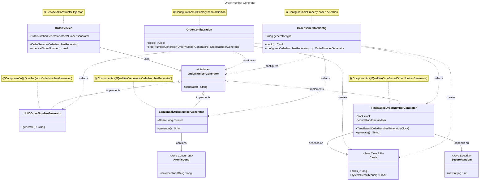

# Pawfect Store - Backend Documentation

A backend documentation for Pawfect Store


## Design Pattern Used

The project uses design patters in below implementation

### 1. Order Number Generator

&nbsp;&nbsp;&nbsp;&nbsp;**Three Generator Implementations:**
<ul>
  <li>UUIDOrderNumberGenerator - Best for production (truly unique, distributed-safe)</li>
  <li>SSequentialOrderNumberGenerator - Thread-safe with atomic counter</li>
  <li>imeBasedOrderNumberGenerator** - Simple timebased generator</li>
</ul>

&nbsp;&nbsp;&nbsp;&nbsp;**Design Patterns Used:**
<ul>
  <li>Strategy Pattern - Interface allows swapping implementations</li>
  <li>Dependency Injection - All dependencies injected via constructor</li>
  <li>Configuration Pattern - Can switch generators via application.properties</li>
</ul>

&nbsp;&nbsp;&nbsp;&nbsp;**Key Features:**
<ul>
  <li>Thread-safe - All implementations handle concurrency
</li>
  <li>Testable - Clock injection allows deterministic tests</li>
  <li>Configurable - Switch generators without code changes</li>
  <li>SOLID principles - Single responsibility, open/closed, dependency inversion</li>
</ul>

&nbsp;&nbsp;&nbsp;&nbsp;**Quick Usage:**
```java
@Autowired
private OrderNumberGenerator orderNumberGenerator;

order.setOrderNUmber(orderNumberGenerator.generate());
```

&nbsp;&nbsp;&nbsp;&nbsp;**Configuration (`application.properties`):**
```properties
# Order Number Generator Type (uuid, sequential, timeBased)
app.order.generator.type=uuid
```
The UUID implementation is recommended for production as it guarantees uniqueness even across multiple servers/instances.

&nbsp;&nbsp;&nbsp;&nbsp;**Class Diagram:**




